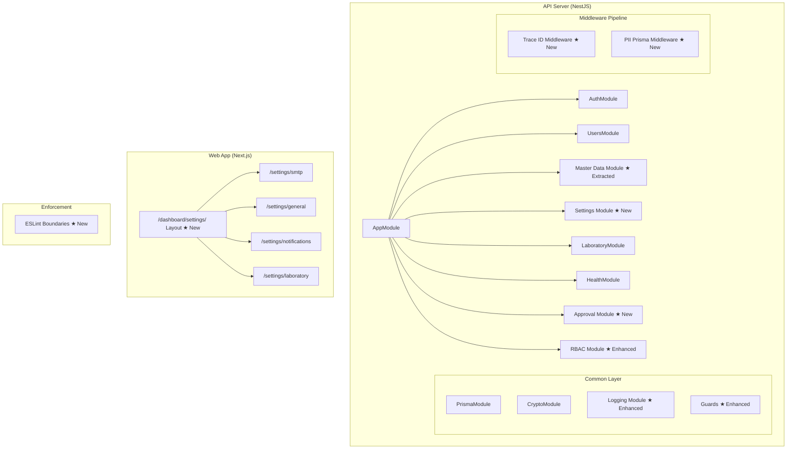
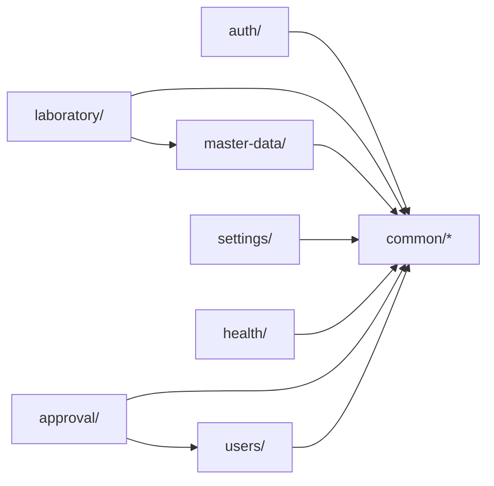

# Design Document: Architecture & Governance Remediation

## Overview

This design addresses 12 remediation tasks (T-042 through T-053) from the eLIS audit backlog. The implementation spans the NestJS API backend and Next.js frontend, covering module architecture enforcement, security hardening, RBAC governance, frontend decomposition, master data enhancements, and insurance analytics.

**Key Design Decisions:**
- ESLint boundary enforcement uses `eslint-plugin-boundaries` with flat config (eslint.config.mjs)
- PII encryption uses Prisma middleware for transparent encrypt/decrypt of NIK field
- Structured logging uses `nestjs-pino` (Pino with JSON transport) for performance and ecosystem compatibility
- Role hierarchy uses a `RoleHierarchy` configuration table with `parentRole` approach
- Approval workflow uses a generic `ApprovalRequest` entity usable across domains
- Settings page decomposition uses Next.js App Router nested routes under `/dashboard/settings/[section]`
- Tariff effective dates use `effectiveFrom`/`effectiveTo` with a resolver service for temporal queries
- Bulk import uses streaming CSV/Excel parsing with `multer` + `csv-parse` or `exceljs`
- Insurance reporting adds dedicated endpoints with insurer grouping, claim aging, and rejection analysis

## Architecture



### Module Dependency Graph (Enforced by ESLint)



## Components and Interfaces

### 1. ESLint Boundary Configuration (T-042)

**File:** `apps/api/eslint.config.mjs`

Adds `eslint-plugin-boundaries` configuration defining module zones and allowed import rules.

```typescript
// Zone definitions for eslint-plugin-boundaries
const moduleZones = [
  { target: 'src/common/**', from: 'common' },
  { target: 'src/auth/**', from: 'auth' },
  { target: 'src/users/**', from: 'users' },
  { target: 'src/master-data/**', from: 'master-data' },
  { target: 'src/settings/**', from: 'settings' },
  { target: 'src/laboratory/**', from: 'laboratory' },
  { target: 'src/health/**', from: 'health' },
  { target: 'src/approval/**', from: 'approval' },
];

// Dependency rules
const elementRules = [
  { from: '*', allow: ['common'] },           // everyone can import common
  { from: 'laboratory', allow: ['master-data'] },
  { from: 'approval', allow: ['users'] },
];
```

### 2. Master Data Module (T-043)

**New path:** `apps/api/src/master-data/`

Extracted from `laboratory/master-data/` with the same controllers, services, and DTOs. The module becomes a top-level import in `AppModule`.

```typescript
// apps/api/src/master-data/master-data.module.ts
@Module({
  imports: [PrismaModule, CryptoModule],
  controllers: [MasterDataController, TariffController, ReferenceMasterController],
  providers: [MasterDataService, TariffResolverService, BulkImportService],
  exports: [MasterDataService, TariffResolverService],
})
export class MasterDataModule {}
```

### 3. Settings Module (T-044)

**New path:** `apps/api/src/settings/`

```typescript
// apps/api/src/settings/settings.module.ts
@Module({
  imports: [PrismaModule],
  controllers: [SettingsController],
  providers: [SettingsService],
  exports: [SettingsService],
})
export class SettingsModule {}

// Interface
interface SettingsService {
  getSetting(key: string): Promise<string | null>;
  setSetting(key: string, value: string): Promise<void>;
  getSettingsByPrefix(prefix: string): Promise<Record<string, string>>;
  bulkUpdate(entries: { key: string; value: string }[]): Promise<void>;
}
```

### 4. PII Encryption Middleware (T-045)

**File:** `apps/api/src/common/prisma/pii-encryption.middleware.ts`

A Prisma middleware extension that intercepts `Patient` model operations to encrypt/decrypt the `nik` field.

```typescript
interface PiiMiddlewareConfig {
  model: string;           // 'Patient'
  fields: string[];        // ['nik']
  cryptoService: CryptoService;
}

// Hooks into Prisma $use() or Prisma Client Extensions
// - beforeCreate/beforeUpdate: encrypt fields
// - afterFind: decrypt fields
// - beforeFindMany (where clause): encrypt search values
```

### 5. Structured Logger (T-046)

**Files:**
- `apps/api/src/common/logging/logging.module.ts`
- `apps/api/src/common/logging/trace-id.middleware.ts`

```typescript
// Trace ID Middleware
@Injectable()
export class TraceIdMiddleware implements NestMiddleware {
  use(req: Request, res: Response, next: NextFunction) {
    const traceId = req.headers['x-request-id'] || randomUUID();
    req['traceId'] = traceId;
    res.setHeader('X-Request-ID', traceId);
    next();
  }
}

// Log format (JSON)
interface LogEntry {
  timestamp: string;    // ISO 8601
  level: string;        // 'info' | 'warn' | 'error' | 'debug'
  traceId: string;      // UUID v4
  context: string;      // NestJS service/controller name
  message: string;
  meta?: Record<string, unknown>;  // Additional data, error stacks
}
```

### 6. Approval Workflow (T-047)

**Path:** `apps/api/src/approval/`

```typescript
// Entity
interface ApprovalRequest {
  id: string;
  requestType: ApprovalType;      // TARIFF_CHANGE, HIGH_VALUE_ORDER, MASTER_DATA_DELETE
  requesterId: string;            // User who initiated
  currentLevel: number;           // Current approval level (1-based)
  maxLevel: number;               // Total levels required
  status: ApprovalStatus;         // PENDING, APPROVED, REJECTED, CANCELLED
  payload: JsonValue;             // The action data (e.g., tariff DTO)
  reason?: string;                // Rejection reason
  createdAt: DateTime;
  resolvedAt?: DateTime;
}

interface ApprovalStep {
  id: string;
  approvalRequestId: string;
  level: number;
  approverId: string;
  action: 'APPROVED' | 'REJECTED';
  comment?: string;
  actedAt: DateTime;
}

enum ApprovalType {
  TARIFF_CHANGE = 'TARIFF_CHANGE',
  HIGH_VALUE_ORDER = 'HIGH_VALUE_ORDER',
  MASTER_DATA_DELETE = 'MASTER_DATA_DELETE',
}

enum ApprovalStatus {
  PENDING = 'PENDING',
  APPROVED = 'APPROVED',
  REJECTED = 'REJECTED',
  CANCELLED = 'CANCELLED',
}
```

### 7. Department & Position (T-048)

**Schema additions:**

```prisma
model Department {
  id          String    @id @default(uuid()) @db.Uuid
  code        String    @unique
  name        String
  description String?
  isActive    Boolean   @default(true)
  createdAt   DateTime  @default(now())
  updatedAt   DateTime  @updatedAt

  positions Position[]
  users     User[]
}

model Position {
  id           String   @id @default(uuid()) @db.Uuid
  code         String   @unique
  name         String
  departmentId String   @db.Uuid
  level        Int      @default(1)  // seniority level
  isActive     Boolean  @default(true)
  createdAt    DateTime @default(now())
  updatedAt    DateTime @updatedAt

  department Department @relation(fields: [departmentId], references: [id])
  users      User[]
}

// User model additions:
// departmentId  String? @db.Uuid
// positionId    String? @db.Uuid
```

### 8. Role Hierarchy (T-049)

**Approach:** Configuration-based hierarchy stored as a `RoleHierarchy` table.

```prisma
model RoleHierarchy {
  id         String @id @default(uuid()) @db.Uuid
  role       Role   @unique
  parentRole Role?
  level      Int    @default(0)  // depth in hierarchy

  @@map("role_hierarchy")
}
```

**Permission resolution algorithm:**

```typescript
// RbacService enhancement
async hasPermission(role: Role, permissionCode: string): Promise<boolean> {
  if (role === 'SUPER_ADMIN') return true;

  // Get all roles in hierarchy (this role + all descendant roles it inherits from)
  const inheritedRoles = await this.getInheritedRoles(role);
  
  // Check if ANY of the inherited roles has the permission
  const rp = await this.prisma.rolePermission.findFirst({
    where: {
      role: { in: inheritedRoles },
      permission: { code: permissionCode },
      isGranted: true,
    },
  });
  return !!rp;
}

async getInheritedRoles(role: Role): Promise<Role[]> {
  // Walk hierarchy downward: OWNER inherits MANAGER, MANAGER inherits ADMIN, etc.
  const hierarchy = await this.prisma.roleHierarchy.findMany();
  const roles: Role[] = [role];
  // Collect all child roles recursively
  const collectChildren = (parentRole: Role) => {
    const children = hierarchy.filter(h => h.parentRole === parentRole);
    for (const child of children) {
      if (!roles.includes(child.role)) {
        roles.push(child.role);
        collectChildren(child.role);
      }
    }
  };
  collectChildren(role);
  return roles;
}
```

### 9. Settings Page Decomposition (T-050)

**New route structure:**

```
apps/web/src/app/dashboard/settings/
├── layout.tsx              # Settings layout with sidebar navigation
├── page.tsx                # Redirect to default section or overview
├── general/
│   └── page.tsx            # General/company settings
├── smtp/
│   └── page.tsx            # SMTP configuration
├── notifications/
│   └── page.tsx            # Notification preferences
├── laboratory/
│   └── page.tsx            # Lab-specific settings
├── whatsapp/
│   └── page.tsx            # WhatsApp integration settings
├── users/
│   └── page.tsx            # User default settings
└── appearance/
    └── page.tsx            # Theme/appearance settings
```

### 10. Tariff Resolver Service (T-051)

```typescript
// apps/api/src/master-data/tariff-resolver.service.ts
@Injectable()
export class TariffResolverService {
  constructor(private prisma: PrismaService) {}

  /**
   * Get the active tariff for a given test, optionally scoped by clinic/insurance.
   * Returns the most recently effective tariff where effectiveFrom <= now and effectiveTo is null or >= now.
   */
  async getActiveTariff(
    testId: string,
    clinicId?: string,
    insuranceId?: string,
    asOfDate?: Date,
  ): Promise<Tariff | null> {
    const referenceDate = asOfDate ?? new Date();
    
    return this.prisma.tariff.findFirst({
      where: {
        testId,
        clinicId: clinicId ?? null,
        insuranceId: insuranceId ?? null,
        effectiveFrom: { lte: referenceDate },
        OR: [
          { effectiveTo: null },
          { effectiveTo: { gte: referenceDate } },
        ],
      },
      orderBy: { effectiveFrom: 'desc' },
    });
  }

  /**
   * Close overlapping tariff when creating a new one.
   */
  async closeOverlappingTariff(
    testId: string,
    clinicId: string | null,
    insuranceId: string | null,
    newEffectiveFrom: Date,
  ): Promise<void> {
    const closingDate = new Date(newEffectiveFrom);
    closingDate.setDate(closingDate.getDate() - 1);
    
    await this.prisma.tariff.updateMany({
      where: {
        testId,
        clinicId,
        insuranceId,
        effectiveTo: null,
        effectiveFrom: { lt: newEffectiveFrom },
      },
      data: { effectiveTo: closingDate },
    });
  }
}
```

### 11. Bulk Import Service (T-052)

```typescript
// apps/api/src/master-data/bulk-import/bulk-import.service.ts
interface BulkImportResult {
  totalRows: number;
  successCount: number;
  errorCount: number;
  errors: BulkImportError[];
}

interface BulkImportError {
  row: number;
  field: string;
  value: string;
  message: string;
}

@Injectable()
export class BulkImportService {
  async importTests(fileBuffer: Buffer, mimeType: string): Promise<BulkImportResult>;
  async importTariffs(fileBuffer: Buffer, mimeType: string): Promise<BulkImportResult>;
  async importDoctors(fileBuffer: Buffer, mimeType: string): Promise<BulkImportResult>;
  async importClinics(fileBuffer: Buffer, mimeType: string): Promise<BulkImportResult>;
  
  async exportTests(format: 'csv' | 'xlsx'): Promise<Buffer>;
  async exportTariffs(format: 'csv' | 'xlsx'): Promise<Buffer>;
}
```

### 12. Insurance Analytics (T-053)

```typescript
// apps/api/src/laboratory/reports/insurance-analytics.service.ts
interface InsurerBreakdown {
  insurerId: string;
  insurerName: string;
  totalClaims: number;
  approvedCount: number;
  rejectedCount: number;
  pendingCount: number;
  totalCoveredAmount: number;
  avgProcessingDays: number;
}

interface RejectionAnalysis {
  insurerId: string;
  insurerName: string;
  rejectionReason: string;
  count: number;
  totalRejectedAmount: number;
}

interface ClaimAgingBucket {
  bucket: '0-30' | '31-60' | '61-90' | '>90';
  count: number;
  totalAmount: number;
}

@Injectable()
export class InsuranceAnalyticsService {
  async getInsurerBreakdown(query: InsuranceReportQuery): Promise<InsurerBreakdown[]>;
  async getRejectionAnalysis(query: InsuranceReportQuery): Promise<RejectionAnalysis[]>;
  async getClaimAging(query: InsuranceReportQuery): Promise<ClaimAgingBucket[]>;
}
```

## Data Models

### New Prisma Schema Additions

```prisma
// === APPROVAL WORKFLOW ===

enum ApprovalType {
  TARIFF_CHANGE
  HIGH_VALUE_ORDER
  MASTER_DATA_DELETE
}

enum ApprovalStatus {
  PENDING
  APPROVED
  REJECTED
  CANCELLED
}

model ApprovalRequest {
  id           String         @id @default(uuid()) @db.Uuid
  requestType  ApprovalType
  requesterId  String         @db.Uuid
  currentLevel Int            @default(1)
  maxLevel     Int            @default(1)
  status       ApprovalStatus @default(PENDING)
  payload      Json
  reason       String?
  createdAt    DateTime       @default(now())
  resolvedAt   DateTime?

  steps ApprovalStep[]

  @@index([requestType, status])
  @@map("approval_requests")
}

model ApprovalStep {
  id                String   @id @default(uuid()) @db.Uuid
  approvalRequestId String   @db.Uuid
  level             Int
  approverId        String   @db.Uuid
  action            String   // 'APPROVED' | 'REJECTED'
  comment           String?
  actedAt           DateTime @default(now())

  request ApprovalRequest @relation(fields: [approvalRequestId], references: [id])

  @@index([approvalRequestId])
  @@map("approval_steps")
}

// === DEPARTMENT & POSITION ===

model Department {
  id          String    @id @default(uuid()) @db.Uuid
  code        String    @unique
  name        String
  description String?
  isActive    Boolean   @default(true)
  createdAt   DateTime  @default(now())
  updatedAt   DateTime  @updatedAt

  positions Position[]
  users     User[]

  @@map("departments")
}

model Position {
  id           String   @id @default(uuid()) @db.Uuid
  code         String   @unique
  name         String
  departmentId String   @db.Uuid
  level        Int      @default(1)
  isActive     Boolean  @default(true)
  createdAt    DateTime @default(now())
  updatedAt    DateTime @updatedAt

  department Department @relation(fields: [departmentId], references: [id])
  users      User[]

  @@map("positions")
}

// === ROLE HIERARCHY ===

model RoleHierarchy {
  id         String @id @default(uuid()) @db.Uuid
  role       Role   @unique
  parentRole Role?
  level      Int    @default(0)

  @@map("role_hierarchy")
}

// === TARIFF ADDITIONS ===
// Add to existing Tariff model:
// effectiveFrom  DateTime  @default(now())
// effectiveTo    DateTime?

// === USER MODEL ADDITIONS ===
// Add to existing User model:
// departmentId   String?   @db.Uuid
// positionId     String?   @db.Uuid
```

### Migration Strategy

1. **Non-breaking additions**: `effectiveFrom`/`effectiveTo` on Tariff (default `effectiveFrom` to `createdAt`)
2. **Non-breaking additions**: `departmentId`/`positionId` on User (nullable FK)
3. **New tables**: `ApprovalRequest`, `ApprovalStep`, `Department`, `Position`, `RoleHierarchy`
4. **Data migration**: Encrypt existing NIK values in a one-time script


## Correctness Properties

*A property is a characteristic or behavior that should hold true across all valid executions of a system—essentially, a formal statement about what the system should do. Properties serve as the bridge between human-readable specifications and machine-verifiable correctness guarantees.*

### Property 1: PII Encryption Round-Trip

*For any* valid NIK string (16-digit Indonesian national ID), encrypting the NIK via PII_Middleware on write and decrypting on read SHALL produce the original NIK value. Additionally, searching by the original NIK value SHALL find the stored patient record.

**Validates: Requirements 4.1, 4.2, 4.4**

### Property 2: PII Encryption Idempotence

*For any* NIK value that is already in encrypted format (`iv:authTag:ciphertext`), passing it through the PII_Middleware encryption step SHALL return the same encrypted value without double-encrypting.

**Validates: Requirements 4.3**

### Property 3: Log Entry Format Completeness

*For any* log message emitted by the Structured_Logger at any level (info, warn, error, debug), the resulting JSON object SHALL contain all required fields: `timestamp` (valid ISO 8601), `level`, `traceId` (valid UUID), `context` (non-empty string), and `message` (non-empty string).

**Validates: Requirements 5.3, 5.4**

### Property 4: Approval Creation Correctness

*For any* valid approval request payload (with requestType, requesterId, and payload), creating an ApprovalRequest SHALL result in a persisted entity with status PENDING, currentLevel = 1, and all submitted fields stored correctly.

**Validates: Requirements 6.1, 6.4**

### Property 5: Approval State Transition - Approve

*For any* ApprovalRequest in PENDING status at its final level, when an authorized approver submits an approval action, the status SHALL transition to APPROVED and resolvedAt SHALL be set.

**Validates: Requirements 6.2**

### Property 6: Approval State Transition - Reject

*For any* ApprovalRequest in PENDING status and any non-empty rejection reason string, when an authorized approver submits a rejection, the status SHALL transition to REJECTED and the reason SHALL be stored verbatim.

**Validates: Requirements 6.3**

### Property 7: Sequential Approval Enforcement

*For any* multi-level ApprovalRequest (maxLevel > 1), attempting to approve level N+1 before level N is approved SHALL fail with a validation error. Approving levels sequentially (1, 2, ..., N) SHALL succeed.

**Validates: Requirements 6.5**

### Property 8: Settings Key-Value Round-Trip

*For any* non-empty key string and any value string, storing the key-value pair via the SettingsService and then retrieving by that key SHALL return the exact stored value.

**Validates: Requirements 3.3**

### Property 9: Department Data Scoping

*For any* user with an assigned departmentId and data scoping enabled, query results from scoped endpoints SHALL only contain records belonging to that user's department.

**Validates: Requirements 7.4**

### Property 10: Role Hierarchy DAG Invariant

*For any* valid role hierarchy configuration, the `parentRole` relationships SHALL form a directed acyclic graph (no role can be its own ancestor).

**Validates: Requirements 8.1**

### Property 11: Permission Inheritance Resolution

*For any* role R that has descendant roles in the hierarchy, the effective permission set for R SHALL be the union of R's direct permissions and all permissions granted to any descendant role of R.

**Validates: Requirements 8.2**

### Property 12: Circular Hierarchy Rejection

*For any* proposed hierarchy configuration change that would introduce a cycle (role A → B → ... → A), the system SHALL reject the change with a validation error and leave the hierarchy unchanged.

**Validates: Requirements 8.4**

### Property 13: Tariff Temporal Resolution

*For any* reference date and set of tariffs for a test-clinic-insurance combination, the TariffResolver SHALL return the tariff where `effectiveFrom <= referenceDate` and (`effectiveTo IS NULL` OR `effectiveTo >= referenceDate`), preferring the most recent `effectiveFrom` when multiple match.

**Validates: Requirements 10.2, 10.3**

### Property 14: Tariff Overlap Auto-Close

*For any* existing open-ended tariff (effectiveTo = null) for a test-clinic-insurance combination, creating a new tariff with a later effectiveFrom SHALL set the existing tariff's effectiveTo to `newEffectiveFrom - 1 day`, ensuring no overlapping open tariffs remain.

**Validates: Requirements 10.4**

### Property 15: Bulk Import Valid Data Persistence

*For any* CSV/Excel file where all rows pass validation, after import, every row SHALL exist in the database as a record with field values matching the CSV row values (upsert semantics).

**Validates: Requirements 11.2**

### Property 16: Bulk Import Error Reporting

*For any* CSV/Excel file containing rows that fail validation, the error report SHALL identify the exact row number, field name, and validation failure message for each invalid row, with no valid rows incorrectly flagged.

**Validates: Requirements 11.3**

### Property 17: Bulk Export Completeness

*For any* set of active records in the database for an entity type, the exported CSV SHALL contain one row per active record with all field values matching the database values.

**Validates: Requirements 11.4**

### Property 18: Insurance Breakdown Correctness

*For any* set of OrderInsurance records within a date range, the insurer breakdown report SHALL correctly compute per-insurer: total claims count, approved count, rejected count, pending count, total covered amount, and average processing time in days.

**Validates: Requirements 12.1, 12.5**

### Property 19: Rejection Analysis Grouping

*For any* set of rejected OrderInsurance claims, the rejection analysis report SHALL correctly group by insurer and rejection reason, with accurate counts and rejected amounts per group.

**Validates: Requirements 12.2**

### Property 20: Claim Aging Bucket Assignment

*For any* claim with a known creation date and a reference date (today), the claim aging report SHALL assign the claim to the correct bucket: 0-30 days, 31-60 days, 61-90 days, or >90 days, based on the difference between the reference date and the claim creation date.

**Validates: Requirements 12.3**

### Property 21: Insurance Analytics Date Filtering

*For any* date range filter (startDate, endDate) and optional insurerId filter, all insurance analytics endpoints SHALL return only records where the record date falls within the range AND (if insurerId is specified) the insurer matches.

**Validates: Requirements 12.4**

## Error Handling

| Scenario | Component | Handling Strategy |
|----------|-----------|-------------------|
| Invalid module import detected | Boundary_Linter | ESLint error with rule name and allowed imports |
| Encryption key missing | PII_Middleware | Fail startup with clear error message; do not start without encryption key |
| Decryption failure (corrupted data) | PII_Middleware | Log error with traceId, return masked value, alert ops |
| NIK already encrypted on write | PII_Middleware | Skip encryption, log at debug level |
| Approval for non-pending request | ApprovalService | Return 409 Conflict with current status |
| Approval by non-authorized user | ApprovalService | Return 403 Forbidden |
| Sequential approval level skip | ApprovalService | Return 422 Unprocessable with required level info |
| Circular role hierarchy | RbacService | Return 422 validation error, reject the change |
| Tariff date overlap | TariffResolverService | Auto-close previous tariff (not an error) |
| No active tariff found | TariffResolverService | Return null, caller falls back to base price |
| CSV parse error (malformed file) | BulkImportService | Return 400 with parse error details |
| CSV row validation failure | BulkImportService | Continue processing, collect all errors, return report |
| File too large (>10MB) | BulkImportService | Return 413 Payload Too Large |
| Insurance report no data | InsuranceAnalyticsService | Return empty arrays with zero totals (not an error) |
| Department scoping with no department assigned | DataScopingMiddleware | Return full results (no scoping applied) |
| Log transport failure | Structured_Logger | Fall back to console.log, emit internal alert |

## Testing Strategy

### Unit Tests

Unit tests cover specific examples, edge cases, and integration points:

- **ESLint config**: Snapshot test verifying boundary plugin is loaded with correct zones
- **PII Middleware**: Test with specific NIK values (16-digit, edge cases like all-zeros)
- **Settings Service**: CRUD operations with specific key-value pairs
- **Approval Service**: State machine transitions with specific payloads
- **Tariff Resolver**: Specific date scenarios (past, present, future, null effectiveTo)
- **Bulk Import**: Specific CSV parsing edge cases (empty file, headers only, unicode)
- **Insurance Analytics**: Reports with known data sets and expected aggregations
- **Role Hierarchy**: Specific hierarchy configurations and permission resolution

### Property-Based Tests

Property tests verify universal correctness properties across randomized inputs. The project will use **fast-check** as the property-based testing library (already available in the Node.js/TypeScript ecosystem with Jest).

**Configuration:**
- Minimum 100 iterations per property test
- Each test references its design document property number
- Tag format: `Feature: architecture-governance-remediation, Property N: [title]`

**Properties to implement:**
- P1: PII Encryption Round-Trip
- P2: PII Encryption Idempotence
- P3: Log Entry Format Completeness
- P4-P7: Approval workflow state machine properties
- P8: Settings round-trip
- P9: Department data scoping
- P10-P12: Role hierarchy properties
- P13-P14: Tariff temporal resolution
- P15-P17: Bulk import/export properties
- P18-P21: Insurance analytics correctness

### Integration Tests

Integration tests verify cross-module behavior with real database:

- Module extraction: API endpoints still respond after refactoring
- PII: End-to-end patient CRUD with encrypted NIK
- Approval: Full workflow from request to resolution
- Bulk import: File upload through HTTP endpoint to database persistence
- Insurance reports: Endpoints with seeded data return correct aggregations

### Test Organization

```
apps/api/src/
├── common/
│   ├── crypto/__tests__/pii-middleware.spec.ts
│   ├── crypto/__tests__/pii-middleware.property.spec.ts
│   └── logging/__tests__/structured-logger.property.spec.ts
├── master-data/
│   ├── __tests__/tariff-resolver.spec.ts
│   ├── __tests__/tariff-resolver.property.spec.ts
│   ├── __tests__/bulk-import.spec.ts
│   └── __tests__/bulk-import.property.spec.ts
├── settings/
│   └── __tests__/settings.property.spec.ts
├── approval/
│   ├── __tests__/approval.spec.ts
│   └── __tests__/approval.property.spec.ts
├── common/rbac/
│   ├── __tests__/role-hierarchy.spec.ts
│   └── __tests__/role-hierarchy.property.spec.ts
└── laboratory/reports/
    ├── __tests__/insurance-analytics.spec.ts
    └── __tests__/insurance-analytics.property.spec.ts
```
