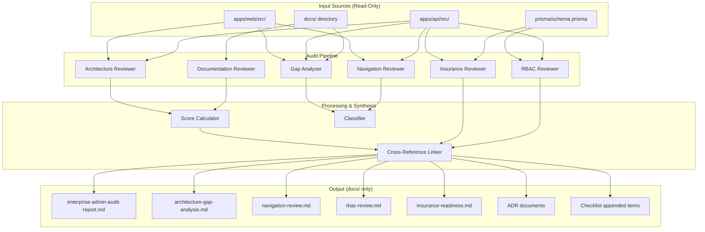

# Design Document: Enterprise Admin Architecture Audit

## Overview

The Enterprise Admin Architecture Audit is a **documentation-only, read-only analysis system** that examines the eLIS codebase and documentation to produce comprehensive audit reports covering architecture compliance, gap analysis, navigation structure, RBAC readiness, and healthcare/insurance readiness.

The system operates as a pipeline of specialized reviewers — each responsible for a specific audit domain — that read source files, analyze patterns, classify findings, and produce structured Markdown reports in the `docs/` directory. No source code modification is permitted.

### Key Design Principles

1. **Read-Only Invariant**: All operations on `apps/` are strictly read-only; output is exclusively to `docs/`
2. **Modular Reviewers**: Each audit domain (Documentation, Architecture, Navigation, Gap, RBAC, Insurance) is an independent reviewer module
3. **Structured Output**: All reports follow enterprise document templates with standard headers, severity classifications, and cross-references
4. **Deterministic Classification**: Findings are classified using well-defined rules (severity, priority, effort) that produce consistent results given the same inputs

## Architecture

The system follows a **Pipeline Architecture** where each stage reads from the source (filesystem) and produces structured intermediate results that feed into the final documentation generation stage.



### System Boundaries

| Boundary | Access Mode | Purpose |
|----------|-------------|---------|
| `apps/api/src/` | READ-ONLY | Analyze backend modules, guards, routes, services |
| `apps/web/src/` | READ-ONLY | Analyze frontend components, routing, state management |
| `apps/api/prisma/` | READ-ONLY | Analyze database schema, models, migrations |
| `docs/` | READ + WRITE | Read existing docs, write audit output |
| `Functiona spec/` | READ-ONLY | Read functional specification documents |

## Components and Interfaces

### 1. File Scanner

Responsible for discovering and reading files from the filesystem.

```typescript
interface FileScanner {
  // Scan directory recursively for files matching extensions
  scanDirectory(path: string, extensions: string[]): FileEntry[];
  
  // Read file content (text-based files only)
  readFileContent(path: string): string;
  
  // List directory structure (for architecture analysis)
  listStructure(path: string, depth: number): DirectoryTree;
}

interface FileEntry {
  path: string;
  extension: string;
  lastModified: Date;
  sizeBytes: number;
}

interface DirectoryTree {
  name: string;
  type: 'file' | 'directory';
  children?: DirectoryTree[];
}
```

### 2. Documentation Reviewer

Analyzes documentation for consistency, cross-references, and implementation gaps.

```typescript
interface DocumentationReviewer {
  // Scan all documentation directories
  scanDocumentation(directories: string[]): DocumentInventory;
  
  // Produce consistency matrix
  buildConsistencyMatrix(inventory: DocumentInventory): ConsistencyMatrix;
  
  // Find inconsistencies between documents
  findInconsistencies(matrix: ConsistencyMatrix): Inconsistency[];
  
  // Check feature coverage across document types
  verifyFeatureCoverage(features: Feature[]): CoverageResult[];
  
  // Identify documentation-implementation gaps
  findImplementationGaps(features: Feature[], sourcePaths: string[]): ImplementationGap[];
}

interface ConsistencyMatrix {
  entries: ConsistencyEntry[];
  totalDocuments: number;
  consistencyPercentage: number;
}

interface ConsistencyEntry {
  filePath: string;
  coverageArea: 'Administration' | 'Settings' | 'Master Data' | 'User Management' | 'Role & Permission' | 'Navigation';
  lastModified: Date;
  status: 'Consistent' | 'Inconsistent' | 'Outdated' | 'Missing';
}

interface Inconsistency {
  sourceDocA: string;
  sourceDocB: string;
  claimA: string;
  claimB: string;
  severity: 'Critical' | 'High' | 'Medium' | 'Low';
  recommendedResolution: string;
}
```

### 3. Architecture Reviewer

Analyzes source code structure against architectural patterns.

```typescript
interface ArchitectureReviewer {
  // Classify folder structure pattern
  classifyStructure(path: string): ArchitectureClassification;
  
  // Check module completeness
  auditModuleCompleteness(modulePath: string): ModuleViolation[];
  
  // Find misplaced shared components
  findArchitecturalViolations(srcPath: string): ArchitecturalViolation[];
  
  // Verify frontend FSD compliance
  verifyFrontendCompliance(webPath: string): FSDComplianceResult;
  
  // Analyze routing
  analyzeRouting(srcPath: string): RoutingAnalysis;
  
  // Analyze state management
  analyzeStateManagement(webPath: string): StateManagementAnalysis;
  
  // Calculate compliance score
  calculateComplianceScore(results: ArchitectureResults): ComplianceScore;
}

type ArchitectureClassification = 'Feature-Based' | 'Layer-Based' | 'Hybrid' | 'Unstructured';

interface ComplianceScore {
  total: number; // 0-100
  categories: {
    folderStructure: number;     // max 25
    moduleIsolation: number;     // max 25
    sharedComponents: number;    // max 20
    routingCorrectness: number;  // max 15
    stateManagement: number;     // max 15
  };
  classification: 'Compliant' | 'Non-Compliant';
  topViolations?: ArchitecturalViolation[];
}
```

### 4. Navigation Reviewer

Analyzes sidebar navigation structure and produces enterprise navigation blueprint.

```typescript
interface NavigationReviewer {
  // Document current sidebar structure
  documentCurrentStructure(webPath: string): SidebarStructure;
  
  // Evaluate against enterprise UX criteria
  evaluateNavigation(structure: SidebarStructure): NavigationEvaluation;
  
  // Produce recommendation (A, B, or C)
  produceRecommendation(evaluation: NavigationEvaluation): NavigationRecommendation;
  
  // Create enterprise navigation blueprint
  createBlueprint(recommendation: NavigationRecommendation): NavigationBlueprint;
  
  // Verify frontend-backend navigation alignment
  verifyAlignment(apiModules: string[], frontendRoutes: string[]): AlignmentGap[];
}

interface NavigationBlueprint {
  domains: NavigationDomain[];
  roleVisibility: Record<string, string[]>; // role -> visible menu items
  routeMapping: Record<string, string>;     // menu item -> route path
}

type NavigationDomain = 'Clinical Operations' | 'Administration' | 'Master Data' | 'System Configuration' | 'Reporting';
```

### 5. Gap Analyzer

Produces comprehensive gap reports across all dimensions.

```typescript
interface GapAnalyzer {
  // Functional gaps
  analyzeFunctionalGaps(docs: DocumentInventory, source: SourceAnalysis): FunctionalGap[];
  
  // Architecture gaps
  analyzeArchitectureGaps(adrs: ADR[], source: SourceAnalysis): ArchitectureGap[];
  
  // Navigation gaps
  analyzeNavigationGaps(sidebar: SidebarStructure, pages: PageInventory): NavigationGap[];
  
  // UX gaps
  analyzeUXGaps(webPath: string): UXGap[];
  
  // Produce summary dashboard
  produceDashboard(gaps: AllGaps): GapDashboard;
}

interface FunctionalGap {
  featureId: string;
  featureName: string;
  expectedBehavior: string;
  currentStatus: 'Not Implemented' | 'Partial' | 'Complete';
  evidence: string;
  rootCause: string;
  recommendation: string;
  priority: 'P1' | 'P2' | 'P3' | 'P4';
}

interface GapDashboard {
  totalGapsByCategory: Record<string, number>;
  gapsBySeverity: Record<string, Record<string, number>>;
  totalRemediationEffort: number; // story points
}
```

### 6. RBAC Reviewer

Analyzes user management and access control implementation.

```typescript
interface RBACReviewer {
  // Document current implementation
  documentCurrentRBAC(apiPath: string, schema: PrismaSchema): RBACImplementation;
  
  // Evaluate against enterprise capabilities
  evaluateCapabilities(current: RBACImplementation): RBACCapabilityGap[];
  
  // Produce recommendation (A, B, or C)
  produceRecommendation(gaps: RBACCapabilityGap[]): RBACRecommendation;
  
  // Generate access matrix
  generateAccessMatrix(endpoints: APIEndpoint[], roles: string[]): AccessMatrix;
  
  // Evaluate approval workflows
  evaluateApprovalWorkflows(current: RBACImplementation): ApprovalWorkflowAssessment[];
  
  // Find unprotected endpoints
  findUnprotectedEndpoints(apiPath: string): SecurityFinding[];
}

type RBACRecommendationOption = 'A-Enhanced-Role' | 'B-Full-RBAC' | 'C-ABAC-Hybrid';
```

### 7. Insurance Reviewer

Verifies healthcare and insurance readiness.

```typescript
interface InsuranceReviewer {
  // Verify schema support
  verifySchemaSupport(schema: PrismaSchema): InsuranceSchemaAssessment;
  
  // Verify billing workflow
  verifyBillingWorkflow(apiPath: string): BillingWorkflowAssessment;
  
  // Verify lab workflow insurance rules
  verifyLabWorkflowRules(apiPath: string): LabInsuranceAssessment;
  
  // Verify payment flow
  verifyPaymentFlow(apiPath: string, schema: PrismaSchema): PaymentFlowAssessment;
  
  // Produce missing capabilities
  produceMissingCapabilities(assessments: AllAssessments): MissingCapability[];
}

interface InsuranceSchemaAssessment {
  hasTypeField: boolean;
  typeDistinguishesBPJS: boolean;
  patientInsuranceRelationship: boolean;
  orderInsuranceRelationship: boolean;
  tariffInsuranceRelationship: boolean;
  findings: Finding[];
}
```

### 8. Documentation Generator

Produces all output documents with standard enterprise formatting.

```typescript
interface DocumentationGenerator {
  // Generate document with standard headers
  generateDocument(content: AuditContent, metadata: DocumentMetadata): string;
  
  // Append to existing checklist
  appendToChecklist(findings: Finding[], checklistPath: string): void;
  
  // Generate cross-reference links
  generateCrossReferences(documents: GeneratedDocument[]): CrossReferenceMap;
  
  // Generate executive summary
  generateExecutiveSummary(allFindings: Finding[]): string;
  
  // Write all output files
  writeOutputFiles(outputs: OutputFile[]): WriteResult;
}

interface DocumentMetadata {
  documentId: string;   // AUDIT-eLIS-[YYYY]-[NNN]
  version: string;      // major.minor
  date: string;         // YYYY-MM-DD
  author: string;
  classification: 'Internal' | 'Confidential' | 'Restricted';
  status: 'Draft' | 'Review' | 'Approved' | 'Superseded';
}

interface OutputFile {
  path: string;       // Must be under docs/
  content: string;
  overwrite: boolean;
}
```

### 9. Score Calculator

Computes compliance scores and metrics.

```typescript
interface ScoreCalculator {
  // Calculate architecture compliance score (0-100)
  calculateArchitectureScore(
    folderCompliance: number,      // items compliant / total, weight 25
    moduleIsolation: number,       // items compliant / total, weight 25
    sharedPlacement: number,       // items compliant / total, weight 20
    routingCorrectness: number,    // items compliant / total, weight 15
    stateManagement: number        // items compliant / total, weight 15
  ): number;
  
  // Calculate documentation consistency percentage
  calculateConsistencyPercentage(
    consistentDocs: number,
    totalDocs: number
  ): number;
  
  // Calculate remediation effort
  calculateRemediationEffort(gaps: Gap[]): number; // story points
}
```

### 10. Classifier

Applies classification rules to findings.

```typescript
interface Classifier {
  // Classify severity
  classifySeverity(finding: RawFinding): 'Critical' | 'High' | 'Medium' | 'Low';
  
  // Classify priority (MoSCoW)
  classifyPriority(finding: RawFinding): 'P1' | 'P2' | 'P3' | 'P4';
  
  // Classify effort
  classifyEffort(finding: RawFinding): 'S' | 'M' | 'L' | 'XL';
  
  // Classify data type for Settings separation
  classifyDataType(feature: SubFeature): 'Master Data' | 'System Settings' | 'User Administration' | 'Operational Configuration';
  
  // Classify architecture pattern
  classifyArchitecturePattern(structure: DirectoryTree): ArchitectureClassification;
}
```

## Data Models

### Core Data Structures

```typescript
// === Finding (universal base for all audit findings) ===
interface Finding {
  id: string;                    // Auto-generated unique ID
  documentId: string;            // Parent document reference
  category: FindingCategory;
  title: string;
  description: string;
  severity: Severity;
  priority: Priority;
  evidence: string;              // File path or observation
  recommendation: string;
  effort: EffortSize;
  status: 'Open' | 'Resolved' | 'Deferred';
}

type FindingCategory = 'Functional' | 'Architecture' | 'Navigation' | 'UX' | 'Security' | 'Insurance';
type Severity = 'Critical' | 'High' | 'Medium' | 'Low';
type Priority = 'P1' | 'P2' | 'P3' | 'P4';
type EffortSize = 'S' | 'M' | 'L' | 'XL';

// === Classification Rules ===
interface ClassificationRule {
  category: FindingCategory;
  severityRules: SeverityRule[];
  priorityRules: PriorityRule[];
}

interface SeverityRule {
  condition: string;             // Description of when this severity applies
  severity: Severity;
}

// === Audit Report Structure ===
interface AuditReport {
  metadata: DocumentMetadata;
  executiveSummary: ExecutiveSummary;
  sections: AuditSection[];
  crossReferences: CrossReference[];
  attestation: NoCodeModificationAttestation;
}

interface ExecutiveSummary {
  totalFindingsBySeverity: Record<Severity, number>;
  topCriticalFindings: Finding[];  // max 5
  immediateActions: string[];
  totalRemediationEffort: number;  // story points
  wordCount: number;               // max 1500
}

// === Module Analysis ===
interface ModuleAnalysis {
  name: string;
  path: string;
  hasController: boolean;
  hasService: boolean;
  hasModule: boolean;
  hasDTOs: boolean;
  hasTests: boolean;
  violations: ModuleViolation[];
}

// === Navigation Model ===
interface SidebarMenuItem {
  name: string;
  routePath: string;
  icon: string;          // Lucide icon name
  parentGroup: string;
  requiredRoles: string[];
  subFeatureCount: number;
  children?: SidebarMenuItem[];
}

// === RBAC Model ===
interface AccessMatrixEntry {
  role: string;
  resource: string;
  endpoint: string;
  httpMethod: string;
  permissions: {
    create: boolean;
    read: boolean;
    update: boolean;
    delete: boolean;
    custom?: Record<string, boolean>;
  };
}

// === Insurance Model ===
interface InsuranceCapability {
  name: string;
  required: boolean;
  implemented: boolean;
  schemaSupport: boolean;
  apiSupport: boolean;
  uiSupport: boolean;
  gap?: string;
}
```

### Output Document Templates

```typescript
// Standard document header (all output docs)
interface DocumentHeader {
  documentId: string;       // AUDIT-eLIS-2026-NNN
  version: string;          // 1.0
  date: string;             // 2026-MM-DD
  author: string;           // Enterprise Architect
  classification: string;   // Internal
  status: string;           // Draft
}

// Cross-reference format
interface CrossReference {
  sourceDocId: string;
  sourceFindingId: string;
  targetDocId: string;
  targetFindingId: string;
  relationship: 'causes' | 'blocks' | 'related-to' | 'resolves';
}
```


## Correctness Properties

*A property is a characteristic or behavior that should hold true across all valid executions of a system — essentially, a formal statement about what the system should do. Properties serve as the bridge between human-readable specifications and machine-verifiable correctness guarantees.*

### Property 1: Document consistency classification follows date rules

*For any* set of documents covering the same area, a document whose last-modified date is more than 90 days before the most recent document in the same coverage area SHALL be classified as "Outdated", and a document referenced by another but not present in the filesystem SHALL be classified as "Missing".

**Validates: Requirements 1.2**

### Property 2: Inconsistency severity classification

*For any* inconsistency between two documents, the severity SHALL be classified as Critical if it contradicts safety/security/data integrity, High if it contradicts core functional behavior, Medium if it contradicts non-functional specification, and Low if it is terminology/formatting only — and the classification SHALL be deterministic given the same inconsistency context.

**Validates: Requirements 1.3**

### Property 3: Feature coverage cross-reference completeness

*For any* feature in the Functional Specification, the coverage check SHALL verify presence in BRD, SRS, Database Design, API Specification, and Frontend Architecture — and any feature absent from at least one document type SHALL be reported as a coverage gap.

**Validates: Requirements 1.4, 1.5**

### Property 4: Consistency percentage calculation

*For any* set of scanned documents where C documents are consistent and T is the total, the consistency percentage SHALL equal (C / T) × 100, and the summary report SHALL list correct totals for documents scanned, inconsistencies per severity, and gaps found.

**Validates: Requirements 1.6**

### Property 5: Architecture compliance score calculation and threshold

*For any* set of compliance measurements across the 5 categories (folder structure weight 25, module isolation weight 25, shared component placement weight 20, routing correctness weight 15, state management weight 15), the total score SHALL equal the sum of (items_compliant / total_items) × category_weight for each category, producing a value between 0 and 100. If the score is below 60, the classification SHALL be "Non-Compliant" and the top 5 violations by category weight impact SHALL be listed.

**Validates: Requirements 2.7, 2.8**

### Property 6: Module completeness violation detection

*For any* feature module in the backend, if it is missing one or more of the required artifacts (controller, service, module, DTOs directory, test files), each missing artifact SHALL be recorded as a "Module Completeness Violation" specifying the module name, missing artifact type, and expected file path.

**Validates: Requirements 2.2**

### Property 7: Shared component placement violation detection

*For any* shared component (guard, interceptor, filter, pipe, decorator) located outside the `common/` directory, the system SHALL record it as an "Architectural Violation" with the current location and recommended location under `common/`.

**Validates: Requirements 2.3**

### Property 8: Route conflict and duplicate detection

*For any* set of route definitions, the system SHALL identify: duplicates (two or more definitions resolving to the same path), conflicting route groups (overlapping parameterized and static segments), and dead routes (definitions with no corresponding page component or handler).

**Validates: Requirements 2.5**

### Property 9: Violation severity classification by score impact

*For any* architectural violation with a known score impact, the severity SHALL be classified as Critical if impact ≥ 5 points, Major if impact is between 2 and 4 points, and Minor if impact is 1 point or less.

**Validates: Requirements 2.9**

### Property 10: Navigation sub-feature capacity threshold

*For any* menu item containing more than 7 sub-features, the Navigation Reviewer SHALL flag it as exceeding single-menu capacity.

**Validates: Requirements 3.2**

### Property 11: Navigation hierarchy constraints

*For any* proposed navigation hierarchy, the structure SHALL have at most 3 levels depth and at most 7 items per level.

**Validates: Requirements 3.4**

### Property 12: Enterprise Navigation Blueprint domain partitioning

*For any* domain assignment of the 14 current sub-features, each sub-feature SHALL be assigned to exactly one domain (Clinical Operations, Administration, Master Data, System Configuration, or Reporting) and all 14 SHALL be covered.

**Validates: Requirements 3.5**

### Property 13: Backend-frontend navigation alignment gap detection

*For any* set of backend API modules and frontend navigation entries, modules without a corresponding frontend navigation path SHALL be listed as gaps.

**Validates: Requirements 3.6**

### Property 14: Gap effort size classification

*For any* gap with an estimated remediation effort in story points, the effort SHALL be classified as S if ≤ 2, M if 3–5, L if 6–13, and XL if ≥ 14.

**Validates: Requirements 4.2**

### Property 15: MoSCoW priority assignment

*For any* identified gap, the priority SHALL be assigned as P1 if it blocks production use or causes data integrity failure, P2 if it degrades core workflow, P3 if it improves usability but has a workaround, and P4 if deferred with no current impact.

**Validates: Requirements 4.5**

### Property 16: Gap dashboard aggregation correctness

*For any* set of gaps across categories (Functional, Architecture, Navigation, UX), the Gap Summary Dashboard SHALL produce correct totals per category, correct counts per severity within each category, and a total remediation effort equal to the sum of all individual gap story point estimates.

**Validates: Requirements 4.6**

### Property 17: Gap analysis module scope filtering

*For any* finding produced by the Gap Analyzer, it SHALL belong to the Administration, Master Data, or Settings modules only — findings from other modules SHALL be excluded.

**Validates: Requirements 4.7**

### Property 18: Access matrix completeness

*For any* set of API endpoints and the 11 defined roles, the generated Access Matrix SHALL contain exactly one entry per role-resource-action combination, with no duplicates and no missing combinations.

**Validates: Requirements 5.4**

### Property 19: Unguarded endpoint detection and classification

*For any* API endpoint lacking a @UseGuards(JwtAuthGuard, RolesGuard) decorator or explicit @Roles assignment, the system SHALL classify the finding as Critical severity and document the endpoint path, HTTP method, containing module, and recommended minimum role restriction.

**Validates: Requirements 5.6, 5.7**

### Property 20: Output path safety invariant

*For any* file written by the Documentation Generator, its path SHALL be within the `docs/` directory and SHALL NOT be under `apps/api/src/`, `apps/web/src/`, `apps/`, `deploy/`, or root configuration paths.

**Validates: Requirements 8.7, 9.7**

### Property 21: Document header completeness

*For any* document produced by the Documentation Generator, it SHALL contain all required header fields: Document ID (format `AUDIT-eLIS-[YYYY]-[NNN]`), Version (format major.minor), Date (format YYYY-MM-DD), Author, Classification (Internal|Confidential|Restricted), and Status (Draft|Review|Approved|Superseded).

**Validates: Requirements 8.4**

### Property 22: Severity label consistency

*For any* recommendation in any output document, the severity label SHALL be one of exactly four values: Critical, High, Medium, or Low.

**Validates: Requirements 8.5**

### Property 23: Executive brief word count constraint

*For any* generated Executive Summary Brief, the total word count SHALL NOT exceed 1500 words.

**Validates: Requirements 8.6**

### Property 24: Checklist append-only invariant

*For any* append operation to the Implementation Readiness Checklist, all original checklist items SHALL be preserved unchanged, and each new item SHALL be prefixed with the audit Document ID for traceability.

**Validates: Requirements 8.3**

### Property 25: Cross-reference link format

*For any* cross-reference link in generated documents, it SHALL use the format `[Document ID]#[Finding ID]` ensuring traceability between related findings.

**Validates: Requirements 8.8**

### Property 26: ADR template completeness

*For any* Architecture Decision Record produced by the system, it SHALL contain all required sections: Context, Problem, Alternative, Pros, Cons, Selected, Consequence, and Future Consideration.

**Validates: Requirements 7.2**

### Property 27: Proposed Change structure for code modifications

*For any* recommendation that requires source code modification, it SHALL be documented as a "Proposed Change" containing: file path, current code reference, proposed change description, and risk assessment with severity and affected components — without the change being applied.

**Validates: Requirements 9.5**

### Property 28: Sub-feature data governance classification

*For any* sub-feature currently under "Pengaturan" (Settings), it SHALL be classified into exactly one of: Master Data (reference data referenced by 2+ modules, changed < 1x/month), System Settings (key-value config), User Administration, or Operational Configuration — with Master Data entities (Doctors, Clinics, Insurance, Equipment, Reagents, Sample Types, Measurement Units, Test Categories, Lab Tests, Panels) always assigned to "Master Data" domain.

**Validates: Requirements 10.1, 10.3**

### Property 29: Module boundary map partitioning

*For any* backend service, it SHALL be assigned to exactly one bounded context ("Master Data", "Settings", or "User Administration"), and any service importing across bounded context boundaries SHALL be identified as a violation with a proposed interface contract.

**Validates: Requirements 10.5**

### Property 30: Version increment on file overwrite

*For any* existing output file that is overwritten, the Version number in the document header SHALL be incremented from the previous version value.

**Validates: Requirements 8.2**

## Error Handling

### File System Errors

| Error Scenario | Handling Strategy |
|---|---|
| File not found during scan | Log warning, mark as "Missing" in consistency matrix, continue scan |
| Permission denied on read | Log error, skip file, include in report as "Inaccessible" |
| Malformed Markdown/code file | Attempt partial parsing, log parse errors, include what was extractable |
| Binary file encountered | Skip silently (only process text-based files) |
| Directory not found | Log warning, mark all expected files as "Missing", continue |

### Classification Errors

| Error Scenario | Handling Strategy |
|---|---|
| Ambiguous severity classification | Default to higher severity, log the ambiguity for manual review |
| Cannot determine architecture pattern | Classify as "Unstructured", note reason |
| Feature name not matchable between docs and code | Use fuzzy matching with confidence threshold (≥ 0.8), flag uncertain matches |
| Circular module dependencies detected | Record all participants in the cycle, classify as Critical violation |

### Output Errors

| Error Scenario | Handling Strategy |
|---|---|
| Cannot write to docs/ directory | Fail with clear error message, no partial writes |
| Output exceeds executive brief word limit | Truncate least-severe findings first, add "[truncated]" marker |
| Cross-reference target not found | Include reference with "[unresolved]" suffix, log warning |
| Existing checklist file corrupt/unparseable | Create backup, start fresh section with clear delimiter |

### Safety Guards

1. **Path validation**: Every output path is validated against allowlist (`docs/` only) before any write operation
2. **Read-only enforcement**: File operations on `apps/` use read-only file handles; no write handle is ever opened
3. **Atomic writes**: Output files are written atomically (write to temp → rename) to prevent partial documents
4. **Idempotency**: Running the audit twice produces the same output (version increment aside)

## Testing Strategy

### Property-Based Testing

This feature is suitable for property-based testing because:
- Classification logic (severity, priority, effort, architecture pattern, data type) involves pure functions mapping inputs to outputs across large input spaces
- Score calculations are pure arithmetic with clear invariants
- Structural validation (document headers, navigation constraints, cross-references) can be universally verified
- Filtering/partitioning operations have clear set-theoretic properties

**Library**: fast-check (TypeScript)
**Configuration**: Minimum 100 iterations per property test

Each property test SHALL be tagged with:
```
// Feature: enterprise-admin-architecture-audit, Property {N}: {title}
```

### Unit Testing (Example-Based)

Unit tests cover specific scenarios not suited to property testing:

| Component | Test Cases |
|---|---|
| Navigation recommendation (A/B/C) | 3 specific evaluation scenarios producing each option |
| RBAC recommendation selection | 3 scenarios with varying gap counts |
| Approval workflow evaluation | 4 specific workflow scenarios |
| Insurance schema verification | Known schema with/without required fields |
| ADR generation | Template with all sections populated |
| Migration path generation | Complete phase structure verification |

### Integration Testing

Integration tests verify I/O-dependent operations:

| Test | Scope |
|---|---|
| File scanning | Verify correct directories scanned with correct extensions |
| Prisma schema parsing | Verify model/field extraction from real schema |
| Source code analysis | Verify module detection in actual `apps/api/src/` structure |
| Sidebar structure extraction | Verify navigation config parsed from `apps/web/src/` |
| Read-only enforcement | Verify no writes occur to protected directories |
| Output file generation | Verify files created in correct locations with correct format |

### Smoke Tests

| Test | Verification |
|---|---|
| Full pipeline execution | Runs without error on actual codebase, produces all expected output files |
| No source modification | After full run, `git status` shows no changes in `apps/` |
| Output directory structure | All 5 expected files exist in `docs/17-Audit/` after run |

### Test Organization

```
tests/
├── property/                    # Property-based tests (fast-check)
│   ├── classifier.property.spec.ts
│   ├── score-calculator.property.spec.ts
│   ├── document-generator.property.spec.ts
│   ├── navigation-constraints.property.spec.ts
│   ├── gap-analyzer.property.spec.ts
│   └── output-safety.property.spec.ts
├── unit/                        # Example-based unit tests
│   ├── documentation-reviewer.spec.ts
│   ├── architecture-reviewer.spec.ts
│   ├── navigation-reviewer.spec.ts
│   ├── rbac-reviewer.spec.ts
│   ├── insurance-reviewer.spec.ts
│   └── documentation-generator.spec.ts
└── integration/                 # Integration tests
    ├── file-scanner.integration.spec.ts
    ├── pipeline.integration.spec.ts
    └── read-only-enforcement.integration.spec.ts
```
