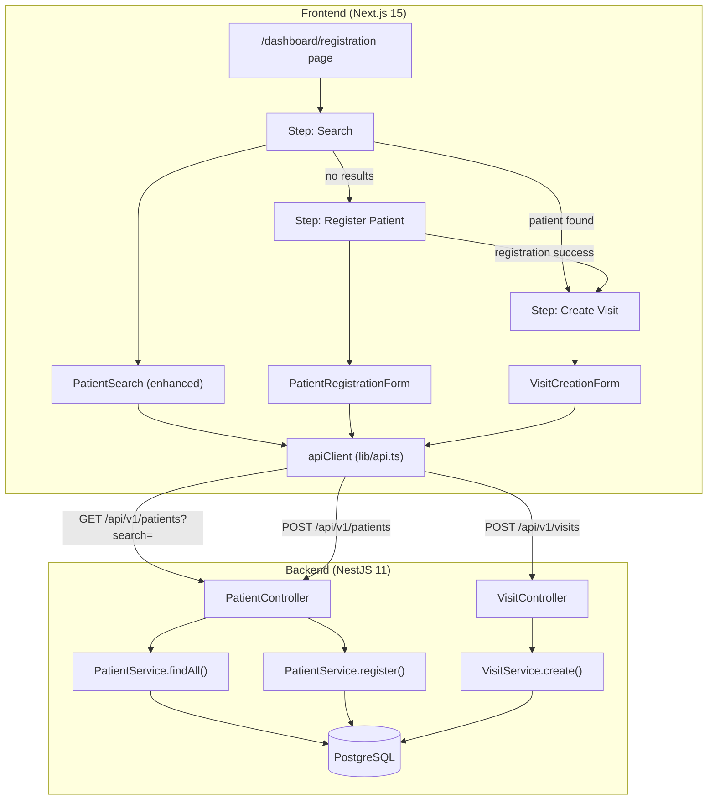
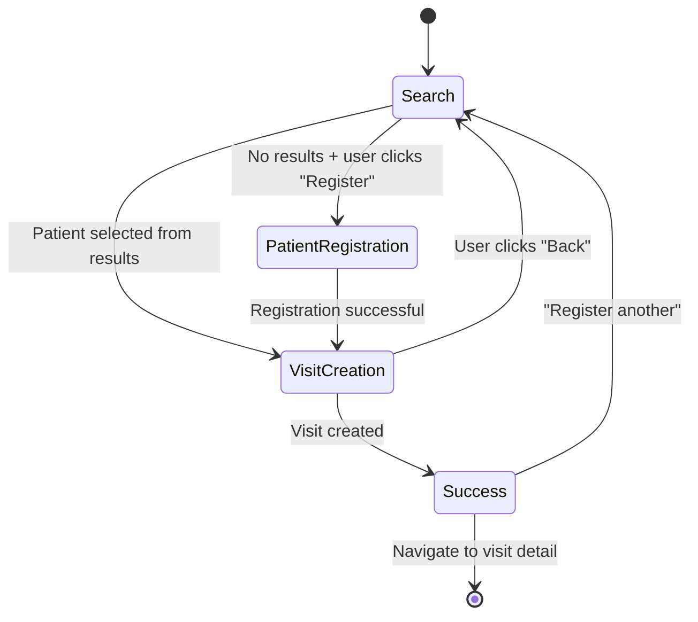

# Design Document: Enterprise Registration Workflow

## Overview

This feature refactors the patient registration and visit creation flow into a unified, search-first workflow. The current system has separate entry points: a "Daftarkan Pasien" button on the patients page and a standalone visit creation page (`/dashboard/visits/new`). This design consolidates them into a single step-based workflow accessible at `/dashboard/registration` that enforces a search-first pattern to prevent duplicate patient records.

**Key Design Decisions:**

1. **Search-first enforcement** — Users must search before the registration form appears, reducing accidental duplicates.
2. **Minimal backend change** — Only the `PatientService.findAll()` method needs modification to add phone and email to the search OR clause. All visit creation and patient registration logic already exists.
3. **Step-based UI** — A linear workflow (Search → Register if needed → Create Visit) with a visual step indicator, reusing existing components where possible (`SearchableDropdown`, form patterns from the existing visit page).
4. **Frontend state machine** — Workflow state is managed via React `useState` with clear transitions between steps.

## Architecture



### Workflow State Machine



## Components and Interfaces

### Backend Changes

#### 1. Enhanced Patient Search — `PatientService.findAll()`

**Current implementation** searches by: name (case-insensitive), NIK (contains), MRN (case-insensitive).

**New implementation** adds: phone (contains), email (case-insensitive contains).

```typescript
// PatientService.findAll() — updated WHERE clause
if (query.search) {
  const searchConditions: any[] = [
    { name: { contains: query.search, mode: 'insensitive' } },
    { mrn: { contains: query.search, mode: 'insensitive' } },
    { phone: { contains: query.search } },
    { email: { contains: query.search, mode: 'insensitive' } },
  ];

  // NIK: exact-prefix match (digits only)
  if (/^\d+$/.test(query.search)) {
    searchConditions.push({ nik: { startsWith: query.search } });
  }

  where.OR = searchConditions;
}
```

**Rationale for NIK change:** The requirements specify exact-prefix match for NIK (digits only). The current implementation uses `contains` which is too broad for a 16-digit national ID. Prefix matching is safer — staff type the beginning of a NIK they're looking at on a physical ID card.

#### 2. No other backend changes required

Visit creation (`VisitService.create()`) and patient registration (`PatientService.register()`) already implement all validation logic defined in Requirements 4, 5, and 6.

### Frontend Components

#### 1. `RegistrationWorkflowPage` — Main orchestrator

**Path:** `apps/web/src/app/dashboard/registration/page.tsx`

```typescript
interface WorkflowState {
  currentStep: 'search' | 'register' | 'visit-creation';
  searchQuery: string;
  searchResults: PatientOption[];
  searchExecuted: boolean;
  selectedPatient: PatientOption | null;
  createdVisit: { id: string; visitNumber: string } | null;
}
```

Responsibilities:
- Manages workflow state transitions
- Renders step indicator
- Conditionally renders the active step component
- Handles "back" navigation with state reset

#### 2. `WorkflowStepIndicator` — Visual step tracker

**Path:** `apps/web/src/components/registration/WorkflowStepIndicator.tsx`

Props:
```typescript
interface WorkflowStepIndicatorProps {
  currentStep: 'search' | 'register' | 'visit-creation';
  completedSteps: ('search' | 'register')[];
}
```

Renders a horizontal 3-step indicator with labels in Indonesian: "Cari Pasien" → "Daftar Pasien" → "Buat Kunjungan".

#### 3. `PatientSearchStep` — Enhanced search step

**Path:** `apps/web/src/components/registration/PatientSearchStep.tsx`

Reuses the search logic from `PatientSearch.tsx` but with enhanced display:
- Shows results in a card list (not dropdown)
- Each result shows: name, MRN, NIK, date of birth, gender, phone
- "Register new patient" button appears only when search returns 0 results
- Minimum 2 characters to search, 300ms debounce

#### 4. `PatientRegistrationStep` — Inline registration form

**Path:** `apps/web/src/components/registration/PatientRegistrationStep.tsx`

Required fields: NIK, name, date of birth, gender.
Optional fields: phone, email, address, region selectors.

On success: automatically advances to visit creation with the new patient data.

#### 5. `VisitCreationStep` — Visit form

**Path:** `apps/web/src/components/registration/VisitCreationStep.tsx`

Displays selected patient info as read-only header. Reuses payment method selection, BPJS number input, insurance dropdown, doctor dropdown, and clinic dropdown from the existing `visits/new/page.tsx`.

## Data Models

### Patient Search Request

```typescript
// GET /api/v1/patients?search=<query>&limit=20
interface PatientSearchQuery {
  search: string;    // min 2 chars, max 100 chars
  page?: number;     // default 1
  limit?: number;    // default 20, max 50
  sortBy?: string;   // default 'createdAt'
  sortOrder?: 'asc' | 'desc'; // default 'desc'
}
```

### Patient Search Response

```typescript
interface PatientSearchResult {
  id: string;        // UUID
  mrn: string;       // e.g., "MRN-202507-0001"
  nik: string;       // 16 digits
  name: string;
  dateOfBirth: string; // ISO date
  gender: 'MALE' | 'FEMALE';
  phone: string | null;
  email: string | null;
}
```

### Visit Creation Request

```typescript
// POST /api/v1/visits
interface CreateVisitPayload {
  patientId: string;                        // UUID, required
  paymentMethod: 'CASH' | 'BPJS' | 'INSURANCE'; // required
  doctorId?: string;                        // UUID, optional
  clinicId?: string;                        // UUID, optional
  bpjsNumber?: string;                     // 13 digits, required if BPJS
  insuranceId?: string;                    // UUID, required if INSURANCE
}
```

### Visit Creation Response

```typescript
interface CreateVisitResponse {
  success: true;
  message: string;
  data: {
    id: string;
    visitNumber: string;   // "VST-YYYYMM-XXXX"
    status: 'REGISTERED';
    patientId: string;
    paymentMethod: string;
    registrationDate: string;
    // ... additional fields
  };
}
```

### Workflow UI State

```typescript
type WorkflowStep = 'search' | 'register' | 'visit-creation';

interface RegistrationWorkflowState {
  currentStep: WorkflowStep;
  searchQuery: string;
  searchResults: PatientSearchResult[];
  searchExecuted: boolean;
  selectedPatient: PatientSearchResult | null;
  createdVisit: { id: string; visitNumber: string } | null;
  isSubmitting: boolean;
  error: string | null;
}
```


## Correctness Properties

*A property is a characteristic or behavior that should hold true across all valid executions of a system — essentially, a formal statement about what the system should do. Properties serve as the bridge between human-readable specifications and machine-verifiable correctness guarantees.*

### Property 1: Patient search correctness

*For any* set of patient records and *for any* search query of 2 or more characters, the search function SHALL return only patients where:
- The query is a case-insensitive substring of the MRN, OR
- The query (if composed entirely of digits) is a prefix of the NIK, OR
- The query is a case-insensitive substring of the name, OR
- The query is a substring of the phone, OR
- The query is a case-insensitive substring of the email

And no patient that fails all of the above conditions SHALL appear in the results.

**Validates: Requirements 1.1, 1.2, 1.3, 1.4, 1.5, 1.6**

### Property 2: Short query guard

*For any* search query of fewer than 2 characters (including empty string), the search function SHALL return an empty result array regardless of the patient dataset.

**Validates: Requirements 1.7, 2.3**

### Property 3: Soft-delete exclusion invariant

*For any* search query and *for any* patient dataset containing soft-deleted records (deletedAt is not null), no soft-deleted patient SHALL ever appear in the search results.

**Validates: Requirements 1.9**

### Property 4: Patient registration produces valid MRN

*For any* valid patient registration input (NIK is exactly 16 numeric digits, name is between 1 and 200 characters, date of birth is a valid past date, gender is MALE or FEMALE), the registration function SHALL produce a patient record with a non-empty, unique MRN string.

**Validates: Requirements 4.3**

### Property 5: BPJS number validation

*For any* visit creation request with payment method BPJS, the request SHALL be accepted if and only if the bpjsNumber field consists of exactly 13 numeric digit characters. Any string that is not exactly 13 digits SHALL be rejected with a validation error.

**Validates: Requirements 6.2, 6.5**

### Property 6: Visit number format and initial status

*For any* successfully created visit, the generated visit number SHALL match the pattern `VST-YYYYMM-XXXX` (where YYYY is a 4-digit year, MM is a 2-digit month, XXXX is a zero-padded sequential number from 0001 to 9999), and the initial status SHALL be REGISTERED.

**Validates: Requirements 6.7**

### Property 7: Workflow state machine transitions

*For any* workflow state:
- The registration form SHALL only be accessible when `searchExecuted` is true AND `searchResults` is empty.
- Advancing from search to visit-creation SHALL only occur when a patient is selected (selectedPatient is not null).
- Navigating back from visit-creation to search SHALL result in `selectedPatient` being null and all form fields reset to defaults.

**Validates: Requirements 5.1, 7.2, 7.3**

## Error Handling

### Backend Error Responses

All errors follow the standard eLIS error envelope:

```typescript
{
  success: false,
  errorCode: string,    // e.g., "ERR_VALIDATION", "ERR_NOT_FOUND"
  message: string,      // Human-readable description
  errors?: Array<{ field: string; message: string }>,  // Field-level errors
  traceId: string       // For debugging
}
```

| Scenario | HTTP Status | Error Code | Message |
|----------|-------------|------------|---------|
| Search query < 2 chars | 200 (empty) | — | Returns empty array |
| Patient not found (visit creation) | 404 | ERR_NOT_FOUND | "Patient not found" |
| NIK already registered | 400 | ERR_VALIDATION | "NIK already registered" |
| BPJS number invalid | 400 | ERR_VALIDATION | "BPJS number must be exactly 13 digits" |
| Insurance provider not found | 400 | ERR_VALIDATION | "Insurance not found or inactive" |
| MRN generation conflict | 500 | ERR_INTERNAL | "MRN generation conflict, please retry" |

### Frontend Error Handling

| Error Type | UI Behavior |
|------------|-------------|
| Validation errors (400) | Inline error messages next to relevant fields |
| Not found (404) | Banner message at top of form section |
| Network error (timeout/offline) | Dismissible toast notification in Indonesian, form state preserved, retry button |
| Server error (500) | Dismissible error notification with retry action |
| Submission timeout (>30s) | Re-enable submit button, show timeout error |

### Retry Strategy

- Network errors: User-initiated retry (button click)
- No automatic retries to avoid duplicate submissions
- Form state always preserved across errors
- 30-second timeout on all API requests

## Testing Strategy

### Unit Tests (Example-Based)

Unit tests cover specific scenarios, edge cases, and UI behavior:

**Backend:**
- Patient search with various query types (name, NIK prefix, phone, email, MRN)
- NIK uniqueness rejection
- Visit creation with invalid patient ID
- BPJS number format edge cases (12 digits, 14 digits, non-numeric)
- Insurance provider reference validation

**Frontend:**
- Initial workflow state renders search step
- Step indicator highlights correct step
- Selecting a patient transitions to visit creation
- Back button resets state
- Form validation messages appear inline
- Loading state disables submit button
- Success state renders visit number
- Unsaved data confirmation dialog

### Property-Based Tests (fast-check)

Property-based testing is appropriate for this feature because:
1. The patient search logic is a pure filter function with a large input space (any query × any patient dataset)
2. Validation functions (BPJS, NIK) have clear universal rules
3. The workflow state machine has invariants that must hold for all transition sequences

**Library:** `fast-check` (already in project dependencies)

**Configuration:**
- Minimum 100 iterations per property
- Each property test tagged with: `Feature: enterprise-registration-workflow, Property {N}: {title}`

**Properties to implement:**

1. **Property 1: Patient search correctness** — Generate random patient arrays and random query strings. Verify all returned patients match at least one field rule, and no non-matching patient is returned.

2. **Property 2: Short query guard** — Generate random strings of length 0-1. Verify the search function always returns empty.

3. **Property 3: Soft-delete exclusion** — Generate patient arrays where some have `deletedAt` set. Verify no deleted patient appears in results for any query.

4. **Property 4: Patient registration valid MRN** — Generate valid registration inputs. Verify output always contains a valid, non-empty MRN.

5. **Property 5: BPJS validation** — Generate random strings. Verify that `validateBpjsNumber()` accepts if and only if the string is exactly 13 digits.

6. **Property 6: Visit number format** — Generate valid visit creation scenarios. Verify output visit numbers match the regex `/^VST-\d{6}-\d{4}$/` and status is `REGISTERED`.

7. **Property 7: Workflow state transitions** — Generate random sequences of workflow actions. Verify state machine invariants hold after every transition.

### Integration Tests

- End-to-end workflow: search → select → create visit
- End-to-end workflow: search → no results → register → create visit
- Patient search with phone/email (new search fields)
- Concurrent MRN generation (SERIALIZABLE isolation)
