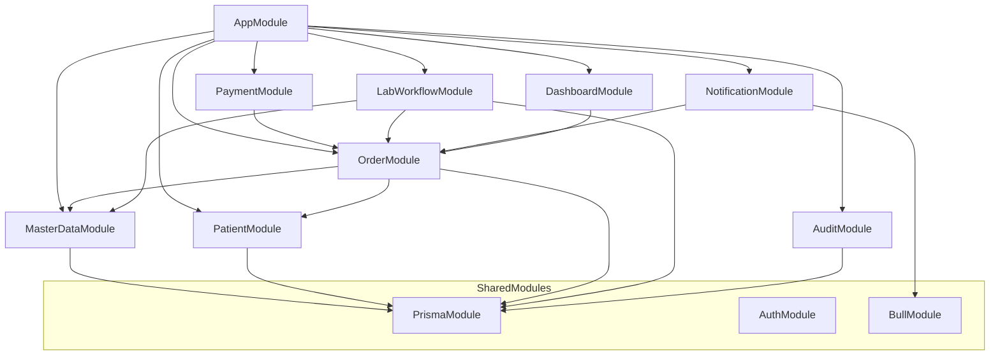
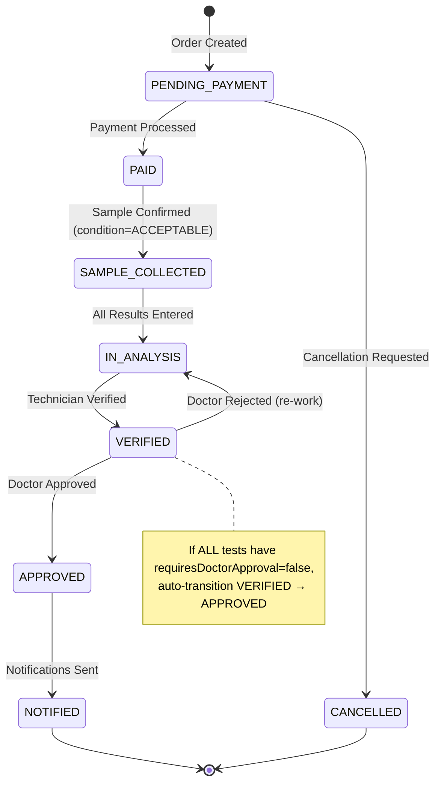
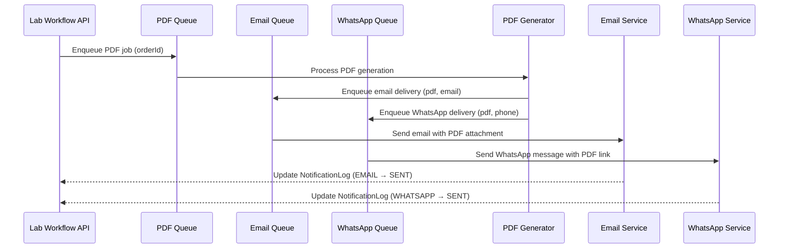

# Design Document: Laboratory Management Module

## Overview

The Laboratory Management module is the core operational module of eLIS, covering the complete lab workflow from test master data configuration through order creation, payment, sample collection, result entry with auto-flagging, verification, doctor approval, and automated notification delivery.

### Design Goals

- **Incremental Delivery**: Module is structured for phased implementation (Master Data → Patients → Orders → Lab Workflow → Notifications)
- **State Machine Integrity**: Order lifecycle transitions are guarded to prevent invalid states
- **Auditability**: Every mutation is logged via Prisma middleware
- **Performance**: Async processing via BullMQ for PDF generation and notifications
- **Correctness**: Auto-flagging algorithm is deterministic and property-testable
- **Race Condition Safety**: MRN and order number generation use database sequences

### Module Boundaries

| Module | Responsibility |
|--------|---------------|
| `MasterDataModule` | Test, Category, Panel, Reference Value, Tariff CRUD |
| `PatientModule` | Patient registration, MRN generation, search |
| `OrderModule` | Order creation, billing calculation, cancellation |
| `PaymentModule` | Payment processing, barcode generation, invoicing |
| `LabWorkflowModule` | Sample collection, result entry, verification, approval |
| `NotificationModule` | PDF generation, Email/WhatsApp delivery via BullMQ |
| `DashboardModule` | Operational metrics, queue counts, TAT calculation |
| `AuditModule` | Audit log query API (write is handled by middleware) |


## Architecture

### High-Level Module Dependency Graph



### Backend Directory Structure

```
apps/api/src/
├── laboratory/
│   ├── laboratory.module.ts          # Umbrella module
│   ├── master-data/
│   │   ├── master-data.module.ts
│   │   ├── master-data.controller.ts
│   │   ├── master-data.service.ts
│   │   ├── dto/
│   │   └── tests/
│   ├── patient/
│   │   ├── patient.module.ts
│   │   ├── patient.controller.ts
│   │   ├── patient.service.ts
│   │   ├── mrn-generator.service.ts
│   │   ├── dto/
│   │   └── tests/
│   ├── order/
│   │   ├── order.module.ts
│   │   ├── order.controller.ts
│   │   ├── order.service.ts
│   │   ├── tariff-resolver.service.ts
│   │   ├── dto/
│   │   └── tests/
│   ├── payment/
│   │   ├── payment.module.ts
│   │   ├── payment.controller.ts
│   │   ├── payment.service.ts
│   │   ├── barcode.service.ts
│   │   ├── dto/
│   │   └── tests/
│   ├── lab-workflow/
│   │   ├── lab-workflow.module.ts
│   │   ├── lab-workflow.controller.ts
│   │   ├── lab-workflow.service.ts
│   │   ├── auto-flagging.service.ts
│   │   ├── order-state-machine.service.ts
│   │   ├── dto/
│   │   └── tests/
│   ├── notification/
│   │   ├── notification.module.ts
│   │   ├── notification.service.ts
│   │   ├── pdf-generator.service.ts
│   │   ├── email.service.ts
│   │   ├── whatsapp.service.ts
│   │   ├── notification.processor.ts
│   │   └── tests/
│   ├── dashboard/
│   │   ├── dashboard.module.ts
│   │   ├── dashboard.controller.ts
│   │   ├── dashboard.service.ts
│   │   └── tests/
│   └── audit/
│       ├── audit.module.ts
│       ├── audit.controller.ts
│       ├── audit.service.ts
│       ├── audit-log.middleware.ts
│       └── tests/
```

### Order Lifecycle State Machine



#### State Transition Guards

| From | To | Guard Condition |
|------|----|----------------|
| PENDING_PAYMENT | PAID | Valid payment received (amount ≥ totalAmount) |
| PENDING_PAYMENT | CANCELLED | Reason provided, user has KASIR/ADMIN/SUPER_ADMIN role |
| PAID | SAMPLE_COLLECTED | sampleCondition === 'ACCEPTABLE', valid barcode |
| SAMPLE_COLLECTED | IN_ANALYSIS | All Order_Detail items have resultValue entered |
| IN_ANALYSIS | VERIFIED | Explicit verification action by ANALIS/ADMIN |
| VERIFIED | APPROVED | Doctor decision === 'APPROVE' OR all tests skip approval |
| VERIFIED | IN_ANALYSIS | Doctor decision === 'REJECT' with rejectionReason |
| APPROVED | NOTIFIED | All notifications sent or patient has no consent |

## Components and Interfaces

### OrderStateMachineService

Central service enforcing valid transitions. All status changes MUST go through this service.

```typescript
interface OrderStateMachineService {
  transition(orderId: string, toStatus: OrderStatus, context: TransitionContext): Promise<Order>;
  canTransition(currentStatus: OrderStatus, toStatus: OrderStatus): boolean;
  getValidTransitions(currentStatus: OrderStatus): OrderStatus[];
}

interface TransitionContext {
  userId: string;
  reason?: string;
  metadata?: Record<string, unknown>;
}
```

### TariffResolverService

Implements the priority-based tariff lookup algorithm.

```typescript
interface TariffResolverService {
  resolvePrice(testId: string, clinicId?: string, insuranceId?: string): Promise<TariffResult>;
  resolveOrderTotal(testIds: string[], clinicId?: string, insuranceId?: string): Promise<OrderPricing>;
}

interface TariffResult {
  basePrice: number;
  discount: number;
  finalPrice: number;
  tariffId: string;
  resolution: 'SPECIFIC' | 'CLINIC_ONLY' | 'INSURANCE_ONLY' | 'DEFAULT';
}

interface OrderPricing {
  items: Array<{ testId: string; tariff: TariffResult }>;
  subtotal: number;
  totalDiscount: number;
  totalAmount: number;
}
```

### AutoFlaggingService

Deterministic algorithm comparing results against reference values.

```typescript
interface AutoFlaggingService {
  calculateFlag(resultValue: number, testId: string, patientAge: number, patientGender: Gender): Promise<Flag>;
  calculateFlags(results: ResultEntry[], patientAge: number, patientGender: Gender): Promise<FlagResult[]>;
}

type Flag = 'NORMAL' | 'LOW' | 'HIGH' | 'CRITICAL';

interface FlagResult {
  orderDetailId: string;
  flag: Flag;
  referenceMin: number;
  referenceMax: number;
  criticalMin?: number;
  criticalMax?: number;
}
```

### MrnGeneratorService

Race-condition-safe MRN generation using PostgreSQL sequences.

```typescript
interface MrnGeneratorService {
  generateMrn(): Promise<string>; // Returns "RM-YYYYMM-XXXX"
}
```

**Implementation Strategy**: Use a PostgreSQL sequence `mrn_seq_YYYYMM` per month. On first call in a new month, create the sequence. Use `nextval()` in a transaction to guarantee uniqueness under concurrency.

### BarcodeService

Code-128 barcode generation for sample tracking.

```typescript
interface BarcodeService {
  generate(orderId: string, orderNumber: string): Promise<BarcodeResult>;
  getBarcode(orderId: string): Promise<string>; // base64 PNG
}

interface BarcodeResult {
  orderId: string;
  barcodeData: string;  // encoded value
  barcodeImage: string; // base64 PNG
}
```

### NotificationProcessor (BullMQ)

```typescript
interface NotificationJob {
  orderId: string;
  type: 'EMAIL' | 'WHATSAPP';
  recipientEmail?: string;
  recipientPhone?: string;
  pdfBuffer?: Buffer;
  attempt: number;
}

// Queue names
const QUEUES = {
  PDF_GENERATION: 'lab-pdf-generation',
  EMAIL_DELIVERY: 'lab-email-delivery',
  WHATSAPP_DELIVERY: 'lab-whatsapp-delivery',
};
```

## Data Models

### Full Prisma Schema Extension

The following models extend the existing schema (`User`, `AuditLog`, `Role` enum already exist).

```prisma
// === ENUMS ===

enum Gender {
  MALE
  FEMALE
}

enum OrderStatus {
  PENDING_PAYMENT
  PAID
  SAMPLE_COLLECTED
  IN_ANALYSIS
  VERIFIED
  APPROVED
  NOTIFIED
  CANCELLED
}

enum OrderDetailStatus {
  PENDING
  RESULT_ENTERED
  VERIFIED
  APPROVED
}

enum Flag {
  NORMAL
  LOW
  HIGH
  CRITICAL
}

enum PaymentMethod {
  CASH
  TRANSFER
  INSURANCE
}

enum SampleCondition {
  ACCEPTABLE
  LIPEMIC
  HEMOLYTIC
  CLOTTED
  INSUFFICIENT
}

enum NotificationStatus {
  PENDING
  SENT
  FAILED
}

enum NotificationType {
  EMAIL
  WHATSAPP
}

// === MASTER DATA ===

model TestCategory {
  id          String    @id @default(uuid()) @db.Uuid
  name        String    @unique
  description String?
  isActive    Boolean   @default(true)
  createdAt   DateTime  @default(now())
  updatedAt   DateTime  @updatedAt
  deletedAt   DateTime?

  tests TestMaster[]

  @@map("test_categories")
}

model TestMaster {
  id                    String    @id @default(uuid()) @db.Uuid
  code                  String    @unique
  name                  String
  categoryId            String    @db.Uuid
  unit                  String?
  method                String?
  sampleType            String?
  price                 Decimal   @db.Decimal(12, 2)
  requiresDoctorApproval Boolean  @default(true)
  isActive              Boolean   @default(true)
  createdAt             DateTime  @default(now())
  updatedAt             DateTime  @updatedAt
  deletedAt             DateTime?

  category        TestCategory     @relation(fields: [categoryId], references: [id])
  referenceValues ReferenceValue[]
  tariffs         Tariff[]
  panelTests      PanelTest[]
  orderDetails    OrderDetail[]

  @@map("test_masters")
}

model ReferenceValue {
  id          String  @id @default(uuid()) @db.Uuid
  testId      String  @db.Uuid
  gender      Gender
  minAge      Int     @default(0)
  maxAge      Int     @default(150)
  minRef      Decimal @db.Decimal(10, 4)
  maxRef      Decimal @db.Decimal(10, 4)
  criticalMin Decimal? @db.Decimal(10, 4)
  criticalMax Decimal? @db.Decimal(10, 4)
  createdAt   DateTime @default(now())
  updatedAt   DateTime @updatedAt

  test TestMaster @relation(fields: [testId], references: [id])

  @@unique([testId, gender, minAge, maxAge])
  @@map("reference_values")
}

model Panel {
  id          String    @id @default(uuid()) @db.Uuid
  name        String    @unique
  description String?
  price       Decimal   @db.Decimal(12, 2)
  isActive    Boolean   @default(true)
  createdAt   DateTime  @default(now())
  updatedAt   DateTime  @updatedAt
  deletedAt   DateTime?

  panelTests PanelTest[]

  @@map("panels")
}

model PanelTest {
  id       String @id @default(uuid()) @db.Uuid
  panelId  String @db.Uuid
  testId   String @db.Uuid

  panel Panel      @relation(fields: [panelId], references: [id])
  test  TestMaster @relation(fields: [testId], references: [id])

  @@unique([panelId, testId])
  @@map("panel_tests")
}

model Tariff {
  id           String   @id @default(uuid()) @db.Uuid
  testId       String   @db.Uuid
  clinicId     String?  @db.Uuid
  insuranceId  String?  @db.Uuid
  price        Decimal  @db.Decimal(12, 2)
  discount     Decimal  @default(0) @db.Decimal(5, 2) // percentage 0-100
  createdAt    DateTime @default(now())
  updatedAt    DateTime @updatedAt

  test TestMaster @relation(fields: [testId], references: [id])

  @@unique([testId, clinicId, insuranceId])
  @@map("tariffs")
}

// === PATIENT ===

model Patient {
  id          String    @id @default(uuid()) @db.Uuid
  mrn         String    @unique
  nik         String    @unique
  name        String
  dateOfBirth DateTime  @db.Date
  gender      Gender
  phone       String?
  address     String?
  email       String?
  consentDigitalNotification Boolean @default(false)
  createdAt   DateTime  @default(now())
  updatedAt   DateTime  @updatedAt
  deletedAt   DateTime?

  orders Order[]

  @@map("patients")
}

// === ORDER ===

model Order {
  id            String        @id @default(uuid()) @db.Uuid
  orderNumber   String        @unique
  patientId     String        @db.Uuid
  clinicId      String?       @db.Uuid
  doctorId      String?       @db.Uuid
  insuranceId   String?       @db.Uuid
  status        OrderStatus   @default(PENDING_PAYMENT)
  totalAmount   Decimal       @db.Decimal(12, 2)
  paymentMethod PaymentMethod?
  amountPaid    Decimal?      @db.Decimal(12, 2)
  paidAt        DateTime?
  barcode       String?
  barcodeImage  String?       // base64 PNG stored
  sampleCollectedAt DateTime?
  sampleCollectedBy String?   @db.Uuid
  sampleCondition   SampleCondition?
  rejectionReason   String?
  verifiedAt    DateTime?
  verifiedBy    String?       @db.Uuid
  verificationNotes String?
  approvedAt    DateTime?
  approvedBy    String?       @db.Uuid
  interpretation String?      // doctor clinical notes
  rejectedReason String?      // if doctor rejects
  cancelledAt   DateTime?
  cancelledBy   String?       @db.Uuid
  cancelReason  String?
  createdAt     DateTime      @default(now())
  updatedAt     DateTime      @updatedAt

  patient      Patient       @relation(fields: [patientId], references: [id])
  orderDetails OrderDetail[]
  notifications NotificationLog[]

  @@index([status])
  @@index([patientId])
  @@index([createdAt])
  @@map("orders")
}

model OrderDetail {
  id            String            @id @default(uuid()) @db.Uuid
  orderId       String            @db.Uuid
  testId        String            @db.Uuid
  status        OrderDetailStatus @default(PENDING)
  resultValue   String?
  flag          Flag?
  comment       String?
  price         Decimal           @db.Decimal(12, 2)
  discount      Decimal           @default(0) @db.Decimal(5, 2)
  finalPrice    Decimal           @db.Decimal(12, 2)
  resultEnteredAt DateTime?
  resultEnteredBy String?         @db.Uuid
  createdAt     DateTime          @default(now())
  updatedAt     DateTime          @updatedAt

  order Order      @relation(fields: [orderId], references: [id])
  test  TestMaster @relation(fields: [testId], references: [id])

  @@index([orderId])
  @@map("order_details")
}

// === NOTIFICATION ===

model NotificationLog {
  id         String             @id @default(uuid()) @db.Uuid
  orderId    String             @db.Uuid
  type       NotificationType
  recipient  String
  status     NotificationStatus @default(PENDING)
  attempts   Int                @default(0)
  lastError  String?
  sentAt     DateTime?
  createdAt  DateTime           @default(now())
  updatedAt  DateTime           @updatedAt

  order Order @relation(fields: [orderId], references: [id])

  @@index([orderId])
  @@map("notification_logs")
}

// === SEQUENCE TABLE (for MRN) ===

model MrnSequence {
  id        String @id // format: "YYYYMM" e.g. "202507"
  lastValue Int    @default(0)

  @@map("mrn_sequences")
}
```

### Key Design Decisions

1. **Soft deletes** on TestMaster, Panel, Patient — preserves referential integrity for historical orders
2. **Decimal type** for monetary values — avoids floating-point precision issues
3. **Composite unique** on Tariff (testId, clinicId, insuranceId) — ensures one price per combination
4. **Reference values scoped** by gender + age range with unique constraint — prevents duplicate ranges
5. **Order stores denormalized** barcode/payment/sample data — avoids excessive joins for the queue view
6. **MRN sequence table** — enables atomic increment in a transaction, safer than application-level counting
7. **NotificationLog** — tracks delivery attempts separately from order status

## API Design

### Master Data Endpoints

| Method | Path | Roles | Description |
|--------|------|-------|-------------|
| GET | `/api/v1/master/test-categories` | All authenticated | List categories (paginated) |
| POST | `/api/v1/master/test-categories` | ADMIN, SUPER_ADMIN | Create category |
| PUT | `/api/v1/master/test-categories/:id` | ADMIN, SUPER_ADMIN | Update category |
| DELETE | `/api/v1/master/test-categories/:id` | ADMIN, SUPER_ADMIN | Soft-delete category |
| GET | `/api/v1/master/tests` | All authenticated | List tests (paginated, filterable) |
| POST | `/api/v1/master/tests` | ADMIN, SUPER_ADMIN | Create test |
| PUT | `/api/v1/master/tests/:id` | ADMIN, SUPER_ADMIN | Update test |
| DELETE | `/api/v1/master/tests/:id` | ADMIN, SUPER_ADMIN | Soft-delete test |
| GET | `/api/v1/master/panels` | All authenticated | List panels |
| POST | `/api/v1/master/panels` | ADMIN, SUPER_ADMIN | Create panel |
| PUT | `/api/v1/master/panels/:id` | ADMIN, SUPER_ADMIN | Update panel |
| DELETE | `/api/v1/master/panels/:id` | ADMIN, SUPER_ADMIN | Soft-delete panel |
| GET | `/api/v1/master/tariffs` | ADMIN, SUPER_ADMIN | List tariffs |
| POST | `/api/v1/master/tariffs` | ADMIN, SUPER_ADMIN | Create tariff |
| PUT | `/api/v1/master/tariffs/:id` | ADMIN, SUPER_ADMIN | Update tariff |
| DELETE | `/api/v1/master/tariffs/:id` | ADMIN, SUPER_ADMIN | Delete tariff |

### Patient Endpoints

| Method | Path | Roles | Description |
|--------|------|-------|-------------|
| POST | `/api/v1/patients` | KASIR, CS, ADMIN, KLINIK_PARTNER | Register patient |
| GET | `/api/v1/patients` | All authenticated | Search patients (paginated) |
| GET | `/api/v1/patients/:id` | All authenticated | Get patient detail |
| PUT | `/api/v1/patients/:id` | KASIR, CS, ADMIN | Update patient (MRN immutable) |

### Order Endpoints

| Method | Path | Roles | Description |
|--------|------|-------|-------------|
| POST | `/api/v1/orders` | KASIR, ADMIN, KLINIK_PARTNER | Create order |
| GET | `/api/v1/orders` | All authenticated | List orders (paginated, filterable) |
| GET | `/api/v1/orders/:id` | All authenticated | Get order detail |
| POST | `/api/v1/orders/:id/pay` | KASIR, ADMIN | Process payment |
| POST | `/api/v1/orders/:id/cancel` | KASIR, ADMIN, SUPER_ADMIN | Cancel order |
| GET | `/api/v1/orders/:id/barcode` | All authenticated | Get barcode image |
| GET | `/api/v1/orders/:id/invoice` | All authenticated | Get invoice detail |

### Lab Workflow Endpoints

| Method | Path | Roles | Description |
|--------|------|-------|-------------|
| GET | `/api/v1/lab/queue` | SAMPLING, ANALIS, DOKTER, ADMIN | Get lab queue |
| POST | `/api/v1/lab/:orderId/sample` | SAMPLING, ADMIN | Confirm sample collection |
| PUT | `/api/v1/lab/:orderId/results` | ANALIS, ADMIN | Enter/update results |
| GET | `/api/v1/lab/:orderId/delta-check` | ANALIS, DOKTER, ADMIN | Get historical results |
| POST | `/api/v1/lab/:orderId/verify` | ANALIS, ADMIN | Verify results |
| GET | `/api/v1/lab/approval-queue` | DOKTER, SUPER_ADMIN | List orders awaiting approval |
| POST | `/api/v1/lab/:orderId/approve` | DOKTER, SUPER_ADMIN | Approve/reject results |

### Dashboard Endpoints

| Method | Path | Roles | Description |
|--------|------|-------|-------------|
| GET | `/api/v1/dashboard/lab-summary` | OWNER, MANAGER, ADMIN, SUPER_ADMIN | Today's metrics |
| GET | `/api/v1/dashboard/lab-volume` | OWNER, MANAGER, ADMIN, SUPER_ADMIN | Volume over time |

### Audit Endpoints

| Method | Path | Roles | Description |
|--------|------|-------|-------------|
| GET | `/api/v1/audit-logs` | ADMIN, SUPER_ADMIN | Query audit logs |

### Request/Response Shapes

#### Create Order Request
```json
{
  "patientId": "uuid",
  "clinicId": "uuid | null",
  "doctorId": "uuid | null",
  "insuranceId": "uuid | null",
  "testIds": ["uuid", "uuid"]
}
```

#### Create Order Response
```json
{
  "success": true,
  "message": "Success",
  "data": {
    "id": "uuid",
    "orderNumber": "LAB-20250703-0001",
    "patientId": "uuid",
    "status": "PENDING_PAYMENT",
    "totalAmount": 350000,
    "orderDetails": [
      { "id": "uuid", "testId": "uuid", "testName": "CBC", "price": 150000, "discount": 0, "finalPrice": 150000 },
      { "id": "uuid", "testId": "uuid", "testName": "Lipid Panel", "price": 200000, "discount": 0, "finalPrice": 200000 }
    ],
    "createdAt": "2025-07-03T10:00:00Z"
  }
}
```

#### Enter Results Request
```json
{
  "results": [
    { "orderDetailId": "uuid", "resultValue": "12.5", "comment": "Slightly elevated" },
    { "orderDetailId": "uuid", "resultValue": "POSITIVE", "comment": null }
  ]
}
```

#### Enter Results Response
```json
{
  "success": true,
  "message": "Success",
  "data": {
    "orderId": "uuid",
    "status": "IN_ANALYSIS",
    "results": [
      { "orderDetailId": "uuid", "resultValue": "12.5", "flag": "HIGH", "referenceMin": 4.0, "referenceMax": 11.0 },
      { "orderDetailId": "uuid", "resultValue": "POSITIVE", "flag": null, "referenceMin": null, "referenceMax": null }
    ]
  }
}
```

#### Payment Request
```json
{
  "paymentMethod": "CASH",
  "amountPaid": 350000,
  "notes": "Paid in full"
}
```

#### Approve/Reject Request
```json
{
  "decision": "APPROVE",
  "interpretation": "All values within expected range for patient profile.",
  "rejectionReason": null
}
```

## Algorithm Design

### Auto-Flagging Algorithm

The auto-flagging algorithm is a pure function: given a numeric result value and a resolved reference range (considering patient age/gender), it deterministically produces a flag.

```
Algorithm: calculateFlag(resultValue, referenceValue)

Input:
  - resultValue: number
  - ref: { minRef, maxRef, criticalMin?, criticalMax? }

Output: Flag

Steps:
  1. IF criticalMin is defined AND resultValue < criticalMin → CRITICAL
  2. IF criticalMax is defined AND resultValue > criticalMax → CRITICAL
  3. IF resultValue < minRef → LOW
  4. IF resultValue > maxRef → HIGH
  5. ELSE → NORMAL

Priority: CRITICAL checks run first (critical is a subset of low/high).
```

**Reference Value Resolution**:
```
resolveReference(testId, patientAge, patientGender):
  1. Query ReferenceValue WHERE testId = testId
     AND gender IN (patientGender, 'ALL')
     AND minAge <= patientAge
     AND maxAge >= patientAge
  2. Prefer gender-specific match over 'ALL'
  3. If no match found, return null (qualitative test — no flag assigned)
```

### Tariff Resolution Algorithm

Priority-based pricing lookup with fallback chain:

```
Algorithm: resolvePrice(testId, clinicId, insuranceId)

Input:
  - testId: string (required)
  - clinicId: string | null
  - insuranceId: string | null

Output: TariffResult

Steps:
  1. Query Tariff WHERE testId = testId AND clinicId = clinicId AND insuranceId = insuranceId
     → If found: resolution = 'SPECIFIC'
  2. Query Tariff WHERE testId = testId AND clinicId = clinicId AND insuranceId IS NULL
     → If found: resolution = 'CLINIC_ONLY'
  3. Query Tariff WHERE testId = testId AND clinicId IS NULL AND insuranceId = insuranceId
     → If found: resolution = 'INSURANCE_ONLY'
  4. Query Tariff WHERE testId = testId AND clinicId IS NULL AND insuranceId IS NULL
     → If found: resolution = 'DEFAULT'
  5. If no tariff found at any level: use TestMaster.price as default, discount = 0

Final price calculation:
  finalPrice = price * (1 - discount / 100)
```

### MRN Generation Algorithm

```
Algorithm: generateMrn()

Uses: PostgreSQL advisory lock + upsert for concurrency safety

Steps:
  1. Calculate monthKey = format(now(), 'YYYYMM')  // e.g. "202507"
  2. BEGIN TRANSACTION with SERIALIZABLE isolation
  3. UPSERT into mrn_sequences (id = monthKey, lastValue = lastValue + 1)
     ON CONFLICT (id) DO UPDATE SET lastValue = lastValue + 1
     RETURNING lastValue
  4. COMMIT
  5. Return "RM-{monthKey}-{padStart(lastValue, 4, '0')}"
```

### Barcode Generation

- **Format**: Code-128 (compact, supports alphanumeric)
- **Content**: Order number (e.g., `LAB-20250703-0001`)
- **Library**: `bwip-js` (pure JavaScript, no native dependencies)
- **Output**: PNG image, base64 encoded, stored in Order.barcodeImage
- **Resolution**: 300 DPI for print-quality labels

## Notification Architecture

### BullMQ Queue Design



### Queue Configuration

| Queue | Concurrency | Max Retries | Backoff | TTL |
|-------|-------------|-------------|---------|-----|
| `lab-pdf-generation` | 3 | 3 | Exponential (1s, 2s, 4s) | 5 min |
| `lab-email-delivery` | 5 | 3 | Exponential (2s, 4s, 8s) | 10 min |
| `lab-whatsapp-delivery` | 2 | 3 | Exponential (5s, 10s, 20s) | 10 min |

### Notification Flow Logic

1. Order reaches APPROVED status
2. Check `patient.consentDigitalNotification`:
   - If `false`: skip all notifications, order stays APPROVED
   - If `true`: continue
3. Generate PDF report
4. If patient has email → enqueue email job
5. If patient has valid phone (starts with `62` or `08`) → enqueue WhatsApp job
6. When all enqueued notifications reach SENT or FAILED (after max retries):
   - If at least one SENT → transition order to NOTIFIED
   - If all FAILED → order stays APPROVED, log failure

## Error Handling

### Standard Error Codes

| Error Code | HTTP Status | Description |
|------------|-------------|-------------|
| `ERR_VALIDATION` | 400 | Input validation failed (class-validator) |
| `ERR_INVALID_STATE` | 400 | Order is not in the required status for this action |
| `ERR_REFERENCE_CONFLICT` | 400 | Cannot delete entity with active references |
| `ERR_DUPLICATE_NIK` | 400 | Patient NIK already exists |
| `ERR_DUPLICATE_CODE` | 400 | Test code already exists |
| `ERR_DUPLICATE_TARIFF` | 400 | Tariff combination already exists |
| `ERR_NOT_FOUND` | 404 | Requested entity does not exist |
| `ERR_UNAUTHORIZED` | 401 | Missing or invalid JWT token |
| `ERR_FORBIDDEN` | 403 | User role does not have permission |
| `ERR_INTERNAL` | 500 | Unexpected server error |

### Error Response Shape

All errors follow the existing `ErrorEnvelope` pattern:

```json
{
  "success": false,
  "errorCode": "ERR_INVALID_STATE",
  "message": "Order must be in PENDING_PAYMENT status to be cancelled",
  "errors": [
    { "field": "status", "constraint": "Current status is PAID, expected PENDING_PAYMENT" }
  ],
  "traceId": "550e8400-e29b-41d4-a716-446655440000"
}
```

### State Machine Error Handling

The `OrderStateMachineService` throws a custom `InvalidStateTransitionException` (extending `BadRequestException`) with:
- Current status
- Attempted target status
- Valid transitions from current status

This provides clear feedback to API consumers about what actions are available.

## Correctness Properties

*A property is a characteristic or behavior that should hold true across all valid executions of a system — essentially, a formal statement about what the system should do. Properties serve as the bridge between human-readable specifications and machine-verifiable correctness guarantees.*

### Property 1: Auto-Flagging Determinism

*For any* numeric result value and *for any* reference range (minRef, maxRef, criticalMin, criticalMax) where criticalMin ≤ minRef and criticalMax ≥ maxRef, the auto-flagging function SHALL produce exactly one flag according to: CRITICAL if value < criticalMin or value > criticalMax, LOW if value < minRef, HIGH if value > maxRef, otherwise NORMAL.

**Validates: Requirements 7.2, 7.3, 7.4, 7.5, 7.6**

### Property 2: State Machine Transition Validity

*For any* order status S and *for any* attempted transition to status T, the transition SHALL succeed if and only if (S, T) is in the set of valid transitions {(PENDING_PAYMENT, PAID), (PENDING_PAYMENT, CANCELLED), (PAID, SAMPLE_COLLECTED), (SAMPLE_COLLECTED, IN_ANALYSIS), (IN_ANALYSIS, VERIFIED), (VERIFIED, APPROVED), (VERIFIED, IN_ANALYSIS), (APPROVED, NOTIFIED)}. All other (S, T) combinations SHALL be rejected with ERR_INVALID_STATE.

**Validates: Requirements 5.3, 6.3, 9.4, 10.4, 12.3**

### Property 3: Tariff Resolution Priority

*For any* test with multiple tariff records at different specificity levels, the tariff resolver SHALL always return the most specific match: specific (clinic+insurance) takes priority over clinic-only, which takes priority over insurance-only, which takes priority over default.

**Validates: Requirements 2.4**

### Property 4: Order Total Equals Sum of Parts

*For any* set of test IDs with resolved tariffs, the order totalAmount SHALL equal the sum of all individual OrderDetail finalPrice values (where finalPrice = tariffPrice × (1 - discount/100)).

**Validates: Requirements 4.3**

### Property 5: Order Creation Invariants

*For any* valid order creation request with N test IDs (N ≥ 1), the created order SHALL have status PENDING_PAYMENT, SHALL have exactly N OrderDetail records, and each OrderDetail SHALL have status PENDING.

**Validates: Requirements 4.2, 4.6**

### Property 6: NIK Validation

*For any* string S, the NIK validator SHALL accept S if and only if S consists of exactly 16 characters and every character is a numeric digit (0-9).

**Validates: Requirements 3.2**

### Property 7: MRN Format Invariant

*For any* successfully generated MRN, the value SHALL match the pattern `RM-YYYYMM-XXXX` where YYYYMM is a valid year-month and XXXX is a zero-padded number ≥ 0001, and no two patients SHALL share the same MRN.

**Validates: Requirements 3.4**

### Property 8: Discount Range Validation

*For any* numeric value V submitted as a tariff discount, the validator SHALL accept V if and only if 0 ≤ V ≤ 100.

**Validates: Requirements 2.6**

### Property 9: Non-Acceptable Sample Preserves Status

*For any* sample condition that is not ACCEPTABLE (i.e., LIPEMIC, HEMOLYTIC, CLOTTED, or INSUFFICIENT), confirming sample collection SHALL leave the order in PAID status and record a rejectionReason.

**Validates: Requirements 6.4**

### Property 10: Verification Requires Complete Results

*For any* order where at least one OrderDetail has a null resultValue, the verification action SHALL be rejected.

**Validates: Requirements 9.2**

### Property 11: All Results Entered Triggers Transition

*For any* order in SAMPLE_COLLECTED status, entering the last remaining result (such that all OrderDetail items now have resultValue) SHALL transition the order to IN_ANALYSIS.

**Validates: Requirements 7.7**

### Property 12: Auto-Approval When No Doctor Required

*For any* order where ALL associated Test_Master records have requiresDoctorApproval = false, completing verification SHALL automatically transition the order from VERIFIED to APPROVED without requiring an explicit doctor approval action.

**Validates: Requirements 10.5**

### Property 13: WhatsApp Phone Validation

*For any* phone number string, the notification service SHALL consider it valid for WhatsApp delivery if and only if it starts with "62" or "08".

**Validates: Requirements 11.3**

### Property 14: Delta Check Bounded Results

*For any* patient/test combination with N historical results (N ≥ 0), the delta check endpoint SHALL return at most 5 results, ordered by date descending.

**Validates: Requirements 8.2**

### Property 15: TAT Calculation Correctness

*For any* completed order with both sampleCollectedAt and approvedAt timestamps, the calculated TAT (Turnaround Time) SHALL equal approvedAt minus sampleCollectedAt, expressed in minutes.

**Validates: Requirements 14.2**

### Property 16: Audit Log Sensitive Field Exclusion

*For any* audit log record created from an entity mutation, the oldValues and newValues JSON fields SHALL never contain the key "passwordHash" or any other designated sensitive field.

**Validates: Requirements 13.2**

### Property 17: Audit Log Creation on Tracked Entities

*For any* Create, Update, or Delete operation on Order, OrderDetail, or Patient entities, exactly one audit_log record SHALL be created containing the correct userId, action, entityName, entityId, and timestamp.

**Validates: Requirements 13.1**

## Testing Strategy

### Testing Stack

- **Unit Tests**: Jest (already configured)
- **Property-Based Tests**: fast-check (already in devDependencies)
- **Integration Tests**: Jest + Supertest + Prisma test database
- **E2E Tests**: Jest + Supertest (existing `test/` directory)

### Property-Based Testing Configuration

- **Library**: `fast-check` v4.8.0 (already installed)
- **Minimum iterations**: 100 per property test
- **File naming**: `*.property.spec.ts`
- **Tag format**: Comment at top of each test referencing the property:
  ```typescript
  // Feature: laboratory-management, Property 1: Auto-Flagging Determinism
  ```

### Test Distribution by Component

| Component | Unit Tests | Property Tests | Integration Tests |
|-----------|-----------|---------------|-------------------|
| AutoFlaggingService | Edge cases | Properties 1 | — |
| OrderStateMachineService | Happy paths | Property 2 | — |
| TariffResolverService | Examples | Property 3, 4 | DB lookup |
| MrnGeneratorService | Format check | Property 7 | Concurrency |
| OrderService | Creation flow | Properties 5 | Full flow |
| PatientService | Validation | Properties 6, 8 | Registration |
| LabWorkflowService | Transitions | Properties 9, 10, 11, 12 | Full workflow |
| NotificationService | Delivery logic | Property 13 | Queue processing |
| DeltaCheckService | Query shape | Property 14 | Historical data |
| DashboardService | Metrics | Property 15 | Aggregation |
| AuditLogMiddleware | Logging | Properties 16, 17 | Prisma middleware |

### Unit Test Strategy

Unit tests focus on:
- **Specific examples**: Happy path for each endpoint
- **Edge cases**: Empty arrays, null values, boundary conditions
- **Error conditions**: Invalid state transitions, missing required fields
- **RBAC enforcement**: Each role tested for access/denial

### Integration Test Strategy

Integration tests verify:
- **Database operations**: CRUD with Prisma + test PostgreSQL
- **API endpoints**: Request/response shapes via Supertest
- **Audit logging**: Middleware creates records on mutations
- **Notification queue**: BullMQ job enqueuing
- **Concurrency**: MRN generation under parallel requests

### Implementation Phases

Testing follows the same phased implementation:

1. **Phase A**: Master Data + Patient (Properties 6, 7, 8, 16, 17)
2. **Phase B**: Orders + Payment + Tariff (Properties 3, 4, 5)
3. **Phase C**: Lab Workflow (Properties 1, 2, 9, 10, 11, 12)
4. **Phase D**: Notifications + Dashboard (Properties 13, 14, 15)

