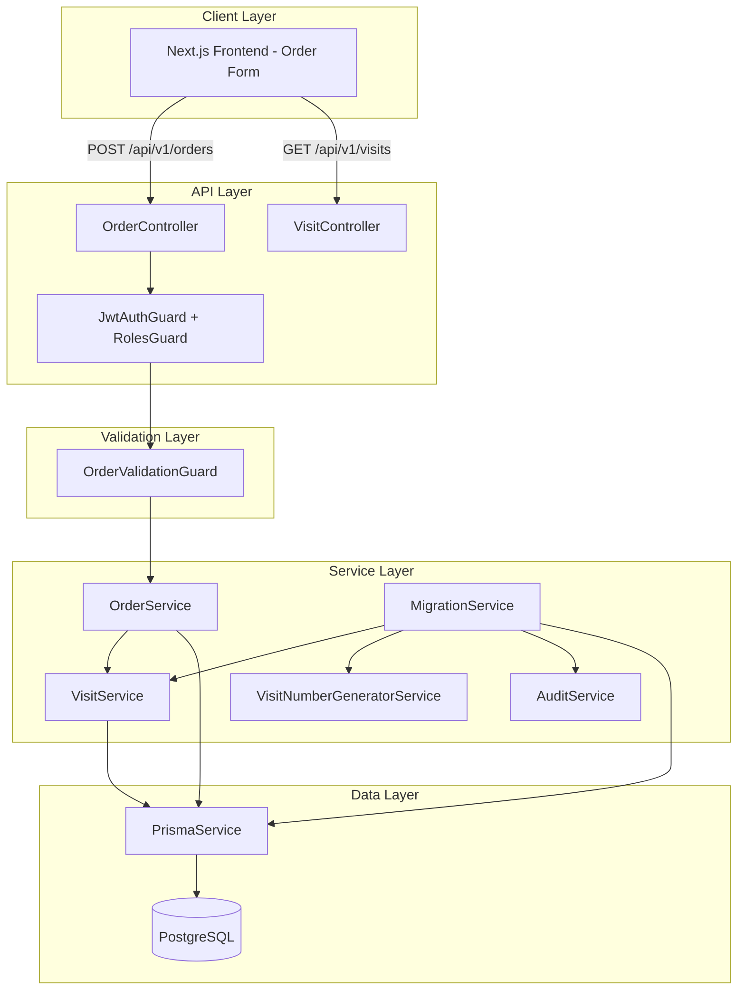
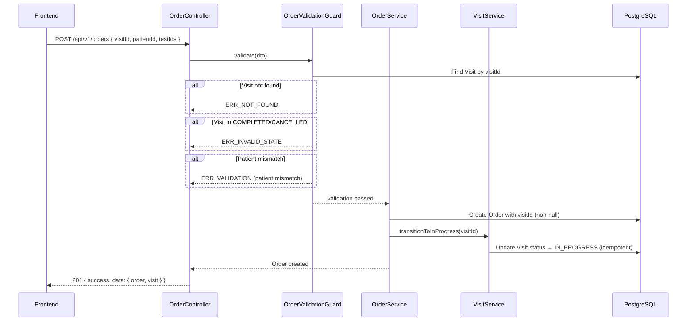
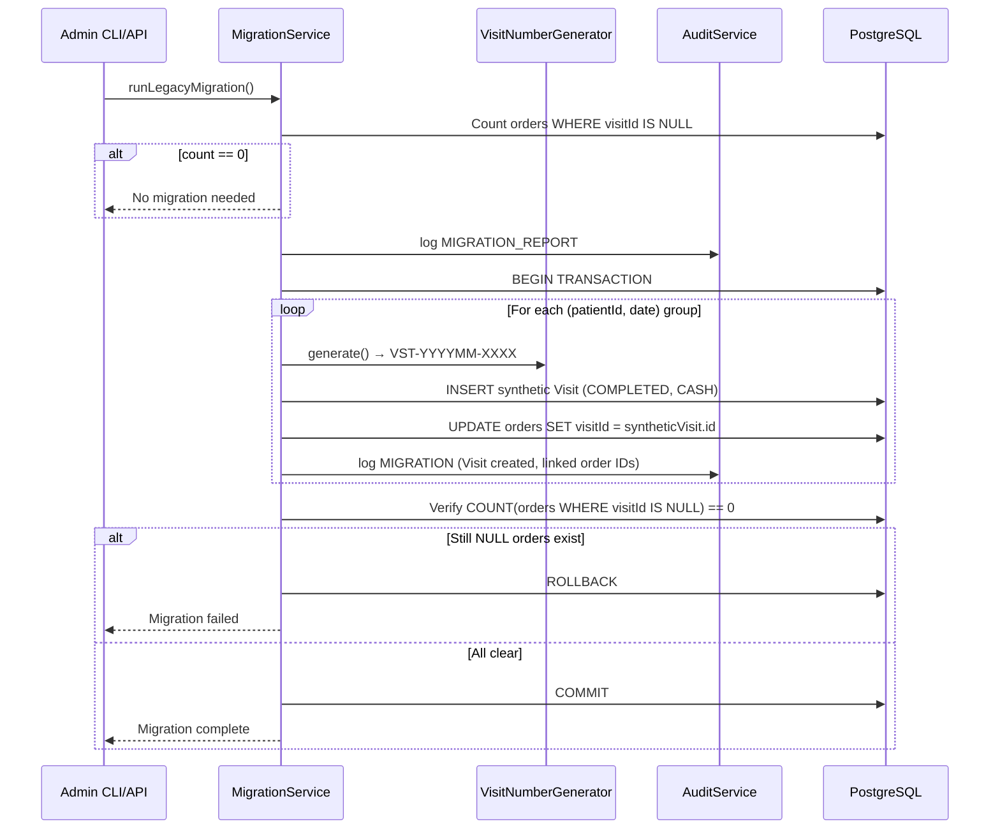
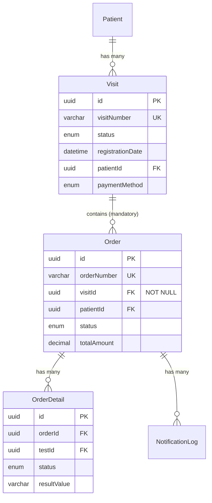

# Design Document: Laboratory Workflow Refactor — Mandatory Visit Linkage

## Overview

This refactoring enforces a mandatory Visit reference on every Order in the eLIS system. The current system allows orders to be created without a Visit (`Order.visitId` is nullable). After this refactoring, the complete traceability chain **Patient → Visit → Order → Sample → Result → Verification → Approval** will be guaranteed at the database, API, service, and frontend layers.

### Key Design Decisions

1. **Centralized Validation Guard** — A single `OrderValidationGuard` class encapsulates all Visit-related checks (presence, format, existence, status, patient match) and is invoked as the first step in every order creation path. This prevents bypass via internal service calls or batch operations.
2. **Two-Phase Migration** — Data migration (legacy orders → synthetic visits) runs as a separate, auditable step before the schema migration (nullable → non-nullable). This ensures zero NULL visitId values exist before the NOT NULL constraint is applied.
3. **Synthetic Visit Strategy** — Legacy orders are grouped by `(patientId, date(createdAt))` and each group gets a single synthetic Visit with status COMPLETED, preserving referential integrity without creating false "in-progress" state.
4. **Backward-Compatible Query Layer** — GET endpoints continue to return `visitId: null` for historical orders that haven't been migrated yet, transitioning to guaranteed non-null after full migration.
5. **Frontend Visit-First Flow** — The order creation form forces visit selection before test selection, with inline visit creation as a convenience path to prevent workflow friction.
6. **Existing Patterns Reused** — VisitNumberGeneratorService's SERIALIZABLE transaction pattern is reused for synthetic visit number generation during migration.

## Architecture



### Order Creation Sequence (Post-Refactor)



### Migration Sequence



## Components and Interfaces

### OrderValidationGuard (New)

```typescript
// apps/api/src/laboratory/order/order-validation.guard.ts
@Injectable()
export class OrderValidationGuard {
  constructor(private readonly prisma: PrismaService) {}

  /**
   * Validates visit linkage for order creation.
   * Executes checks in sequence:
   *   1. visitId presence and UUID format
   *   2. Visit existence
   *   3. Visit status is REGISTERED or IN_PROGRESS
   *   4. Visit.patientId matches Order.patientId
   *
   * Throws appropriate NestJS exceptions on failure.
   */
  async validate(visitId: string, patientId: string): Promise<void> {}
}
```

### MigrationService (New)

```typescript
// apps/api/src/laboratory/order/migration.service.ts
@Injectable()
export class MigrationService {
  constructor(
    private readonly prisma: PrismaService,
    private readonly visitNumberGenerator: VisitNumberGeneratorService,
    private readonly auditService: AuditService,
  ) {}

  /**
   * Identifies legacy orders with NULL visitId, creates synthetic visits,
   * and links orders. Runs within a single transaction.
   */
  async runLegacyMigration(userId: string): Promise<MigrationReport> {}

  /**
   * Returns a report of how many orders need migration, grouped by patient-date.
   */
  async getMigrationReport(): Promise<MigrationReport> {}
}

interface MigrationReport {
  totalAffectedOrders: number;
  distinctPatientDateGroups: number;
  syntheticVisitsCreated: number;
  ordersMigrated: number;
  status: 'SUCCESS' | 'FAILED' | 'NOT_NEEDED';
}
```

### Updated OrderService

```typescript
// Changes to existing OrderService.create()
@Injectable()
export class OrderService {
  constructor(
    private readonly prisma: PrismaService,
    private readonly tariffResolver: TariffResolverService,
    private readonly visitService: VisitService,
    private readonly orderValidationGuard: OrderValidationGuard, // NEW
  ) {}

  async create(dto: CreateOrderDto, userId: string) {
    // Step 1: Centralized visit validation (FIRST)
    await this.orderValidationGuard.validate(dto.visitId, dto.patientId);

    // Step 2: Validate patient, tests, pricing (existing logic)
    // Step 3: Create order with non-null visitId
    // Step 4: Transition visit to IN_PROGRESS
  }
}
```

### Updated CreateOrderDto

```typescript
export class CreateOrderDto {
  @IsUUID()
  visitId: string; // NOW REQUIRED (was @IsOptional())

  @IsUUID()
  patientId: string;

  @IsUUID()
  @IsOptional()
  clinicId?: string;

  @IsUUID()
  @IsOptional()
  doctorId?: string;

  @IsUUID()
  @IsOptional()
  insuranceId?: string;

  @IsArray()
  @ArrayMinSize(1)
  @IsUUID('4', { each: true })
  testIds: string[];
}
```

### Visit Controller Update — Orders Sub-Endpoint

```typescript
// Addition to existing VisitController
@Get(':id/orders')
@UseGuards(JwtAuthGuard)
async findOrdersByVisit(
  @Param('id', ParseUUIDPipe) id: string,
  @Query() query: OrderQueryDto,
) {
  return this.visitService.findOrdersByVisit(id, query);
}
```

### Frontend OrderForm Component (Updated)

```typescript
// apps/web/src/app/(laboratory)/orders/create/page.tsx
// Multi-step form:
//   Step 1: Visit Selection (mandatory)
//   Step 2: Test Selection (enabled only after visit selected)
//   Step 3: Review & Submit

interface OrderFormState {
  selectedVisit: Visit | null;
  patient: Patient | null; // auto-populated from visit
  selectedTests: TestMaster[];
  notes: string;
}
```

## Data Models

### Schema Changes

```prisma
// BEFORE (current)
model Order {
  visitId  String?  @db.Uuid
  visit    Visit?   @relation(fields: [visitId], references: [id])
}

// AFTER (target)
model Order {
  visitId  String   @db.Uuid
  visit    Visit    @relation(fields: [visitId], references: [id], onDelete: Restrict)
}
```

### Migration SQL (Two Steps)

**Step 1: Data Migration** (run via MigrationService)
```sql
-- Handled programmatically in a transaction by MigrationService
-- Creates synthetic visits and updates legacy orders
```

**Step 2: Schema Migration** (Prisma migration)
```sql
-- Pre-condition: SELECT COUNT(*) FROM orders WHERE "visitId" IS NULL = 0

-- Add NOT NULL constraint
ALTER TABLE "orders" ALTER COLUMN "visitId" SET NOT NULL;

-- Add ON DELETE RESTRICT foreign key (replace existing FK if needed)
ALTER TABLE "orders" DROP CONSTRAINT IF EXISTS "orders_visitId_fkey";
ALTER TABLE "orders"
  ADD CONSTRAINT "orders_visitId_fkey"
  FOREIGN KEY ("visitId") REFERENCES "visits"("id")
  ON DELETE RESTRICT;
```

### Entity Relationship (Post-Refactor)



### Traceability Chain Enforcement

After the refactor, any lab artifact can trace back to its Visit:

| Artifact | Trace Path |
|----------|-----------|
| Sample | Order.visitId → Visit |
| Result | OrderDetail.orderId → Order.visitId → Visit |
| Verification | Order.verifiedBy + Order.visitId → Visit |
| Approval | Order.approvedBy + Order.visitId → Visit |

The enforcement is guaranteed by:
1. **Database level**: NOT NULL + FK constraint on `Order.visitId`
2. **Application level**: `OrderValidationGuard` checks before persistence
3. **Workflow level**: `LabWorkflowService` operations verify `order.visitId != null` before sample/result/verification/approval steps


## Correctness Properties

*A property is a characteristic or behavior that should hold true across all valid executions of a system — essentially, a formal statement about what the system should do. Properties serve as the bridge between human-readable specifications and machine-verifiable correctness guarantees.*

### Property 1: Order Creation Persists Non-Null Visit Reference

*For any* valid CreateOrderDto containing a visitId that references an existing Visit in REGISTERED or IN_PROGRESS status with a matching patientId, the created Order record SHALL have a non-null visitId field equal to the provided value.

**Validates: Requirements 1.1, 1.5**

### Property 2: Invalid or Missing visitId Always Rejected

*For any* order creation request where the visitId is null, undefined, an empty string, or a string that is not a valid UUID v4 format, the OrderValidationGuard SHALL reject the request with ERR_VALIDATION error and SHALL NOT persist any Order record.

**Validates: Requirements 1.2, 4.1, 4.2, 9.2**

### Property 3: Non-Existent Visit Always Rejected

*For any* order creation request where the visitId is a valid UUID that does not match any Visit record in the database, the OrderValidationGuard SHALL reject the request with ERR_NOT_FOUND error and SHALL NOT persist any Order record.

**Validates: Requirements 1.3, 4.3, 9.3**

### Property 4: Terminal Visit Status Rejects Order Creation

*For any* Visit in CANCELLED or COMPLETED status, any order creation request referencing that Visit SHALL be rejected with ERR_INVALID_STATE error and SHALL NOT persist any Order record.

**Validates: Requirements 1.4, 9.4**

### Property 5: Patient Mismatch Between Order and Visit Rejected

*For any* order creation request where the patientId differs from the referenced Visit's patientId, the OrderValidationGuard SHALL reject the request with ERR_VALIDATION error indicating patient mismatch, and SHALL NOT persist any Order record.

**Validates: Requirements 5.1, 5.2, 9.5**

### Property 6: Visit Transitions to IN_PROGRESS on Order Creation (Idempotent)

*For any* Visit in REGISTERED or IN_PROGRESS status, after a successful order creation under that visit, the Visit's status SHALL be IN_PROGRESS. If the Visit was already IN_PROGRESS, the status SHALL remain IN_PROGRESS (idempotent).

**Validates: Requirements 1.6**

### Property 7: Schema Migration Precondition Enforcement

*For any* database state where the count of orders with NULL visitId is greater than zero, initiating the schema migration SHALL abort without applying any schema changes and SHALL report the exact count of affected orders.

**Validates: Requirements 2.2, 2.5**

### Property 8: Legacy Order Migration Grouping and Completeness

*For any* set of legacy orders with NULL visitId, the MigrationService SHALL create exactly one synthetic Visit per distinct (patientId, truncate-to-date(createdAt)) group, link all orders in that group to the synthetic Visit, and after completion the count of orders with NULL visitId SHALL be zero.

**Validates: Requirements 3.1, 3.2, 3.4**

### Property 9: Synthetic Visit Number Month Reference

*For any* synthetic Visit created during legacy migration, the visit number SHALL follow the format `VST-YYYYMM-XXXX` where YYYYMM corresponds to the month of the earliest order's createdAt date in that migration group.

**Validates: Requirements 3.3**

### Property 10: Migration Audit Log Completeness

*For any* legacy order migration that creates N synthetic visits, exactly N audit log entries SHALL be recorded with action "MIGRATION", entityName "Visit", and details containing the correct array of migrated Order IDs linked to each synthetic Visit.

**Validates: Requirements 3.6**

### Property 11: API Response Includes Visit Information

*For any* successfully created or queried Order that has a non-null visitId, the API response payload SHALL include the associated Visit's `visitNumber` and `status` fields.

**Validates: Requirements 4.4, 4.5, 6.5**

### Property 12: Validation Guard Ordering

*For any* order creation request that has multiple validation failures (e.g., invalid UUID format AND non-existent visit AND wrong patient), the error returned SHALL correspond to the first failing check in the defined sequence: (a) visitId presence/format, (b) Visit existence, (c) Visit status, (d) patient match.

**Validates: Requirements 9.6**

### Property 13: Visit-Based Order Query Filter Correctness

*For any* visit with N associated orders, querying `GET /api/v1/visits/:id/orders` with pagination parameters (page, limit where 1 ≤ limit ≤ 100) SHALL return only orders belonging to that visit, with `data.length ≤ limit`, `meta.total == N`, and `meta.totalPages == ceil(N / limit)`.

**Validates: Requirements 10.1, 10.2, 10.4**

### Property 14: Visit Search Filter Correctness

*For any* set of visits and a search query of 3+ characters, the visit search/filter SHALL return only visits in REGISTERED or IN_PROGRESS status where the visitNumber, patient name, or patient MRN contains the search term (case-insensitive), with a maximum of 20 results.

**Validates: Requirements 7.4**

## Error Handling

### Error Code Mapping

| Scenario | HTTP Status | Error Code | Message |
|----------|-------------|------------|---------|
| Missing visitId on order creation | 400 | ERR_VALIDATION | visitId is required. Create a Visit first via POST /api/v1/visits |
| Invalid UUID format for visitId | 400 | ERR_VALIDATION | visitId must be a valid UUID |
| Visit not found | 404 | ERR_NOT_FOUND | Visit not found |
| Visit in terminal status | 400 | ERR_INVALID_STATE | Cannot add order to visit in {status} status |
| Patient mismatch | 400 | ERR_VALIDATION | Patient mismatch: order patientId does not match visit patientId |
| Migration precondition failed | 400 | ERR_PRECONDITION | Cannot apply schema migration: {count} orders still have NULL visitId |
| Migration transaction failure | 500 | ERR_INTERNAL | Legacy migration failed, all changes rolled back |
| Visit search < 3 characters | 400 | ERR_VALIDATION | Search query must be at least 3 characters |

### Error Response Envelope

All errors follow the existing project pattern:

```json
{
  "success": false,
  "errorCode": "ERR_VALIDATION",
  "message": "visitId is required. Create a Visit first via POST /api/v1/visits",
  "errors": [
    { "field": "visitId", "message": "visitId is required" }
  ]
}
```

### Exception Handling Strategy

1. **OrderValidationGuard failures** — Thrown as `BadRequestException` or `NotFoundException` depending on the validation step that fails. The guard uses early-return pattern (first failure stops evaluation).
2. **Migration failures** — The MigrationService wraps all operations in a Prisma `$transaction()`. Any exception inside the transaction triggers automatic rollback. The service catches and re-throws with a user-friendly message.
3. **Concurrent visit modification** — If a visit transitions to COMPLETED/CANCELLED between the guard check and order persistence, the FK constraint prevents orphaned state. The service retries once or returns ERR_INVALID_STATE.
4. **Frontend error display** — API errors are surfaced as toast notifications with the message field. Form state is preserved (no data loss) on error responses.

## Testing Strategy

### Property-Based Testing (fast-check)

Property-based testing is appropriate for this feature because:
- The OrderValidationGuard performs multi-step validation logic with meaningful input variation (UUIDs, visit states, patient IDs)
- Migration grouping logic transforms variable-sized datasets with combinatorial (patientId × date) groupings
- Query filtering and pagination have universal invariants that hold across any dataset
- Visit state transitions follow deterministic rules across all inputs

**Library**: `fast-check` (already in devDependencies)
**Minimum iterations**: 100 per property test
**Tag format**: `Feature: laboratory-workflow-refactor, Property {N}: {title}`

#### Property Test Files

| File | Properties Covered |
|------|-------------------|
| `order-validation-guard.property.spec.ts` | Properties 2, 3, 4, 5, 12 |
| `order-creation.property.spec.ts` | Properties 1, 6 |
| `migration-service.property.spec.ts` | Properties 7, 8, 9, 10 |
| `order-query.property.spec.ts` | Properties 11, 13 |
| `visit-search.property.spec.ts` | Property 14 |

#### Example Property Test Structure

```typescript
// order-validation-guard.property.spec.ts
describe('Feature: laboratory-workflow-refactor, Property 2: Invalid or Missing visitId Always Rejected', () => {
  it('should reject any null, empty, or non-UUID visitId', () => {
    fc.assert(
      fc.property(
        fc.oneof(
          fc.constant(null),
          fc.constant(undefined),
          fc.constant(''),
          fc.string().filter(s => !isValidUUID(s)),
        ),
        async (invalidVisitId) => {
          await expect(
            orderValidationGuard.validate(invalidVisitId as any, validPatientId),
          ).rejects.toMatchObject({
            response: expect.objectContaining({ errorCode: 'ERR_VALIDATION' }),
          });
        },
      ),
      { numRuns: 100 },
    );
  });
});

// migration-service.property.spec.ts
describe('Feature: laboratory-workflow-refactor, Property 8: Legacy Order Migration Grouping', () => {
  it('should create one synthetic visit per (patientId, date) group', () => {
    fc.assert(
      fc.property(
        fc.array(
          fc.record({
            patientId: fc.uuid(),
            createdAt: fc.date({ min: new Date('2020-01-01'), max: new Date('2026-12-31') }),
          }),
          { minLength: 1, maxLength: 50 },
        ),
        async (legacyOrders) => {
          const expectedGroups = new Set(
            legacyOrders.map(o => `${o.patientId}_${o.createdAt.toISOString().slice(0, 10)}`)
          );
          const result = await migrationService.runLegacyMigration(adminUserId);
          expect(result.syntheticVisitsCreated).toBe(expectedGroups.size);
          expect(result.totalAffectedOrders).toBe(legacyOrders.length);
        },
      ),
      { numRuns: 100 },
    );
  });
});
```

### Unit Tests (Jest)

Unit tests complement property tests for specific examples and edge cases:

| Test Area | Scenarios |
|-----------|-----------|
| OrderValidationGuard | Valid visit passes, specific error messages match expected text |
| MigrationService | Zero legacy orders (no-op), single order single group, orders spanning midnight boundary |
| OrderService.create | Full happy path with response shape verification |
| LabWorkflowService traceability | Confirm sample/result/verify/approve include visitId check |
| Frontend OrderForm | Component renders visit-first step, button disabled without visit |

### Integration Tests

| Endpoint | Test Scenarios |
|----------|---------------|
| `POST /api/v1/orders` | 201 with valid visitId, 400 without visitId, 400 wrong patient, 400 terminal visit |
| `GET /api/v1/visits/:id/orders` | 200 paginated, 404 non-existent visit, 200 empty list |
| `GET /api/v1/orders?visitId=X` | 200 filtered results |
| Migration CLI | Full migration e2e with seeded legacy data |

### Test Configuration

```json
// jest.config additions for property tests
{
  "testMatch": ["**/*.property.spec.ts"],
  "testTimeout": 30000
}
```
