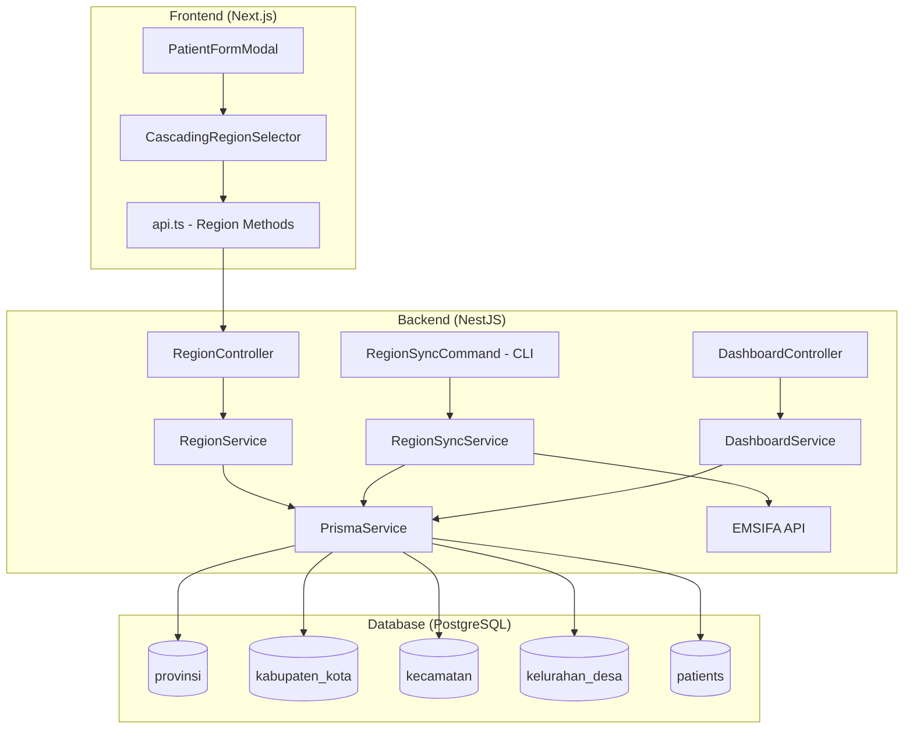
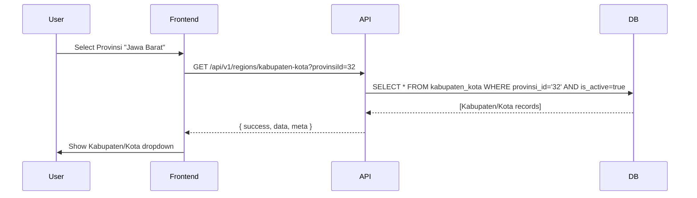

# Design Document: Master Wilayah Indonesia

## Overview

This design describes the Master Wilayah Indonesia module for eLIS — a normalized region data layer that replaces free-text geographic fields in patient registration with foreign-key references to four hierarchical tables (Provinsi → Kabupaten/Kota → Kecamatan → Kelurahan/Desa). The module provides:

1. **Database schema** — Four region tables using EMSIFA string codes as primary keys
2. **Sync service** — Fetches and upserts data from the EMSIFA API via CLI command or admin endpoint
3. **Lookup API** — Paginated, searchable endpoints for cascading selectors
4. **Frontend component** — `CascadingRegionSelector` with server-side search and auto-reset
5. **Patient model migration** — New FK columns alongside existing string columns
6. **Dashboard analytics** — Patient distribution grouped by region level

### Design Rationale

- **EMSIFA codes as PK**: The EMSIFA dataset uses a well-defined numeric code hierarchy (2-digit province → 4-digit regency → 6-digit district → 10-digit village). Using these as string PKs avoids a UUID join and enables prefix-based queries.
- **Module placement**: A new `RegionModule` under `src/laboratory/region/` keeps it within the laboratory domain boundary alongside the existing `MasterDataModule`, `PatientModule`, and `DashboardModule`.
- **Upsert-based sync**: Ensures idempotent data loading regardless of whether the seed/sync runs on a fresh or populated database.

## Architecture



### Request Flow: Cascading Selector



## Components and Interfaces

### Backend Module Structure

```
src/laboratory/region/
├── region.module.ts
├── region.controller.ts        # GET endpoints for region lookups
├── region.service.ts           # Query logic with pagination/search
├── region-sync.service.ts      # EMSIFA API fetch + upsert logic
├── region-sync.command.ts      # NestJS CLI command for seeding
├── dto/
│   ├── region-query.dto.ts     # Query params: page, limit, search, parentId
│   └── region-response.dto.ts  # Response shape
└── interfaces/
    └── emsifa-response.interface.ts  # EMSIFA JSON shape typing
```

### Key Interfaces

```typescript
// EMSIFA API response shapes
interface EmsifaProvince {
  id: string;   // "11"
  name: string; // "ACEH"
}

interface EmsifaRegency {
  id: string;        // "1101"
  province_id: string;
  name: string;
}

interface EmsifaDistrict {
  id: string;        // "110101"
  regency_id: string;
  name: string;
}

interface EmsifaVillage {
  id: string;        // "1101012001"
  district_id: string;
  name: string;
}

// Region query DTO
class RegionQueryDto {
  @IsOptional() @IsString() search?: string;
  @IsOptional() @IsInt() @Min(1) page?: number = 1;
  @IsOptional() @IsInt() @Min(1) @Max(100) limit?: number = 50;
}

// Region response item
interface RegionItem {
  id: string;
  name: string;
  parentId?: string;
  postalCode?: string;  // Only for kelurahan_desa
}
```

### API Endpoints

| Method | Endpoint | Query Params | Description |
|--------|----------|--------------|-------------|
| GET | `/api/v1/regions/provinsi` | `search`, `page`, `limit` | List active provinces |
| GET | `/api/v1/regions/kabupaten-kota` | `provinsiId` (required), `search`, `page`, `limit` | List regencies by province |
| GET | `/api/v1/regions/kecamatan` | `kabupatenKotaId` (required), `search`, `page`, `limit` | List districts by regency |
| GET | `/api/v1/regions/kelurahan-desa` | `kecamatanId` (required), `search`, `page`, `limit` | List villages by district |
| POST | `/api/v1/regions/sync` | — | Trigger sync (admin only) |

### Frontend Components

```
src/components/regions/
├── CascadingRegionSelector.tsx   # Main compound component
├── RegionSelect.tsx              # Single searchable select with loading state
└── useRegionData.ts              # Custom hook for data fetching + caching
```

```typescript
// CascadingRegionSelector props
interface CascadingRegionSelectorProps {
  value: {
    provinsiId?: string;
    kabupatenKotaId?: string;
    kecamatanId?: string;
    kelurahanDesaId?: string;
  };
  onChange: (value: CascadingRegionSelectorProps['value']) => void;
  disabled?: boolean;
}
```

### RegionSyncService Design

```typescript
@Injectable()
class RegionSyncService {
  private readonly baseUrl = 'https://emsifa.github.io/api-wilayah-indonesia/api';
  private readonly logger = new Logger(RegionSyncService.name);

  async syncAll(): Promise<SyncResult> {
    const result: SyncResult = { provinsi: 0, kabupatenKota: 0, kecamatan: 0, kelurahanDesa: 0, errors: [] };
    
    // Level 1: Provinces
    const provinces = await this.fetchWithRetry('/provinces.json');
    await this.upsertProvinces(provinces);
    result.provinsi = provinces.length;

    // Level 2: Regencies (per province)
    for (const prov of provinces) {
      try {
        const regencies = await this.fetchWithRetry(`/regencies/${prov.id}.json`);
        await this.upsertRegencies(regencies);
        result.kabupatenKota += regencies.length;
      } catch (err) {
        result.errors.push({ level: 'kabupaten_kota', parentId: prov.id, error: err.message });
      }
    }

    // Level 3 & 4: Similar pattern with error isolation
    // ...
    return result;
  }
}
```

### Validation Service (Hierarchy Check)

```typescript
@Injectable()
class RegionValidationService {
  /**
   * Validates that a set of region IDs form a valid parent-child chain.
   * Returns true if the chain is consistent, false otherwise.
   */
  async validateHierarchy(
    provinsiId: string,
    kabupatenKotaId: string,
    kecamatanId: string,
    kelurahanDesaId: string,
  ): Promise<boolean> {
    const kelurahan = await this.prisma.kelurahanDesa.findFirst({
      where: {
        id: kelurahanDesaId,
        kecamatanId: kecamatanId,
        kecamatan: {
          kabupatenKotaId: kabupatenKotaId,
          kabupatenKota: {
            provinsiId: provinsiId,
          },
        },
      },
    });
    return kelurahan !== null;
  }
}
```

## Data Models

### Prisma Schema Additions

```prisma
// === REGION MASTER DATA ===

model Provinsi {
  id        String   @id          // EMSIFA code: "11", "32", etc.
  name      String
  isActive  Boolean  @default(true)
  createdAt DateTime @default(now())
  updatedAt DateTime @updatedAt

  kabupatenKota KabupatenKota[]
  patients      Patient[]

  @@map("provinsi")
}

model KabupatenKota {
  id        String   @id          // EMSIFA code: "1101", "3201", etc.
  provinsiId String
  name      String
  isActive  Boolean  @default(true)
  createdAt DateTime @default(now())
  updatedAt DateTime @updatedAt

  provinsi  Provinsi    @relation(fields: [provinsiId], references: [id])
  kecamatan Kecamatan[]
  patients  Patient[]

  @@index([provinsiId])
  @@map("kabupaten_kota")
}

model Kecamatan {
  id             String   @id    // EMSIFA code: "110101", "320101", etc.
  kabupatenKotaId String
  name           String
  isActive       Boolean  @default(true)
  createdAt      DateTime @default(now())
  updatedAt      DateTime @updatedAt

  kabupatenKota KabupatenKota  @relation(fields: [kabupatenKotaId], references: [id])
  kelurahanDesa KelurahanDesa[]
  patients      Patient[]

  @@index([kabupatenKotaId])
  @@map("kecamatan")
}

model KelurahanDesa {
  id          String   @id      // EMSIFA code: "1101012001", etc.
  kecamatanId String
  name        String
  postalCode  String?
  isActive    Boolean  @default(true)
  createdAt   DateTime @default(now())
  updatedAt   DateTime @updatedAt

  kecamatan Kecamatan @relation(fields: [kecamatanId], references: [id])
  patients  Patient[]

  @@index([kecamatanId])
  @@map("kelurahan_desa")
}
```

### Patient Model Changes

```prisma
model Patient {
  // ... existing fields ...

  // New FK fields (nullable for backward compatibility)
  provinsiId      String?
  kabupatenKotaId String?
  kecamatanId     String?
  kelurahanDesaId String?

  // Relations
  provinsiRef      Provinsi?      @relation(fields: [provinsiId], references: [id])
  kabupatenKotaRef KabupatenKota? @relation(fields: [kabupatenKotaId], references: [id])
  kecamatanRef     Kecamatan?     @relation(fields: [kecamatanId], references: [id])
  kelurahanDesaRef KelurahanDesa? @relation(fields: [kelurahanDesaId], references: [id])

  // Existing string fields retained
  province   String?
  city       String?
  district   String?
  village    String?
  postalCode String?
}
```

### Migration Strategy

1. Add four region tables (`provinsi`, `kabupaten_kota`, `kecamatan`, `kelurahan_desa`)
2. Add FK columns to `patients` table: `provinsi_id`, `kabupaten_kota_id`, `kecamatan_id`, `kelurahan_desa_id` (all nullable)
3. Run region sync/seed to populate region tables
4. Existing patients retain their string-based values; new registrations use FK references

### API Response Format

```json
{
  "success": true,
  "message": "Provinsi list retrieved successfully",
  "data": [
    { "id": "11", "name": "ACEH" },
    { "id": "12", "name": "SUMATERA UTARA" }
  ],
  "meta": {
    "total": 34,
    "page": 1,
    "limit": 50,
    "totalPages": 1
  }
}
```

### Patient Response (with resolved names)

```json
{
  "id": "uuid",
  "name": "John Doe",
  "provinsiId": "32",
  "kabupatenKotaId": "3201",
  "kecamatanId": "320101",
  "kelurahanDesaId": "3201012001",
  "provinsi": { "id": "32", "name": "JAWA BARAT" },
  "kabupatenKota": { "id": "3201", "name": "KABUPATEN BOGOR" },
  "kecamatan": { "id": "320101", "name": "CIBINONG" },
  "kelurahanDesa": { "id": "3201012001", "name": "PAKANSARI" }
}
```


## Correctness Properties

*A property is a characteristic or behavior that should hold true across all valid executions of a system — essentially, a formal statement about what the system should do. Properties serve as the bridge between human-readable specifications and machine-verifiable correctness guarantees.*

### Property 1: Referential Integrity Enforcement

*For any* region record (Kabupaten_Kota, Kecamatan, or Kelurahan_Desa) with a parent ID that does not exist in the parent table, the database SHALL reject the insertion.

**Validates: Requirements 1.5**

### Property 2: EMSIFA ID Preservation Through Sync

*For any* EMSIFA API response containing region records, after the sync service processes them, each stored record's primary key SHALL equal the original EMSIFA code from the API response.

**Validates: Requirements 1.6, 2.1**

### Property 3: Upsert Preserves isActive Flag

*For any* existing region record with any `isActive` value (true or false), when the sync service upserts that record with updated data, the `isActive` field SHALL remain unchanged while the `name` field is updated.

**Validates: Requirements 2.6**

### Property 4: Active-Filtered Parent-Scoped Query

*For any* region level and any valid parent ID, the lookup endpoint SHALL return exactly the set of records that are both (a) active (`isActive = true`) and (b) direct children of the specified parent. No inactive records and no records belonging to other parents shall appear.

**Validates: Requirements 3.1, 3.2, 3.3, 3.4**

### Property 5: Case-Insensitive Partial Name Search

*For any* region record in the database and any substring of its name (in any letter casing), the search endpoint with that substring as query SHALL include that record in its results.

**Validates: Requirements 3.5**

### Property 6: Pagination Completeness and No Overlap

*For any* region list with N total records and a given page size, the union of all paginated pages SHALL equal the complete set of matching records, with no duplicates across pages.

**Validates: Requirements 3.6**

### Property 7: Cascading Reset on Parent Change

*For any* cascading selector state where child levels have values, when a parent level selection changes, all child-level selections below that parent SHALL be reset to empty.

**Validates: Requirements 4.5**

### Property 8: Patient Region Storage Round-Trip

*For any* patient created with a valid set of region IDs (provinsiId, kabupatenKotaId, kecamatanId, kelurahanDesaId), retrieving that patient SHALL return the same IDs and the corresponding region names that match the stored region records.

**Validates: Requirements 5.3, 5.4**

### Property 9: Region Hierarchy Validation

*For any* set of four region IDs submitted during patient registration, the backend SHALL accept the submission if and only if the IDs form a valid parent-child chain (kelurahanDesa belongs to kecamatan, kecamatan belongs to kabupatenKota, kabupatenKota belongs to provinsi). Additionally, any partial selection (some levels filled, some empty, but not all-empty) SHALL be rejected.

**Validates: Requirements 6.1, 6.3, 6.4**

### Property 10: Dashboard Counting Invariant

*For any* set of non-deleted patients with region FK assignments, the dashboard endpoint grouped by any region level SHALL produce counts that sum to the total number of non-deleted patients matching the filter, and each individual count SHALL equal the actual number of non-deleted patients assigned to that specific region.

**Validates: Requirements 7.1, 7.2, 7.3, 7.4, 7.5**

### Property 11: Sync Idempotency

*For any* set of region data from the EMSIFA API, executing the sync/upsert operation multiple times SHALL produce the same record count and data state as executing it once — no duplicate records shall be created.

**Validates: Requirements 8.2**

## Error Handling

### Backend Error Scenarios

| Scenario | HTTP Status | Error Code | Message |
|----------|-------------|------------|---------|
| Region ID not found | 404 | `ERR_NOT_FOUND` | "Region with id '{id}' not found" |
| Invalid parent filter (parentId doesn't exist) | 400 | `ERR_VALIDATION` | "Invalid parent region ID" |
| Inconsistent hierarchy on patient create | 400 | `ERR_VALIDATION` | "Region hierarchy is inconsistent: {detail}" |
| EMSIFA API unreachable during sync | — (logged) | N/A | Logged at ERROR level, sync continues |
| EMSIFA API unreachable during seed | — (exit 1) | N/A | Process exits with error message |
| Sync triggered by unauthorized user | 403 | `ERR_FORBIDDEN` | "Insufficient permissions" |

### Frontend Error Handling

- **Network error during region loading**: Show inline error message with retry button in the affected selector
- **API returns empty list**: Show "Tidak ada data" placeholder in the dropdown
- **Timeout on region fetch**: 10-second timeout, then show error state with retry
- **Stale cache**: Region data cached client-side for 5 minutes; auto-refetch on cache expiry

### Sync Error Isolation

The sync service processes each region level independently. If fetching regencies for province "11" fails:
1. Log the error with province ID and HTTP status
2. Continue fetching regencies for province "12", "13", etc.
3. Return a `SyncResult` object with `errors[]` array summarizing failures
4. Do NOT rollback successfully synced records

## Testing Strategy

### Property-Based Tests (fast-check)

The project already uses `fast-check` (v4.8.0) for property-based testing. Each property from the Correctness Properties section maps to a property-based test.

**Configuration:**
- Minimum 100 iterations per property test
- Each test tagged with: `Feature: master-wilayah-indonesia, Property {N}: {title}`
- Test files: `*.property.spec.ts`

**Property test locations:**
- `src/laboratory/region/region.service.property.spec.ts` — Properties 2, 3, 4, 5, 6, 11
- `src/laboratory/region/region-validation.service.property.spec.ts` — Properties 1, 9
- `src/laboratory/patient/patient-region.property.spec.ts` — Property 8
- `src/laboratory/dashboard/dashboard-region.property.spec.ts` — Property 10

**Frontend property tests:**
- `src/components/regions/__tests__/CascadingRegionSelector.property.spec.tsx` — Property 7

### Unit Tests (Jest)

- `region.service.spec.ts` — Example-based tests for edge cases: empty search, zero results, boundary pagination
- `region-sync.service.spec.ts` — Mocked EMSIFA API responses, error handling scenarios
- `region-validation.service.spec.ts` — Concrete hierarchy examples (valid chain, broken chain)
- `CascadingRegionSelector.spec.tsx` — Render tests, loading states, error states

### Integration Tests

- Sync command execution against mocked API
- Full patient registration flow with region selection
- Dashboard analytics query with seeded data

### Test Data Generators (fast-check Arbitraries)

```typescript
// Generate valid region hierarchy
const regionHierarchyArb = fc.record({
  provinsiId: fc.stringOf(fc.constantFrom('0','1','2','3','4','5','6','7','8','9'), { minLength: 2, maxLength: 2 }),
  kabupatenKotaId: fc.stringOf(fc.constantFrom('0','1','2','3','4','5','6','7','8','9'), { minLength: 4, maxLength: 4 }),
  kecamatanId: fc.stringOf(fc.constantFrom('0','1','2','3','4','5','6','7','8','9'), { minLength: 6, maxLength: 6 }),
  kelurahanDesaId: fc.stringOf(fc.constantFrom('0','1','2','3','4','5','6','7','8','9'), { minLength: 10, maxLength: 10 }),
  name: fc.string({ minLength: 1, maxLength: 100 }),
});

// Generate region record with random isActive
const regionRecordArb = fc.record({
  id: fc.stringOf(fc.constantFrom('0','1','2','3','4','5','6','7','8','9'), { minLength: 2, maxLength: 10 }),
  name: fc.string({ minLength: 1, maxLength: 100 }),
  isActive: fc.boolean(),
});
```
