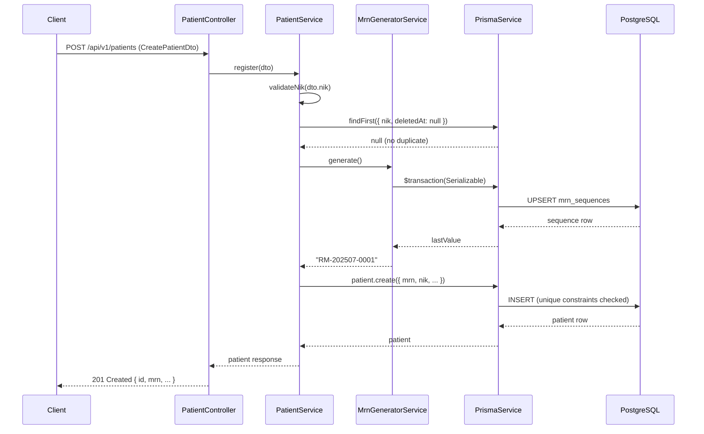

# Design Document: Patient MRN Identifier

## Overview

This design implements patient identity integrity for eLIS by ensuring every patient receives a unique, auto-generated Medical Record Number (MRN) upon registration, enforcing NIK (national ID) uniqueness at both application and database levels, and adding search indexes for fast patient lookup. The implementation builds on the existing `MrnGeneratorService`, `PatientService`, and Prisma schema — adding database-level constraints, a name search index, and NIK validation logic.

### Key Design Decisions

1. **Atomic MRN generation via UPSERT + Serializable isolation** — prevents race conditions without application-level locking.
2. **Database-level unique constraints** as the final line of defense (application checks are optimistic pre-flight).
3. **Partial unique index on NIK** — allows `NULL` NIK values for backward compatibility with legacy records while enforcing uniqueness for non-null values.
4. **GIN trigram index on name** — supports `ILIKE` partial-match queries efficiently.
5. **No breaking API changes** — MRN remains server-generated; `CreatePatientDto` is unchanged.

## Architecture



## Components and Interfaces

### MrnGeneratorService (existing — no changes needed)

**Location:** `apps/api/src/laboratory/patient/mrn-generator.service.ts`

```typescript
@Injectable()
export class MrnGeneratorService {
  generate(): Promise<string>
}
```

**Behavior:**
- Determines current month key (`YYYYMM`)
- Executes a Serializable transaction:
  1. UPSERT into `mrn_sequences` — inserts with value 1 or increments `lastValue`
  2. Reads back the row to get the new `lastValue`
- Returns formatted string `RM-{YYYYMM}-{paddedSequence}`

The Serializable isolation level ensures that concurrent transactions attempting UPSERT on the same month key are linearized by PostgreSQL, preventing duplicate sequence values.

### PatientService (enhanced)

**Location:** `apps/api/src/laboratory/patient/patient.service.ts`

**Changes:**
- Add explicit NIK format validation (16-digit check) before database query
- Improve error handling for Prisma unique constraint violations (P2002)
- No structural changes — deduplication check and MRN assignment already implemented

```typescript
@Injectable()
export class PatientService {
  async register(dto: CreatePatientDto): Promise<Patient> {
    // 1. Validate NIK format (16 numeric digits)
    this.validateNikFormat(dto.nik);
    
    // 2. Deduplication check (existing logic)
    const existing = await this.prisma.patient.findFirst({
      where: { nik: dto.nik, deletedAt: null },
    });
    if (existing) {
      throw new BadRequestException({
        errorCode: 'ERR_VALIDATION',
        message: 'NIK already registered',
      });
    }
    
    // 3. Generate MRN (existing logic)
    const mrn = await this.mrnGenerator.generate();
    
    // 4. Create patient (existing logic)
    // Database unique constraints on mrn and nik provide final safety net
    return this.prisma.patient.create({ data: { mrn, ...mapped } });
  }

  private validateNikFormat(nik: string): void {
    if (!/^\d{16}$/.test(nik)) {
      throw new BadRequestException({
        errorCode: 'ERR_VALIDATION',
        message: 'NIK must be exactly 16 digits',
      });
    }
  }
}
```

### CreatePatientDto (no changes needed)

The DTO already has the `@Matches(/^\d{16}$/)` decorator on `nik` and does not include `mrn` as a field, satisfying API contract stability requirements.

### Database Migration

A new Prisma migration will add the name search index. The unique constraints on `mrn` and `nik` already exist from the initial migration (`patients_mrn_key` and `patients_nik_key`).

**New migration: `add_patient_name_search_index`**

```sql
-- Add trigram extension for partial-match name search
CREATE EXTENSION IF NOT EXISTS pg_trgm;

-- Add GIN trigram index on patient name for ILIKE searches
CREATE INDEX IF NOT EXISTS "patients_name_trgm_idx" 
  ON "patients" USING gin ("name" gin_trgm_ops);
```

## Data Models

### MrnSequence (existing — no changes)

| Column    | Type    | Description                         |
|-----------|---------|-------------------------------------|
| id        | TEXT PK | Month key in format `YYYYMM`        |
| lastValue | INT     | Last assigned sequence number        |

### Patient (existing — index additions only)

| Column | Constraint/Index | Status |
|--------|-----------------|--------|
| mrn    | UNIQUE (B-tree) | Already exists |
| nik    | UNIQUE (B-tree) | Already exists |
| name   | GIN trigram index | **New — to be added** |

### Handling NULL NIK in Legacy Data

The current schema has `nik String @unique` which means NIK cannot be NULL at the Prisma level. Since the initial migration already enforced this (`"nik" TEXT NOT NULL`), all existing records must have non-null NIK values. The constraint was applied at table creation time, so backward compatibility is inherently maintained — no special handling is needed for NULL values.

If legacy data were imported with empty strings, the unique constraint would still hold since empty strings are distinct values (only one empty string allowed). The migration strategy handles this by:
1. Verifying no duplicate NIKs exist before the migration (pre-flight check in the migration script)
2. The constraint already exists, so no new constraint needs to be added

## Correctness Properties

*A property is a characteristic or behavior that should hold true across all valid executions of a system — essentially, a formal statement about what the system should do. Properties serve as the bridge between human-readable specifications and machine-verifiable correctness guarantees.*

### Property 1: MRN Format Correctness

*For any* date (year and month) and any sequence number from 1 to 9999, the generated MRN SHALL match the pattern `RM-YYYYMM-XXXX` where YYYY is a 4-digit year, MM is a 2-digit month (01-12), and XXXX is zero-padded to 4 digits.

**Validates: Requirements 1.1**

### Property 2: MRN Sequence Monotonicity

*For any* series of N MRN generation calls within the same month (where N ≥ 2), the sequence numbers extracted from the generated MRNs SHALL be strictly monotonically increasing and all MRN values SHALL be distinct.

**Validates: Requirements 1.3, 2.1**

### Property 3: NIK Validation

*For any* string input, the NIK validation SHALL accept the input if and only if it consists of exactly 16 characters and every character is a numeric digit (0-9).

**Validates: Requirements 3.4**

### Property 4: NIK Deduplication

*For any* valid NIK and any patient database state, if a non-deleted patient with that NIK already exists, then a registration attempt with the same NIK SHALL be rejected with error code `ERR_VALIDATION`; if no non-deleted patient with that NIK exists, the registration SHALL proceed.

**Validates: Requirements 3.2, 3.3**

### Property 5: Search Correctness

*For any* patient in the database and any search query string, if the query is a substring (case-insensitive) of the patient's name, MRN, or NIK, then that patient SHALL appear in the search results.

**Validates: Requirements 4.4**

### Property 6: Registration Response Completeness

*For any* valid `CreatePatientDto`, upon successful registration the response SHALL contain all input fields with their submitted values, plus a server-generated MRN field matching the `RM-YYYYMM-XXXX` format that was not present in the input.

**Validates: Requirements 6.2, 6.3**

## Error Handling

| Scenario | Error Code | HTTP Status | Message |
|----------|-----------|-------------|---------|
| NIK not 16 digits | ERR_VALIDATION | 400 | "NIK must be exactly 16 digits" |
| Duplicate NIK (application check) | ERR_VALIDATION | 400 | "NIK already registered" |
| Duplicate NIK (DB constraint P2002 on nik) | ERR_VALIDATION | 409 | "Patient with this NIK already exists" |
| Duplicate MRN (DB constraint P2002 on mrn) | ERR_INTERNAL | 500 | "MRN generation conflict, please retry" |
| MRN sequence overflow (>9999 in a month) | ERR_INTERNAL | 500 | "Monthly MRN capacity exceeded" |
| Invalid region hierarchy | ERR_VALIDATION | 400 | "Invalid region hierarchy" |

### Prisma Error Handling Strategy

```typescript
try {
  return await this.prisma.patient.create({ data });
} catch (error) {
  if (error instanceof Prisma.PrismaClientKnownRequestError) {
    if (error.code === 'P2002') {
      const target = error.meta?.target as string[];
      if (target?.includes('nik')) {
        throw new ConflictException({
          errorCode: 'ERR_VALIDATION',
          message: 'Patient with this NIK already exists',
        });
      }
      if (target?.includes('mrn')) {
        // Should not happen with Serializable isolation — indicates a bug
        throw new InternalServerErrorException({
          errorCode: 'ERR_INTERNAL',
          message: 'MRN generation conflict, please retry',
        });
      }
    }
  }
  throw error;
}
```

## Testing Strategy

### Unit Tests (Jest)

- **MrnGeneratorService**: Verify format output for specific dates, verify UPSERT SQL is called with correct month key
- **PatientService.register**: Verify NIK validation rejects invalid formats (specific examples: empty string, 15 digits, 17 digits, letters)
- **PatientService.register**: Verify deduplication throws when existing patient found
- **PatientService.register**: Verify MRN is assigned from generator (not from DTO input)
- **Error handling**: Verify P2002 errors are mapped to correct HTTP responses

### Property-Based Tests (fast-check)

The project already has `fast-check` v4.8.0 installed. Each property test runs minimum 100 iterations.

| Property | Test File | Tag |
|----------|-----------|-----|
| Property 1: MRN Format | `mrn-generator.service.property.spec.ts` | Feature: patient-mrn-identifier, Property 1: MRN format correctness |
| Property 2: MRN Monotonicity | `mrn-generator.service.property.spec.ts` | Feature: patient-mrn-identifier, Property 2: MRN sequence monotonicity |
| Property 3: NIK Validation | `patient.service.property.spec.ts` | Feature: patient-mrn-identifier, Property 3: NIK validation |
| Property 4: NIK Deduplication | `patient.service.property.spec.ts` | Feature: patient-mrn-identifier, Property 4: NIK deduplication |
| Property 5: Search Correctness | `patient.service.property.spec.ts` | Feature: patient-mrn-identifier, Property 5: Search correctness |
| Property 6: Response Completeness | `patient.service.property.spec.ts` | Feature: patient-mrn-identifier, Property 6: Registration response completeness |

### Integration Tests

- Migration test: Run migration against seeded database, verify existing records preserved
- Concurrent registration: Spawn multiple registration requests simultaneously, verify all get unique MRNs
- Search performance: Verify EXPLAIN plan uses indexes for MRN, NIK, and name searches

### Test Configuration

```typescript
// fast-check configuration for all property tests
fc.assert(
  fc.property(/* arbitraries */, (input) => {
    // property assertion
  }),
  { numRuns: 100 }
);
```
