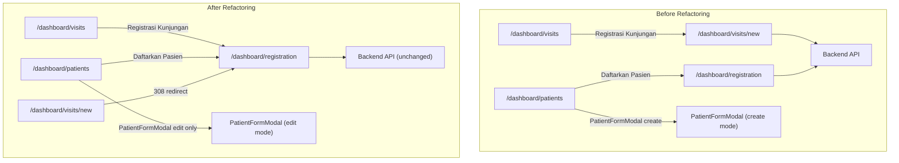

# Design Document: Patient Registration Refactor

## Overview

This design consolidates all patient registration and visit creation entry points into the existing unified workflow at `/dashboard/registration`. The refactoring is **frontend-only** — no backend services, APIs, or database schemas are modified.

Currently, the system has three overlapping entry points:
1. **Unified Workflow** (`/dashboard/registration`) — the 3-step search-first wizard (already implemented and working)
2. **Standalone Visit Page** (`/dashboard/visits/new`) — a flat form with patient dropdown, no search-first enforcement
3. **PatientFormModal on Patients Page** — can create patients without search-first deduplication

After this refactoring:
- `/dashboard/visits/new` becomes a redirect to `/dashboard/registration`
- All "Registrasi Kunjungan" and "Daftarkan Pasien" buttons navigate to `/dashboard/registration`
- `PatientFormModal` only supports edit mode (no create mode)
- Dead code exclusively used by the old standalone page is removed

**Key Design Decisions:**

1. **Server-side redirect** — Use Next.js `redirect()` from `next/navigation` in a server component for `/dashboard/visits/new` (permanent redirect, no client-side flash)
2. **PatientOption type extraction** — Move the `PatientOption` interface to `@/types/visit.ts` so downstream components remain stable after removing `PatientSearch.tsx`
3. **SearchableDropdown preserved** — It's actively used by `VisitCreationStep.tsx` in the unified workflow
4. **Zero backend changes** — All API endpoints, services, and database schema remain untouched

## Architecture



All roads lead to `/dashboard/registration`.

## Components and Interfaces

### Modified Components

| Component | Change | Rationale |
|-----------|--------|-----------|
| `apps/web/src/app/dashboard/visits/new/page.tsx` | Replace with server-side `redirect('/dashboard/registration')` | Requirement 1.1–1.3 |
| `apps/web/src/app/dashboard/visits/page.tsx` | Update `href="/dashboard/visits/new"` → `href="/dashboard/registration"` (2 locations: header button + empty state link) | Requirement 1.4 |
| `apps/web/src/components/patients/PatientFormModal.tsx` | Add guard: if `!editData`, don't render — return `null` | Requirement 2.1–2.5 |
| `apps/web/src/app/dashboard/patients/page.tsx` | Remove `handleSubmit` create branch; ensure "Daftarkan Pasien" button navigates to `/dashboard/registration` (already done) | Requirement 2.3 |

### Redirect Implementation

```typescript
// apps/web/src/app/dashboard/visits/new/page.tsx (after refactoring)
import { redirect } from "next/navigation";

export default function NewVisitPage() {
  redirect("/dashboard/registration");
}
```

This is a server component — Next.js handles the 308 redirect before any client-side JavaScript executes. No flash of old UI, works with bookmarks and direct URLs.

### PatientFormModal Guard

```typescript
// Inside PatientFormModal component
export function PatientFormModal({ isOpen, onClose, onSubmit, editData }: Props) {
  // Guard: only allow edit mode
  if (!editData) {
    return null; // Don't render in create mode
  }
  
  // ... existing edit form logic
}
```

### Type Extraction

The `PatientOption` interface currently lives in `apps/web/src/components/visits/PatientSearch.tsx`. Multiple components import it:
- `apps/web/src/app/dashboard/registration/page.tsx`
- `apps/web/src/components/registration/PatientSearchStep.tsx`
- `apps/web/src/components/registration/PatientRegistrationStep.tsx`
- `apps/web/src/components/registration/VisitCreationStep.tsx`

**New shared location:**

```typescript
// apps/web/src/types/visit.ts
export interface PatientOption {
  id: string;
  name: string;
  mrn: string;
  nik: string;
  dateOfBirth: string;
  gender: "MALE" | "FEMALE";
}
```

All imports updated from `@/components/visits/PatientSearch` to `@/types/visit`.

### Files to Remove

| File | Reason | Safety Check |
|------|--------|--------------|
| `apps/web/src/components/visits/PatientSearch.tsx` | After type extraction, the component is only used by the deleted `visits/new/page.tsx` | Verify zero active imports of the component (type re-exported from new location) |

### Files to Keep (No Changes)

- `apps/web/src/components/visits/SearchableDropdown.tsx` — used by `VisitCreationStep.tsx`
- `apps/web/src/app/dashboard/registration/page.tsx` — the unified workflow (untouched)
- All files under `apps/web/src/components/registration/` — untouched
- All backend files — untouched

## Data Models

No data model changes. This refactoring is purely frontend navigation and component lifecycle changes. The backend API contracts remain identical:

- `POST /api/v1/patients` — still called by `PatientRegistrationStep.tsx`
- `POST /api/v1/visits` — still called by `VisitCreationStep.tsx`
- `GET /api/v1/patients?search=` — still called by `PatientSearchStep.tsx`

## Correctness Properties

*A property is a characteristic or behavior that should hold true across all valid executions of a system.*

### Property 1: Navigation consolidation invariant

*For any* navigation action triggered by a "Daftarkan Pasien" or "Registrasi Kunjungan" button across all pages in the application, the resulting destination SHALL be `/dashboard/registration`. No navigation action from these buttons SHALL resolve to `/dashboard/visits/new` or open a patient creation modal.

**Validates: Requirements 1.4, 2.3, 3.1, 3.2, 3.4**

### Property 2: PatientFormModal edit-only guard

*For any* invocation of `PatientFormModal` where `editData` is null or undefined, the component SHALL render nothing (return null) and SHALL NOT display a patient creation form. *For any* invocation where `editData` contains a valid patient record, the component SHALL render the edit form with pre-filled data.

**Validates: Requirements 2.1, 2.4, 2.5**

### Property 3: Redirect completeness

*For any* HTTP request or client-side navigation to the path `/dashboard/visits/new`, the system SHALL respond with a redirect to `/dashboard/registration` without rendering the old standalone visit creation UI at any point.

**Validates: Requirements 1.1, 1.2, 1.3**

## Error Handling

### Redirect Behavior

- **Server-side redirect**: No client-side flash. Response is 308 Permanent Redirect.
- **Bookmarks/deep links**: Transparently redirected to `/dashboard/registration`.
- **No error states**: The redirect is unconditional — cannot fail (same-origin navigation).

### PatientFormModal Guard

- If `PatientFormModal` is rendered without `editData`, it returns `null` (no render).
- The `handleSubmit` in `PatientsPage` removes the create branch — only the update API call remains.
- Modal's submit button label always shows "Simpan Perubahan" (save changes) since create mode is gone.

### Dead Code Removal Safety

- Before deleting any file, verify zero active imports (excluding the replaced page)
- Run `npx tsc --noEmit` to confirm no TypeScript compilation errors
- Run lint to confirm no unused import warnings

## Testing Strategy

### Approach

This refactoring involves routing configuration, static link changes, and dead code removal — NOT input-varying logic. Property-based testing is inappropriate. Verification relies on:

**1. TypeScript Compilation:**
```bash
cd apps/web && npx tsc --noEmit
```
Confirms no broken imports after dead code removal and type extraction.

**2. Lint Check:**
```bash
cd apps/web && npx next lint
```
Confirms no unused imports or missing references.

**3. Existing Tests Must Pass (unchanged):**
- `apps/web/src/components/registration/__tests__/workflow-state.spec.ts` — property tests for workflow state machine
- All backend tests — no backend modifications

**4. Manual Verification Checklist:**
- Navigate to `/dashboard/visits/new` → confirms redirect to `/dashboard/registration`
- Click "Registrasi Kunjungan" on visits page → arrives at `/dashboard/registration`
- Click "Registrasi Kunjungan" in empty state → arrives at `/dashboard/registration`
- Click "Daftarkan Pasien" on patients page → arrives at `/dashboard/registration`
- Edit a patient via PatientFormModal → modal opens with patient data (edit mode works)
- Run complete unified workflow (search → register → visit) → still works end-to-end

**5. Test Commands:**
```bash
# TypeScript compilation check
cd apps/web && npx tsc --noEmit

# Run existing frontend tests
cd apps/web && npx jest --passWithNoTests

# Run existing backend tests (should be unaffected)
cd apps/api && npx jest

# Lint check
cd apps/web && npx next lint
```
