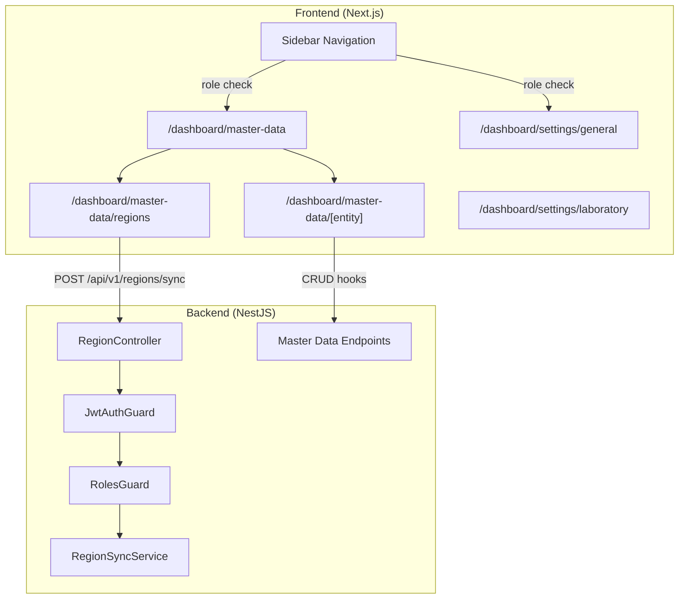

# Design Document: Settings & Master Data Restructure

## Overview

This design addresses three tightly-coupled changes in the eLIS application:

1. **Fix Region Sync 403** — A guard misconfiguration in `RegionController` causes the `POST /api/v1/regions/sync` endpoint to reject SUPER_ADMIN/ADMIN users with HTTP 403.
2. **Restructure General Settings** — Remove master data tabs (Dokter, Klinik, Asuransi, Tarif, Wilayah, Users) from `/dashboard/settings/general` and replace with a system-config placeholder.
3. **Restructure Laboratory Settings** — Remove lab master data tabs from `/dashboard/settings/laboratory` and replace with a lab-config placeholder.
4. **Consolidate Master Data Hub** — Ensure `/dashboard/master-data` provides a unified entry point for all 13 master data entities, reusing existing components and hooks.

### Design Principles

- **Minimum safe changes**: Modify only what is necessary. No new API endpoints, no schema changes, no duplicated code.
- **Reuse over rewrite**: The `[entity]/page.tsx` dynamic route and `@/services/master-data.ts` hooks already exist and cover most entities. Extend, don't replace.
- **Preserve existing behavior**: All CRUD operations, React Query cache invalidation, and form validation must continue working identically.

## Architecture



### Current State vs Target State

| Concern | Current State | Target State |
|---------|--------------|--------------|
| Region sync | 403 for SUPER_ADMIN due to duplicate `JwtAuthGuard` | Works for SUPER_ADMIN and ADMIN |
| General Settings page | Renders 6 master data tabs + CRUD | Shows system-config placeholder only |
| Laboratory Settings page | Renders 7 lab master data tabs + CRUD | Shows lab-config placeholder only |
| Master Data hub | 10 cards (missing Tarif, Wilayah, Users) | 13 cards (adds Tarif, Wilayah, Users) |
| Settings nav sidebar | "General" description mentions master data | Description references system config only |

## Components and Interfaces

### 1. API Fix: RegionController Guard Chain

**File**: `apps/api/src/laboratory/region/region.controller.ts`

**Root Cause**: The `sync` endpoint declares `@UseGuards(JwtAuthGuard, RolesGuard)` at method level while the controller already has `@UseGuards(JwtAuthGuard)` at class level. In NestJS, method-level guards accumulate with class-level guards, causing `JwtAuthGuard` to execute twice. On the second execution, Passport's `AuthGuard` may re-run the strategy and interfere with the already-populated `request.user`, resulting in the `RolesGuard` receiving an incomplete or missing user object.

**Fix**: Remove `JwtAuthGuard` from the method-level `@UseGuards()` on the `sync` endpoint. The class-level `JwtAuthGuard` already handles authentication. Only `RolesGuard` needs to be method-level:

```typescript
@Post('sync')
@UseGuards(RolesGuard)  // JwtAuthGuard already applied at class level
@Roles(Role.SUPER_ADMIN, Role.ADMIN)
async syncRegions() { ... }
```

### 2. Frontend: General Settings Page

**File**: `apps/web/src/app/dashboard/settings/general/page.tsx`

**Change**: Replace the entire master-data tabbed interface with a static placeholder indicating system configuration will be available in a future release.

```typescript
export default function GeneralSettingsPage() {
  return (
    <div className="space-y-4">
      <div>
        <h2>Konfigurasi Sistem</h2>
        <p>Pengaturan umum konfigurasi sistem aplikasi</p>
      </div>
      <PlaceholderCard
        message="Opsi konfigurasi sistem akan tersedia pada rilis mendatang."
      />
    </div>
  );
}
```

No imports from master data hooks. No CRUD controls.

### 3. Frontend: Laboratory Settings Page

**File**: `apps/web/src/app/dashboard/settings/laboratory/page.tsx`

**Change**: Replace the lab master data tabs with a placeholder indicating that lab master data has moved to the Master Data hub.

```typescript
export default function LaboratorySettingsPage() {
  return (
    <div className="space-y-4">
      <div>
        <h2>Konfigurasi Laboratorium</h2>
        <p>Pengaturan khusus laboratorium</p>
      </div>
      <PlaceholderCard
        message="Master data laboratorium telah dipindahkan ke halaman Master Data. Konfigurasi lab spesifik akan tersedia pada rilis mendatang."
        linkTo="/dashboard/master-data"
        linkLabel="Buka Master Data"
      />
    </div>
  );
}
```

### 4. Frontend: Master Data Hub Page

**File**: `apps/web/src/app/dashboard/master-data/page.tsx`

**Change**: Add 3 missing cards: Tarif, Wilayah, Users — to bring total to 13.

The existing page already has 10 items. We add:
- `{ name: "Tarif", href: "/dashboard/master-data/tarif", icon: CreditCard, description: "Kelola tarif pemeriksaan" }`
- `{ name: "Wilayah", href: "/dashboard/master-data/regions", icon: MapPin, description: "Data wilayah Indonesia (provinsi, kabupaten/kota, dll)" }`
- `{ name: "Users", href: "/dashboard/master-data/users", icon: Users, description: "Kelola pengguna dan peran akses" }`

The Wilayah card routes to the existing `/dashboard/master-data/regions` page. The Users and Tarif cards route to new entity slugs under `[entity]`.

### 5. Frontend: Entity Config Extensions

**File**: `apps/web/src/app/dashboard/master-data/[entity]/page.tsx`

**Change**: Add `tarif` and `users` entries to the `entityConfigs` map.

For **Tarif**: Create new hooks `useMasterTariffs`, `useCreateMasterTariff`, `useUpdateMasterTariff`, `useDeleteMasterTariff` in `@/services/master-data.ts` (following the same pattern as other entities, pointing to `/api/v1/master/tariffs`).

For **Users**: Reuse existing `@/services/users.ts` hooks OR create thin wrappers that match the `EntityConfig` interface signature. The existing `apiClient.getUsers/createUser/updateUser/deleteUser` methods already exist.

### 6. Frontend: Sidebar Navigation (No Change Needed)

**File**: `apps/web/src/components/layout/sidebar.tsx`

The sidebar already has:
- "Master Data" with `roles: ["SUPER_ADMIN", "OWNER", "MANAGER", "ADMIN"]` → matches Requirement 5.1
- "Pengaturan" with `roles: ["SUPER_ADMIN", "ADMIN"]` → matches Requirement 5.2

No changes needed here.

### 7. Frontend: Settings Layout Navigation

**File**: `apps/web/src/app/dashboard/settings/layout.tsx`

**Change**: Update the "General" description from "Pengaturan umum & master data" to "Konfigurasi sistem umum". The "Laboratory" description from "Pengaturan laboratorium" stays the same or becomes "Konfigurasi laboratorium".

### 8. Frontend: Client-side Access Control

The existing `useAuth()` context provides `user.role`. Pages that need role-gating will check the role and redirect unauthorized users to `/dashboard`.

**Implementation**: Add a lightweight `useRoleGuard` hook or inline check at the top of protected pages:

```typescript
// In master-data page layout or page component
const { user } = useAuth();
const router = useRouter();
useEffect(() => {
  const allowed = ["SUPER_ADMIN", "OWNER", "MANAGER", "ADMIN"];
  if (user && !allowed.includes(user.role)) {
    router.replace("/dashboard");
  }
}, [user, router]);
```

## Data Models

No changes to the database schema. All entities use existing Prisma models and API endpoints.

**Existing API endpoints reused** (unchanged):
- `GET/POST /api/v1/master/doctors`
- `GET/POST /api/v1/master/clinics`
- `GET/POST /api/v1/master/insurances`
- `GET/POST /api/v1/master/tariffs`
- `GET/POST /api/v1/master/test-categories`
- `GET/POST /api/v1/master/tests`
- `GET/POST /api/v1/master/panels`
- `GET/POST /api/v1/master/equipments`
- `GET/POST /api/v1/master/reagents`
- `GET/POST /api/v1/master/sample-types`
- `GET/POST /api/v1/master/units`
- `GET/POST /api/v1/users`
- `GET /api/v1/regions/provinsi`
- `POST /api/v1/regions/sync`

**React Query cache keys** (unchanged — from `@/services/master-data.ts`):
- `["master-data", "doctors", "list", {...}]`
- `["master-data", "clinics", "list", {...}]`
- `["master-data", "insurances", "list", {...}]`
- `["master-data", "units", "list", {...}]`
- etc.

New keys to add:
- `["master-data", "tariffs", "list", {...}]`
- `["users", "list", {...}]` (may already exist in `@/services/users.ts`)

## Correctness Properties

*A property is a characteristic or behavior that should hold true across all valid executions of a system — essentially, a formal statement about what the system should do. Properties serve as the bridge between human-readable specifications and machine-verifiable correctness guarantees.*

### Property 1: Sync endpoint rejects all unauthorized roles

*For any* user whose role is NOT in the set {SUPER_ADMIN, ADMIN}, sending a POST request to `/api/v1/regions/sync` with a valid JWT SHALL return HTTP 403 Forbidden.

**Validates: Requirements 1.4**

### Property 2: Sync continues on partial EMSIFA failure

*For any* subset of EMSIFA region levels (provinsi, kabupaten/kota, kecamatan, kelurahan/desa) that return errors during sync, the sync process SHALL continue processing remaining levels and return HTTP 200 with a sync summary that includes the error details for failed levels and correct counts for successful levels.

**Validates: Requirements 1.6**

### Property 3: Master Data access controlled by role

*For any* user role in the system, the "Master Data" sidebar menu item is visible AND the `/dashboard/master-data` page renders content if and only if the role is in the set {SUPER_ADMIN, OWNER, MANAGER, ADMIN}. For all other roles, the menu item is hidden and direct URL access redirects to `/dashboard`.

**Validates: Requirements 5.1, 5.4**

### Property 4: Settings access controlled by role

*For any* user role in the system, the "Pengaturan" sidebar menu item is visible AND the `/dashboard/settings/general` page renders content if and only if the role is in the set {SUPER_ADMIN, ADMIN}. For all other roles, the menu item is hidden and direct URL access redirects to `/dashboard`.

**Validates: Requirements 5.2, 5.5**

## Error Handling

### API Layer

| Scenario | Response | Behavior |
|----------|----------|----------|
| No JWT token on sync endpoint | 401 Unauthorized | JwtAuthGuard rejects before reaching controller |
| Invalid/expired JWT | 401 Unauthorized | JwtAuthGuard rejects |
| Valid JWT, unauthorized role | 403 Forbidden | RolesGuard rejects |
| EMSIFA API unreachable (some levels) | 200 OK | Sync continues, errors array populated |
| EMSIFA API fully unreachable | 200 OK | All levels in errors array, counts at 0 |

### Frontend Layer

| Scenario | Behavior |
|----------|----------|
| Sync button pressed, API returns error | Error message displayed, province list unchanged |
| CRUD mutation fails with validation error | Error shown in form, user input preserved |
| CRUD mutation fails with network error | Toast/alert shown, form state preserved |
| Unauthorized user navigates directly to protected page | Redirect to /dashboard |
| Invalid entity slug in /master-data/[entity] | "Halaman Tidak Ditemukan" message (already implemented) |

## Testing Strategy

### Unit Tests (Example-based)

- **General Settings page**: Verify no master data tabs rendered, placeholder message present
- **Laboratory Settings page**: Verify no lab tabs rendered, placeholder with link to Master Data
- **Master Data hub page**: Verify 13 cards rendered with correct names and hrefs
- **Settings layout nav**: Verify "General" description says "Konfigurasi sistem umum"
- **Region sync success**: Mock successful sync, verify toast/message displayed
- **Region sync error**: Mock failed sync, verify error message and list preservation
- **Form validation error**: Mock API 400, verify error displayed and form input preserved

### Integration Tests

- **Region sync authorization**: Test POST /api/v1/regions/sync with SUPER_ADMIN JWT → 200
- **Region sync authorization**: Test POST /api/v1/regions/sync with ADMIN JWT → 200
- **Region sync unauthorized**: Test POST /api/v1/regions/sync with KASIR JWT → 403
- **Region sync unauthenticated**: Test POST /api/v1/regions/sync with no token → 401
- **CRUD operations**: Verify each entity's create/read/update/delete still works via existing endpoints

### Property-Based Tests

Property-based testing applies to this feature for the RBAC access control properties and the sync resilience property.

**Library**: fast-check (already available or easily added to the project's test setup)

**Configuration**: Minimum 100 iterations per property test.

**Tag format**: `Feature: settings-master-data-restructure, Property {N}: {text}`

- **Property 1**: Generate random roles from the full Role enum excluding SUPER_ADMIN and ADMIN. For each, verify sync endpoint returns 403.
- **Property 2**: Generate random binary vectors representing which EMSIFA levels fail. For each pattern, mock the failures and verify sync returns 200 with correct error entries and non-zero counts for successful levels.
- **Property 3**: Generate random roles from the full Role enum. For each, render the Sidebar component and verify "Master Data" visibility matches the allowed set.
- **Property 4**: Generate random roles from the full Role enum. For each, render the Sidebar component and verify "Pengaturan" visibility matches the allowed set.

### Smoke Tests

- TypeScript build (`tsc --noEmit`) completes with zero errors
- Full test suite passes with zero new failures
- Application starts and all routes are accessible
