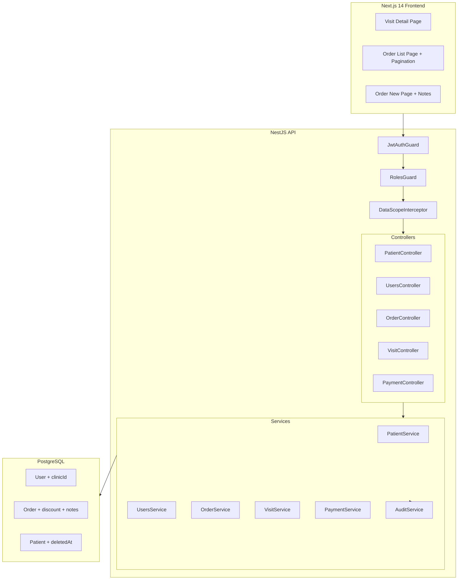
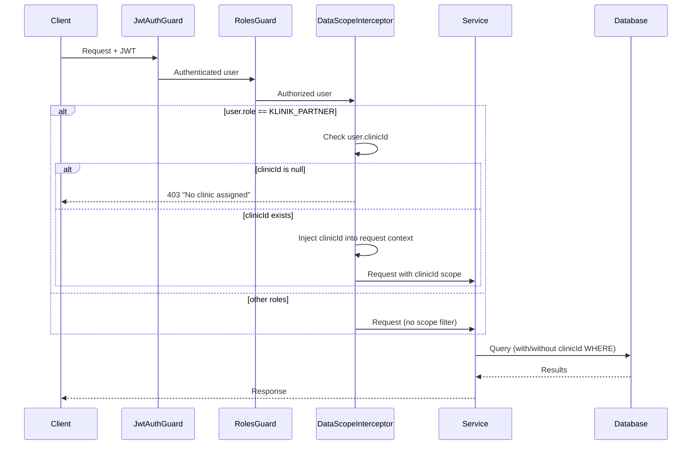

# Design Document: Sprint Next-1 Critical Security & Data Integrity

## Overview

This design addresses 9 P1/CRITICAL production-readiness items spanning security (privilege escalation, data-scope isolation, self-delete prevention), data integrity (soft-delete guards, discount persistence, clinical notes), and UX (missing pages, pagination). The changes span the NestJS backend (guards, interceptors, services, controllers, DTOs, Prisma schema) and the Next.js frontend (new pages, pagination component).

### Design Principles

1. **Defense-in-depth** — validation at guard, service, and database levels
2. **Backward compatibility** — new fields are nullable; existing API contracts are additive only
3. **Audit accountability** — all mutations log actor, timestamp, and payload diffs
4. **Least privilege** — KLINIK_PARTNER data scope is enforced transparently via interceptor

---

## Architecture

### High-Level System Diagram



### Request Flow with DataScopeInterceptor



---

## Components and Interfaces

### 1. DataScopeInterceptor (NEW)

**Location:** `apps/api/src/common/interceptors/data-scope.interceptor.ts`

**Purpose:** Transparently enforces clinic-level data isolation for KLINIK_PARTNER users.

```typescript
@Injectable()
export class DataScopeInterceptor implements NestInterceptor {
  intercept(context: ExecutionContext, next: CallHandler): Observable<any> {
    const request = context.switchToHttp().getRequest();
    const user = request.user;

    if (user?.role === Role.KLINIK_PARTNER) {
      if (!user.clinicId) {
        throw new ForbiddenException('No clinic assigned to this user');
      }
      // Attach clinicId to request for service-layer filtering
      request.dataScope = { clinicId: user.clinicId };
    }

    return next.handle();
  }
}
```

**Applied to:** VisitController, OrderController via `@UseInterceptors(DataScopeInterceptor)`

---

### 2. PatientService.softDelete (NEW METHOD)

**Location:** `apps/api/src/laboratory/patient/patient.service.ts`

```typescript
async softDelete(id: string, userId: string, ipAddress?: string): Promise<Patient> {
  // 1. Verify patient exists and not already deleted
  const patient = await this.prisma.patient.findFirst({
    where: { id, deletedAt: null },
  });
  if (!patient) throw new NotFoundException('Patient not found');

  // 2. Check for active visits (REGISTERED or IN_PROGRESS)
  const activeVisits = await this.prisma.visit.count({
    where: { patientId: id, status: { in: ['REGISTERED', 'IN_PROGRESS'] } },
  });
  if (activeVisits > 0) {
    throw new ConflictException('Cannot deactivate patient with active visits');
  }

  // 3. Check for active orders (not COMPLETED, not CANCELLED, not NOTIFIED)
  const activeOrders = await this.prisma.order.count({
    where: {
      patientId: id,
      status: { notIn: ['COMPLETED', 'CANCELLED', 'NOTIFIED'] },
    },
  });
  if (activeOrders > 0) {
    throw new ConflictException('Cannot deactivate patient with active orders');
  }

  // 4. Soft-delete
  const updated = await this.prisma.patient.update({
    where: { id },
    data: { deletedAt: new Date() },
  });

  // 5. Audit
  await this.auditService.log(userId, 'SOFT_DELETE', 'Patient', id, null, { deletedAt: updated.deletedAt }, ipAddress);

  return updated;
}
```

---

### 3. PatientController DELETE Endpoint (NEW)

**Location:** `apps/api/src/laboratory/patient/patient.controller.ts`

```typescript
@Delete(':id')
@UseGuards(JwtAuthGuard, RolesGuard)
@Roles(Role.ADMIN, Role.SUPER_ADMIN)
async softDelete(
  @Param('id', ParseUUIDPipe) id: string,
  @CurrentUser() user: any,
  @Req() req: express.Request,
) {
  const ipAddress = (req.headers['x-forwarded-for'] as string) || req.ip;
  return this.patientService.softDelete(id, user.sub, ipAddress);
}
```

---

### 4. UsersService — Privilege Escalation Guard (MODIFIED)

**Location:** `apps/api/src/users/users.service.ts`

New private method + integration into `create()` and `update()`:

```typescript
private validateRoleEscalation(requestingUserRole: Role, targetRole: Role): void {
  if (targetRole === Role.SUPER_ADMIN && requestingUserRole !== Role.SUPER_ADMIN) {
    throw new ForbiddenException('Only SUPER_ADMIN can assign SUPER_ADMIN role');
  }
}

async create(dto: CreateUserDto, requestingUser: { id: string; role: Role }) {
  this.validateRoleEscalation(requestingUser.role, dto.role);
  // ... existing logic
}

async update(id: string, dto: UpdateUserDto, requestingUser: { id: string; role: Role }) {
  if (dto.role) {
    this.validateRoleEscalation(requestingUser.role, dto.role);
  }
  // ... existing logic
}
```

---

### 5. UsersService — Self-Delete & Last Admin Guard (MODIFIED)

**Location:** `apps/api/src/users/users.service.ts`

```typescript
async softDelete(id: string, requestingUserId: string) {
  // 1. Self-delete check
  if (id === requestingUserId) {
    throw new ForbiddenException('Cannot delete own account');
  }

  const targetUser = await this.findById(id);

  // 2. Last SUPER_ADMIN check
  if (targetUser.role === Role.SUPER_ADMIN) {
    const activeSuperAdminCount = await this.prisma.user.count({
      where: { role: Role.SUPER_ADMIN, deletedAt: null, id: { not: id } },
    });
    if (activeSuperAdminCount === 0) {
      throw new ConflictException('Cannot delete last super admin');
    }
  }

  // 3. Proceed with soft-delete
  return this.prisma.user.update({
    where: { id },
    data: { deletedAt: new Date() },
    select: userSelect,
  });
}
```

---

### 6. UsersController — Pass Requesting User Context (MODIFIED)

**Location:** `apps/api/src/users/users.controller.ts`

```typescript
@Post()
@Roles(Role.ADMIN, Role.SUPER_ADMIN)
async create(@Body() dto: CreateUserDto, @CurrentUser() user: any) {
  return this.usersService.create(dto, { id: user.sub, role: user.role });
}

@Put(':id')
@Roles(Role.ADMIN, Role.SUPER_ADMIN)
async update(
  @Param('id', ParseUUIDPipe) id: string,
  @Body() dto: UpdateUserDto,
  @CurrentUser() user: any,
) {
  return this.usersService.update(id, dto, { id: user.sub, role: user.role });
}

@Delete(':id')
@Roles(Role.ADMIN, Role.SUPER_ADMIN)  // Changed: ADMIN can also delete (non-SUPER_ADMIN)
async remove(@Param('id', ParseUUIDPipe) id: string, @CurrentUser() user: any) {
  return this.usersService.softDelete(id, user.sub);
}
```

---

### 7. PaymentService.processPayment — Discount Handling (MODIFIED)

**Location:** `apps/api/src/laboratory/payment/payment.service.ts`

```typescript
async processPayment(orderId: string, dto: ProcessPaymentDto, userId: string) {
  const order = await this.prisma.order.findUnique({ where: { id: orderId } });
  if (!order) throw new NotFoundException('Order not found');
  if (order.status !== OrderStatus.PENDING_PAYMENT) {
    throw new BadRequestException({ errorCode: 'ERR_INVALID_STATE', message: `...` });
  }

  // Discount validation
  let finalPayable = order.totalAmount;
  if (dto.discountAmount !== undefined && dto.discountAmount !== null) {
    const discount = new Decimal(dto.discountAmount);
    if (discount.lte(0)) {
      throw new BadRequestException('Discount amount must be greater than zero');
    }
    if (discount.gt(order.totalAmount)) {
      throw new BadRequestException('Discount amount cannot exceed total order amount');
    }
    finalPayable = order.totalAmount.minus(discount);
  }

  const barcode = await this.barcodeService.generate(orderId, order.orderNumber);

  const updatedOrder = await this.prisma.order.update({
    where: { id: orderId },
    data: {
      status: OrderStatus.PAID,
      paymentMethod: dto.paymentMethod,
      amountPaid: finalPayable,
      discountAmount: dto.discountAmount ? new Decimal(dto.discountAmount) : null,
      discountReason: dto.discountReason || null,
      paidAt: new Date(),
      barcode: barcode.barcodeData,
      barcodeImage: barcode.barcodeImage,
    },
    include: { patient: true, orderDetails: true },
  });

  // Audit discount application
  if (dto.discountAmount) {
    await this.auditService.log(
      userId, 'APPLY_DISCOUNT', 'Order', orderId,
      null,
      { discountAmount: dto.discountAmount, discountReason: dto.discountReason },
      null,
    );
  }

  return updatedOrder;
}
```

---

### 8. ProcessPaymentDto — Discount Fields (MODIFIED)

**Location:** `apps/api/src/laboratory/payment/dto/process-payment.dto.ts`

```typescript
export class ProcessPaymentDto {
  @IsEnum(PaymentMethod)
  paymentMethod: PaymentMethod;

  @IsNumber()
  @Min(0)
  amountPaid: number;

  @IsOptional()
  @IsNumber()
  @Min(0)
  discountAmount?: number;

  @IsOptional()
  @IsString()
  @MaxLength(500)
  discountReason?: string;

  @IsOptional()
  @IsString()
  notes?: string;
}
```

---

### 9. CreateOrderDto — Notes Field (MODIFIED)

**Location:** `apps/api/src/laboratory/order/dto/create-order.dto.ts`

```typescript
// Add to existing class:
@IsOptional()
@IsString()
@MaxLength(2000)
notes?: string;
```

---

### 10. OrderService.create — Persist Notes (MODIFIED)

In the `create()` method, add `notes` to the Prisma `create` data:

```typescript
const createdOrder = await tx.order.create({
  data: {
    // ... existing fields
    notes: dto.notes ?? null,
  },
});
```

---

### 11. Visit Detail Page (NEW)

**Location:** `apps/web/src/app/dashboard/visits/[id]/page.tsx`

**Sections:**
- Header: visit number, status badge, registration date
- Patient card: name, MRN, DOB, contact
- Payment info: method, insurance details
- Orders list: linked orders with number, status, test names
- Status timeline: progression through REGISTERED → IN_PROGRESS → COMPLETED/CANCELLED
- Action button: "Batalkan Kunjungan" (visible only when REGISTERED or IN_PROGRESS)

**Data fetching:** `GET /api/v1/visits/:id` via TanStack Query hook

---

### 12. Order List Page — Pagination (MODIFIED)

**Location:** `apps/web/src/app/dashboard/orders/page.tsx`

Changes:
- Replace `limit: 100` with `page=1, limit=20`
- Add pagination state (page, totalPages, total)
- Render shared Pagination component (same pattern as visits page)
- Disable prev/next at boundaries

---

## Data Models

### Schema Changes (Prisma Migration)

```prisma
model User {
  // ... existing fields
  clinicId  String?   @db.Uuid
  clinic    Clinic?   @relation(fields: [clinicId], references: [id])
}

model Order {
  // ... existing fields
  discountAmount  Decimal?  @db.Decimal(12, 2)
  discountReason  String?
  notes           String?
}

model Clinic {
  // ... existing fields
  users     User[]    // Add reverse relation
}
```

### Migration Strategy

1. Generate migration: `prisma migrate dev --name add_user_clinicid_order_discount_notes`
2. All new fields are nullable — no data backfill required
3. Add index on `User.clinicId` for DataScopeInterceptor performance:
   ```sql
   CREATE INDEX idx_users_clinic_id ON users(clinic_id) WHERE clinic_id IS NOT NULL;
   ```

### API Contract Changes

| Endpoint | Method | Change |
|----------|--------|--------|
| `api/v1/patients/:id` | DELETE | **NEW** — soft-delete with 409 guard |
| `api/v1/users` | POST | **MODIFIED** — escalation check (no API shape change) |
| `api/v1/users/:id` | PUT | **MODIFIED** — escalation check |
| `api/v1/users/:id` | DELETE | **MODIFIED** — self-delete + last-admin check, ADMIN can now delete |
| `api/v1/orders/:id/pay` | POST | **MODIFIED** — accepts `discountAmount`, `discountReason` |
| `api/v1/orders` | POST | **MODIFIED** — accepts `notes` |
| `api/v1/visits/:id` | GET | No change (used by new Visit Detail Page) |
| `api/v1/orders` | GET | No change (pagination already supported, frontend changes only) |

### New Request/Response Shapes

**DELETE `api/v1/patients/:id`**
- Response 200: `{ id, mrn, name, ..., deletedAt: "2025-07-12T..." }`
- Response 409: `{ errorCode: "ERR_CONFLICT", message: "Cannot deactivate patient with active visits" }`
- Response 403: Standard forbidden response

**POST `api/v1/orders/:id/pay` (modified)**
```json
{
  "paymentMethod": "CASH",
  "amountPaid": 150000,
  "discountAmount": 25000,
  "discountReason": "Diskon karyawan"
}
```

**POST `api/v1/orders` (modified)**
```json
{
  "visitId": "...",
  "patientId": "...",
  "testIds": ["..."],
  "notes": "Pasien puasa 10 jam, suspek DM tipe 2"
}
```

---

## Correctness Properties

*A property is a characteristic or behavior that should hold true across all valid executions of a system — essentially, a formal statement about what the system should do. Properties serve as the bridge between human-readable specifications and machine-verifiable correctness guarantees.*

### Consolidation and Redundancy Analysis

Before defining properties, I consolidated the prework analysis:

- **1.3 + 1.4** (patient soft-delete guard + exclusion from findAll) — these are distinct properties. 1.3 is about blocking deletion when dependencies exist; 1.4 is about query filtering. Keep separate.
- **2.2 + 2.3 + 2.4 + 2.5** (data scope) — 2.2 and 2.3 are the same property applied to different entities (Visit vs Order). They can be combined into ONE property: "for any KLINIK_PARTNER request to a scoped endpoint, all returned resources have clinicId matching the user's clinicId." 2.4 is a special case (findById) that's covered by the same property. 2.5 is the inverse (non-KLINIK_PARTNER sees all data). **Combine 2.2/2.3/2.4 into one property; keep 2.5 as inverse.**
- **3.1 + 3.2 + 3.3 + 3.4** — These are all facets of ONE property: "role assignment to SUPER_ADMIN succeeds iff requester is SUPER_ADMIN." **Combine into one property.**
- **4.1 + 4.2 + 4.3** — 4.1 (self-delete) is independent. 4.2/4.3 form one property (last-admin). **Keep as two separate properties.**
- **5.3 + 5.6** — 5.3 is validation bounds; 5.6 is arithmetic correctness. Both can be combined: "for any valid discount, final payable = totalAmount - discountAmount AND 0 < discountAmount <= totalAmount." **Combine into one property.**
- **7.4** (notes persistence round-trip) — standalone property.

Final property set: 7 properties.

---

### Property 1: Patient soft-delete is blocked by active dependencies

*For any* patient that has at least one visit with status REGISTERED or IN_PROGRESS, OR at least one order with status not in {COMPLETED, CANCELLED, NOTIFIED}, calling `softDelete` on that patient SHALL be rejected with a conflict error and the patient's `deletedAt` SHALL remain null.

**Validates: Requirements 1.3**

---

### Property 2: Soft-deleted patients are excluded from queries

*For any* set of patient records where some have `deletedAt` set to a non-null timestamp, calling `findAll` SHALL never return a patient whose `deletedAt` is non-null.

**Validates: Requirements 1.4**

---

### Property 3: Data-scope isolation for KLINIK_PARTNER

*For any* KLINIK_PARTNER user with a non-null `clinicId` and any dataset of visits/orders spanning multiple clinics, all resources returned by list or detail endpoints SHALL have a `clinicId` value equal to the requesting user's `clinicId`. Resources belonging to other clinics SHALL never appear in the response.

**Validates: Requirements 2.2, 2.3, 2.4**

---

### Property 4: Privilege escalation guard

*For any* user creation or update request where the target role is SUPER_ADMIN, the operation SHALL succeed if and only if the requesting user's role is SUPER_ADMIN. For all other requesting roles (including ADMIN), the operation SHALL be rejected with a 403 Forbidden error.

**Validates: Requirements 3.1, 3.2, 3.3, 3.4**

---

### Property 5: Self-delete prevention

*For any* user deletion request where the requesting user's ID equals the target user's ID, the operation SHALL be rejected with a 403 Forbidden error regardless of the user's role.

**Validates: Requirements 4.1**

---

### Property 6: Last SUPER_ADMIN protection

*For any* system state, attempting to soft-delete a SUPER_ADMIN user SHALL succeed if and only if at least one other active (non-deleted) SUPER_ADMIN user exists in the system. If the target is the last active SUPER_ADMIN, the operation SHALL be rejected with a 409 Conflict error.

**Validates: Requirements 4.2, 4.3, 4.4**

---

### Property 7: Discount bounds and arithmetic

*For any* order with a given `totalAmount` and any `discountAmount` value:
- If `discountAmount > 0` AND `discountAmount <= totalAmount`, then the payment SHALL succeed and `amountPaid` SHALL equal `totalAmount - discountAmount`.
- If `discountAmount <= 0` OR `discountAmount > totalAmount`, then the payment SHALL be rejected with a 400 Bad Request error.

**Validates: Requirements 5.3, 5.4, 5.6**

---

### Property 8: Clinical notes round-trip persistence

*For any* valid notes string (including null/undefined), creating an order with that notes value and then retrieving the order SHALL return the same notes value. If notes is not provided, the persisted value SHALL be null.

**Validates: Requirements 7.4, 7.5**

---

## Error Handling

| Scenario | HTTP Status | Error Code | Message |
|----------|-------------|------------|---------|
| Patient soft-delete with active visits | 409 | ERR_CONFLICT | "Cannot deactivate patient with active visits" |
| Patient soft-delete with active orders | 409 | ERR_CONFLICT | "Cannot deactivate patient with active orders" |
| ADMIN tries to assign SUPER_ADMIN role | 403 | ERR_FORBIDDEN | "Only SUPER_ADMIN can assign SUPER_ADMIN role" |
| User tries to delete themselves | 403 | ERR_FORBIDDEN | "Cannot delete own account" |
| Deleting last SUPER_ADMIN | 409 | ERR_CONFLICT | "Cannot delete last super admin" |
| KLINIK_PARTNER with no clinicId | 403 | ERR_FORBIDDEN | "No clinic assigned to this user" |
| KLINIK_PARTNER accessing other clinic's data | 403 | ERR_FORBIDDEN | "Access denied: resource belongs to another clinic" |
| Discount exceeds total | 400 | ERR_VALIDATION | "Discount amount cannot exceed total order amount" |
| Discount is zero or negative | 400 | ERR_VALIDATION | "Discount amount must be greater than zero" |
| Patient not found (already deleted) | 404 | ERR_NOT_FOUND | "Patient not found" |

### Error Response Format

All error responses follow the existing NestJS exception format:

```json
{
  "statusCode": 409,
  "errorCode": "ERR_CONFLICT",
  "message": "Cannot deactivate patient with active visits"
}
```

---

## Testing Strategy

### Property-Based Tests (fast-check)

The project already uses Jest + fast-check. Each correctness property maps to one property-based test with ≥100 iterations.

**Library:** `fast-check` (already in devDependencies)

**Test files:**
- `apps/api/src/laboratory/patient/__tests__/patient-soft-delete.property.spec.ts`
- `apps/api/src/users/__tests__/privilege-escalation.property.spec.ts`
- `apps/api/src/users/__tests__/self-delete-last-admin.property.spec.ts`
- `apps/api/src/common/interceptors/__tests__/data-scope.property.spec.ts`
- `apps/api/src/laboratory/payment/__tests__/discount-bounds.property.spec.ts`
- `apps/api/src/laboratory/order/__tests__/order-notes.property.spec.ts`

**Configuration:** Each test runs `fc.assert(fc.property(...), { numRuns: 100 })`.

**Tagging format:**
```typescript
// Feature: sprint-next1-critical-security, Property 4: Privilege escalation guard
```

### Unit Tests (Example-Based)

- Patient DELETE controller: role authorization (403 for unauthorized roles)
- Visit Detail Page: render all sections, conditional cancel button
- Order List Page: pagination state management
- ProcessPaymentDto: validation decorators
- CreateOrderDto: notes field acceptance

### Integration Tests

- DataScopeInterceptor with real Prisma queries
- Audit trail creation on discount application
- Full patient soft-delete flow with visit/order dependencies

### Test Balance

- **Property tests** cover the 8 correctness properties (security invariants, business rules)
- **Unit tests** cover UI behavior, DTO validation, and controller routing
- **Integration tests** cover end-to-end flows requiring database state
