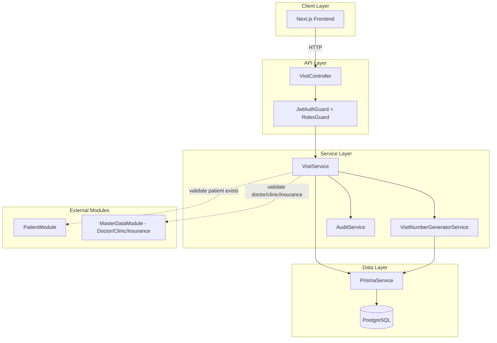
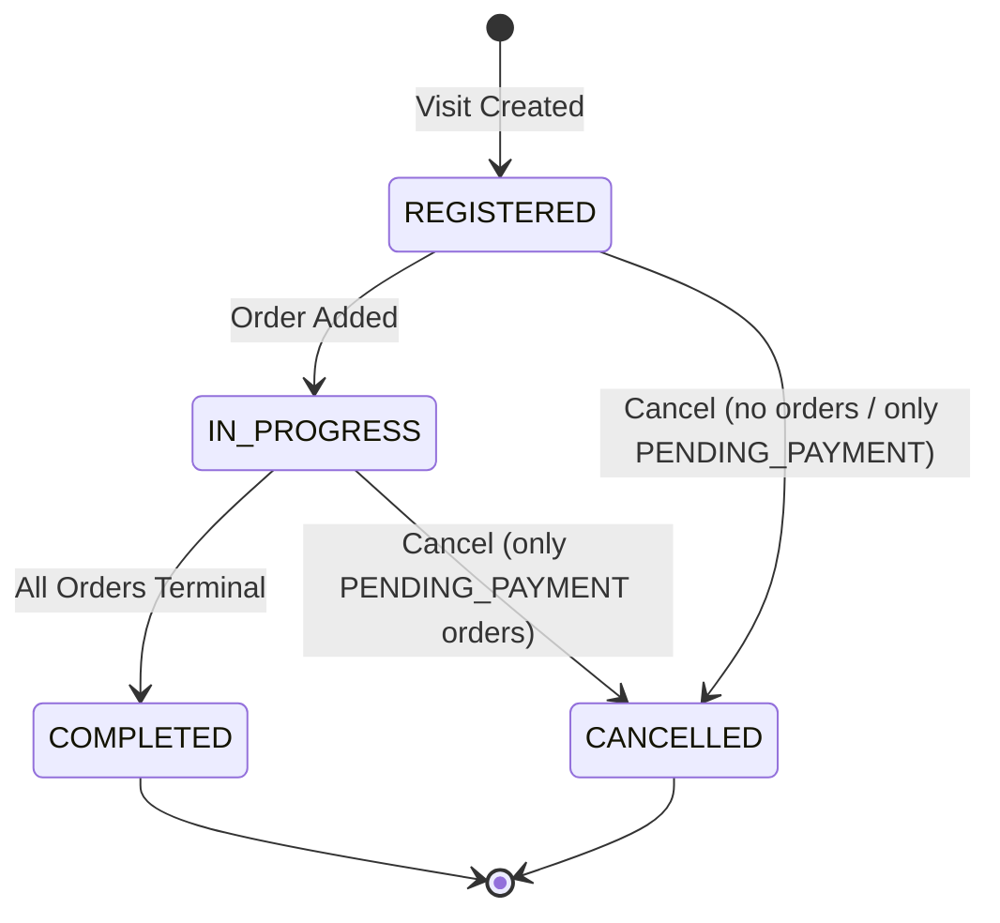
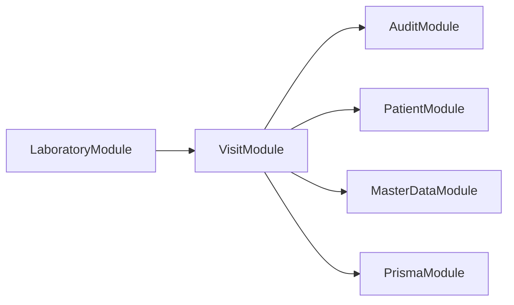
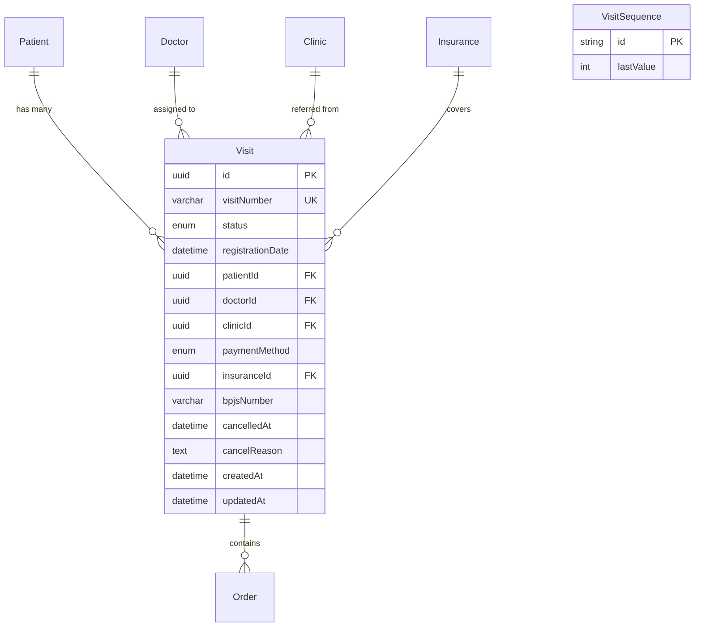

# Design Document: Visit Management

## Overview

The Visit Management module implements the patient encounter layer in eLIS, acting as the bridge between patient identity (Patient module) and laboratory orders (Order module). Each visit represents a single clinical encounter at the laboratory, recording the registration context, assigned physician, referring clinic, and payment/insurance classification.

### Key Design Decisions

1. **Follow existing Patient module patterns** — The Visit module mirrors the structure of the Patient module (service, controller, DTOs, generator service) for consistency across the codebase.
2. **VisitNumberGeneratorService** modeled after MrnGeneratorService — Uses the same SERIALIZABLE transaction pattern with a dedicated `visit_sequences` table for atomic, gap-free sequential number generation.
3. **State machine enforcement in service layer** — Visit status transitions are validated in the VisitService using an explicit transition map rather than database triggers, keeping business logic testable.
4. **Soft-delete not needed for visits** — Visits use a status-based lifecycle (CANCELLED) rather than soft-delete, since cancelled visits still carry audit and billing significance.
5. **Payment method validation uses conditional DTO validation** — Payment-dependent field requirements (BPJS number, insurance ID) are validated in the service layer for clarity, using class-validator for static rules and service-level logic for cross-field and referential validation.
6. **Audit integration via explicit AuditService.log() calls** — Follows the existing AuditService pattern where mutations explicitly log before/after values.

## Architecture



### Visit Status State Machine



### Module Dependency Diagram



## Components and Interfaces

### VisitModule

```typescript
@Module({
  imports: [AuditModule, PatientModule, MasterDataModule],
  controllers: [VisitController],
  providers: [VisitService, VisitNumberGeneratorService],
  exports: [VisitService],
})
export class VisitModule {}
```

### VisitController

```typescript
@Controller('api/v1/visits')
export class VisitController {
  constructor(private readonly visitService: VisitService) {}

  @Post()
  @UseGuards(JwtAuthGuard, RolesGuard)
  @Roles(Role.KASIR, Role.CS, Role.ADMIN, Role.KLINIK_PARTNER, Role.SUPER_ADMIN)
  async create(
    @Body() dto: CreateVisitDto,
    @CurrentUser() user: JwtPayload,
    @Req() req: Request,
  ): Promise<VisitResponseDto> {}

  @Get()
  @UseGuards(JwtAuthGuard)
  async findAll(@Query() query: VisitQueryDto): Promise<PaginatedVisitResponseDto> {}

  @Get(':id')
  @UseGuards(JwtAuthGuard)
  async findById(@Param('id', ParseUUIDPipe) id: string): Promise<VisitDetailResponseDto> {}

  @Put(':id')
  @UseGuards(JwtAuthGuard, RolesGuard)
  @Roles(Role.KASIR, Role.CS, Role.ADMIN, Role.SUPER_ADMIN)
  async update(
    @Param('id', ParseUUIDPipe) id: string,
    @Body() dto: UpdateVisitDto,
    @CurrentUser() user: JwtPayload,
    @Req() req: Request,
  ): Promise<VisitResponseDto> {}

  @Post(':id/cancel')
  @UseGuards(JwtAuthGuard, RolesGuard)
  @Roles(Role.KASIR, Role.ADMIN, Role.SUPER_ADMIN)
  async cancel(
    @Param('id', ParseUUIDPipe) id: string,
    @Body() dto: CancelVisitDto,
    @CurrentUser() user: JwtPayload,
    @Req() req: Request,
  ): Promise<VisitResponseDto> {}
}
```

### VisitService

```typescript
@Injectable()
export class VisitService {
  constructor(
    private readonly prisma: PrismaService,
    private readonly visitNumberGenerator: VisitNumberGeneratorService,
    private readonly auditService: AuditService,
  ) {}

  async create(dto: CreateVisitDto, userId: string, ipAddress?: string): Promise<Visit> {}
  async findAll(query: VisitQueryParams): Promise<PaginatedResult<Visit>> {}
  async findById(id: string): Promise<VisitWithOrders> {}
  async update(id: string, dto: UpdateVisitDto, userId: string, ipAddress?: string): Promise<Visit> {}
  async cancel(id: string, dto: CancelVisitDto, userId: string, ipAddress?: string): Promise<Visit> {}
  async transitionToInProgress(visitId: string): Promise<void> {}
  async evaluateCompletion(visitId: string): Promise<void> {}

  // Internal helpers
  private async validatePatientExists(patientId: string): Promise<void> {}
  private async validateDoctorExists(doctorId: string): Promise<void> {}
  private async validateClinicExists(clinicId: string): Promise<void> {}
  private async validateInsuranceExists(insuranceId: string): Promise<void> {}
  private validatePaymentFields(dto: CreateVisitDto | UpdateVisitDto): void {}
  private validateStatusTransition(current: VisitStatus, target: VisitStatus): void {}
}
```

### VisitNumberGeneratorService

```typescript
@Injectable()
export class VisitNumberGeneratorService {
  constructor(private readonly prisma: PrismaService) {}

  /**
   * Generates a unique visit number in format VST-YYYYMM-XXXX
   * Uses SERIALIZABLE transaction isolation for concurrency safety.
   */
  async generate(): Promise<string> {}

  /**
   * Parses a visit number into its components.
   * Returns null if the format is invalid.
   */
  static parse(visitNumber: string): { year: string; month: string; sequence: number } | null {}

  /**
   * Formats components back into a visit number string.
   */
  static format(year: string, month: string, sequence: number): string {}
}
```

### DTOs

```typescript
// CreateVisitDto
export class CreateVisitDto {
  @IsUUID()
  patientId: string;

  @IsEnum(PaymentMethod)
  paymentMethod: PaymentMethod; // CASH | BPJS | INSURANCE

  @IsOptional()
  @IsUUID()
  doctorId?: string;

  @IsOptional()
  @IsUUID()
  clinicId?: string;

  @IsOptional()
  @IsUUID()
  insuranceId?: string;

  @IsOptional()
  @IsString()
  @Matches(/^\d{13}$/, { message: 'BPJS number must be exactly 13 digits' })
  bpjsNumber?: string;
}

// UpdateVisitDto
export class UpdateVisitDto {
  @IsOptional()
  @IsEnum(PaymentMethod)
  paymentMethod?: PaymentMethod;

  @IsOptional()
  @IsUUID()
  doctorId?: string;

  @IsOptional()
  @IsUUID()
  clinicId?: string;

  @IsOptional()
  @IsUUID()
  insuranceId?: string;

  @IsOptional()
  @IsString()
  @Matches(/^\d{13}$/, { message: 'BPJS number must be exactly 13 digits' })
  bpjsNumber?: string;
}

// CancelVisitDto
export class CancelVisitDto {
  @IsString()
  @MinLength(1)
  reason: string;
}

// VisitQueryDto
export class VisitQueryDto {
  @IsOptional() @IsInt() @Min(1) page?: number;
  @IsOptional() @IsInt() @Min(1) @Max(100) limit?: number;
  @IsOptional() @IsString() search?: string;
  @IsOptional() @IsEnum(VisitStatus) status?: VisitStatus;
  @IsOptional() @IsDateString() startDate?: string;
  @IsOptional() @IsDateString() endDate?: string;
  @IsOptional() @IsUUID() doctorId?: string;
  @IsOptional() @IsUUID() clinicId?: string;
}
```

## Data Models

### Prisma Schema Additions

```prisma
// === VISIT STATUS ENUM ===
enum VisitStatus {
  REGISTERED
  IN_PROGRESS
  COMPLETED
  CANCELLED
}

// === VISIT MODEL ===
model Visit {
  id               String        @id @default(uuid()) @db.Uuid
  visitNumber      String        @unique @db.VarChar(50)
  status           VisitStatus   @default(REGISTERED)
  registrationDate DateTime      @default(now())
  patientId        String        @db.Uuid
  doctorId         String?       @db.Uuid
  clinicId         String?       @db.Uuid
  paymentMethod    PaymentMethod
  insuranceId      String?       @db.Uuid
  bpjsNumber       String?       @db.VarChar(20)
  cancelledAt      DateTime?
  cancelReason     String?
  createdAt        DateTime      @default(now())
  updatedAt        DateTime      @updatedAt

  patient   Patient    @relation(fields: [patientId], references: [id])
  doctor    Doctor?    @relation(fields: [doctorId], references: [id])
  clinic    Clinic?    @relation(fields: [clinicId], references: [id])
  insurance Insurance? @relation(fields: [insuranceId], references: [id])
  orders    Order[]

  @@index([status])
  @@index([patientId, registrationDate])
  @@map("visits")
}

// === VISIT SEQUENCE TABLE ===
model VisitSequence {
  id        String @id // format: "YYYYMM" e.g. "202507"
  lastValue Int    @default(0)

  @@map("visit_sequences")
}

// === UPDATES TO EXISTING MODELS ===

// PaymentMethod enum update (add BPJS variant)
enum PaymentMethod {
  CASH
  BPJS
  TRANSFER
  INSURANCE
}

// Patient model: add visits relation
// model Patient { ... visits Visit[] }

// Doctor model: add visits relation
// model Doctor { ... visits Visit[] }

// Clinic model: add visits relation
// model Clinic { ... visits Visit[] }

// Insurance model: add visits relation
// model Insurance { ... visits Visit[] }

// Order model: add visitId FK
// model Order { ... visitId String? @db.Uuid; visit Visit? @relation(fields: [visitId], references: [id]) }
```

### Entity Relationship



## Correctness Properties

*A property is a characteristic or behavior that should hold true across all valid executions of a system — essentially, a formal statement about what the system should do. Properties serve as the bridge between human-readable specifications and machine-verifiable correctness guarantees.*

### Property 1: Visit Number Round-Trip

*For any* valid visit number string matching the format `VST-YYYYMM-XXXX`, parsing it into components (year, month, sequence) and formatting back should produce the original visit number.

**Validates: Requirements 2.4**

### Property 2: Visit Creation Produces REGISTERED Status

*For any* valid CreateVisitDto with an existing patient and valid references, creating a visit should produce a record with status REGISTERED, the patient count should remain unchanged, and the generated visitNumber should match the format `VST-YYYYMM-XXXX`.

**Validates: Requirements 1.1, 1.5, 3.1**

### Property 3: BPJS Number Validation

*For any* string, if the payment method is BPJS, the visit creation should succeed if and only if the bpjsNumber consists of exactly 13 numeric digit characters (matching `/^\d{13}$/`).

**Validates: Requirements 4.2, 4.5**

### Property 4: CASH Payment Ignores Insurance Fields

*For any* visit creation with payment method CASH, the system should succeed regardless of the values provided for bpjsNumber or insuranceId fields (those fields are ignored).

**Validates: Requirements 4.4**

### Property 5: Status Transition Enforcement

*For any* pair (currentStatus, targetStatus) from the set of all VisitStatus values, a transition should succeed if and only if it is in the allowed set: {REGISTERED→IN_PROGRESS, REGISTERED→CANCELLED, IN_PROGRESS→COMPLETED, IN_PROGRESS→CANCELLED}.

**Validates: Requirements 3.7, 3.8**

### Property 6: Order Addition Transitions to IN_PROGRESS (Idempotent)

*For any* visit in REGISTERED or IN_PROGRESS status, adding an order should result in the visit being in IN_PROGRESS status.

**Validates: Requirements 3.2, 3.3**

### Property 7: Cancellation Precondition

*For any* visit, cancellation should succeed if and only if (a) the visit has no orders, or (b) all orders under the visit are in PENDING_PAYMENT status. Otherwise, cancellation should be rejected with ERR_INVALID_STATE.

**Validates: Requirements 3.5, 3.6**

### Property 8: Immutable Fields on Update

*For any* update operation on a visit (regardless of the DTO content), the visitNumber, patientId, and registrationDate fields should remain unchanged from their original values.

**Validates: Requirements 2.3, 7.2**

### Property 9: Updates Only Allowed on Non-Terminal Visits

*For any* visit in COMPLETED or CANCELLED status, any update attempt should be rejected with ERR_INVALID_STATE. For any visit in REGISTERED or IN_PROGRESS status, valid updates should succeed.

**Validates: Requirements 7.1, 7.3**

### Property 10: Query Filter Correctness

*For any* combination of filters (status, doctorId, clinicId, date range), all returned visits should satisfy every applied filter predicate. Specifically: if status filter is set, all results have that status; if doctorId is set, all results have that doctorId; if date range is set, all results have registrationDate within [start, end].

**Validates: Requirements 5.3, 5.4, 5.5, 5.6**

### Property 11: Pagination Invariants

*For any* dataset of N visits and any valid (page, limit) parameters where limit is between 1 and 100, the response should satisfy: `data.length <= limit`, `meta.total == N`, and `meta.totalPages == Math.ceil(N / limit)`.

**Validates: Requirements 5.1**

### Property 12: Audit Log Completeness

*For any* mutating operation (create, update, cancel) on a visit that succeeds, an audit log entry should exist with the correct action (CREATE/UPDATE/CANCEL), entityName "Visit", the visit's ID as entityId, a non-null userId, and no keys from SENSITIVE_FIELDS in oldValues/newValues.

**Validates: Requirements 12.1, 12.2, 12.3, 12.4, 12.5**

### Property 13: Search Results Relevance

*For any* search term provided to the visit list endpoint, all returned visits should have at least one of: patient name (case-insensitive), patient MRN, or visitNumber containing the search term as a substring.

**Validates: Requirements 5.2**

## Error Handling

### Error Code Mapping

| Scenario | HTTP Status | Error Code | Message |
|----------|-------------|------------|---------|
| Patient not found | 404 | ERR_NOT_FOUND | Patient not found |
| Visit not found | 404 | ERR_NOT_FOUND | Visit not found |
| Invalid doctor reference | 400 | ERR_VALIDATION | Doctor not found or inactive |
| Invalid clinic reference | 400 | ERR_VALIDATION | Clinic not found or inactive |
| Invalid insurance reference | 400 | ERR_VALIDATION | Insurance not found or inactive |
| Missing required fields | 400 | ERR_VALIDATION | Field-level validation errors |
| Invalid BPJS number | 400 | ERR_VALIDATION | BPJS number must be exactly 13 digits |
| Invalid payment method | 400 | ERR_VALIDATION | Payment method must be CASH, BPJS, or INSURANCE |
| Invalid status transition | 400 | ERR_INVALID_STATE | Cannot transition from {current} to {target} |
| Cannot cancel (orders exist) | 400 | ERR_INVALID_STATE | Cannot cancel: orders {ids} are beyond PENDING_PAYMENT |
| Update on terminal visit | 400 | ERR_INVALID_STATE | Cannot update visit in {status} status |
| Order on terminal visit | 400 | ERR_INVALID_STATE | Cannot add order to visit in {status} status |
| Monthly capacity exceeded | 500 | ERR_INTERNAL | Monthly visit number capacity (9999) exceeded |
| Visit number conflict | 500 | ERR_INTERNAL | Visit number generation conflict, please retry |
| Unauthorized (no JWT) | 401 | — | Unauthorized |
| Forbidden (wrong role) | 403 | — | Forbidden |

### Error Response Envelope

All errors follow the existing project pattern:

```json
{
  "success": false,
  "errorCode": "ERR_VALIDATION",
  "message": "Validation failed",
  "errors": [
    { "field": "bpjsNumber", "message": "BPJS number must be exactly 13 digits" }
  ],
  "traceId": "uuid-trace-id"
}
```

### Exception Handling Strategy

1. **Validation errors** — Thrown as `BadRequestException` with structured error payload
2. **Not found errors** — Thrown as `NotFoundException`
3. **State transition errors** — Custom `InvalidStateException` extending `BadRequestException` with `ERR_INVALID_STATE` code
4. **Prisma P2002 (unique constraint)** — Caught and re-thrown as `InternalServerErrorException` for MRN conflicts or `ConflictException` for business duplicates
5. **Prisma P2003 (FK constraint)** — Caught during delete operations (not applicable here since visits don't have hard delete)
6. **Serialization retry** — The SERIALIZABLE transaction for visit number generation may throw serialization failures; the service should retry once on `P0001` (serialization_failure)

## Testing Strategy

### Property-Based Testing (fast-check)

Property-based testing is appropriate for this feature because:
- Visit number generation has clear input/output behavior (pure formatting logic)
- Status transitions are a finite state machine with universal rules
- Payment validation has conditional logic that varies meaningfully with inputs
- Query filtering must satisfy universal predicates regardless of data content

**Library**: `fast-check` (already installed in devDependencies)
**Minimum iterations**: 100 per property test
**Tag format**: `Feature: visit-management, Property {N}: {title}`

#### Property Test Files

| File | Properties Covered |
|------|-------------------|
| `visit-number.property.spec.ts` | Property 1 (round-trip) |
| `visit-creation.property.spec.ts` | Properties 2, 3, 4 |
| `visit-status.property.spec.ts` | Properties 5, 6, 7 |
| `visit-update.property.spec.ts` | Properties 8, 9 |
| `visit-query.property.spec.ts` | Properties 10, 11, 13 |
| `visit-audit.property.spec.ts` | Property 12 |

### Unit Tests (Jest)

Unit tests complement property tests for specific examples and edge cases:

| Test Area | Scenarios |
|-----------|-----------|
| Visit creation | Valid creation, missing patient, invalid doctor/clinic/insurance references |
| Visit number | Monthly reset, sequence overflow at 9999, format validation |
| Status transitions | Each valid transition, each invalid transition attempt |
| Payment validation | BPJS without number, INSURANCE without ID, invalid format |
| Cancellation | Cancel with no orders, cancel with PENDING_PAYMENT orders, reject cancel with active orders |
| Update | Update mutable fields, reject update on terminal visits, reject immutable field changes |
| Query | Empty results, pagination bounds, search matching |

### Integration Tests (supertest)

| Endpoint | Test Scenarios |
|----------|---------------|
| `POST /api/v1/visits` | 201 success, 400 validation, 401 unauthorized, 403 forbidden |
| `GET /api/v1/visits` | 200 with pagination, search, filters |
| `GET /api/v1/visits/:id` | 200 with orders, 404 not found |
| `PUT /api/v1/visits/:id` | 200 success, 400 invalid state, 404 not found |
| `POST /api/v1/visits/:id/cancel` | 200 success, 400 invalid state |

### Test Configuration

```typescript
// jest property test example structure
describe('Feature: visit-management, Property 1: Visit Number Round-Trip', () => {
  it('should round-trip parse/format visit numbers', () => {
    fc.assert(
      fc.property(
        fc.integer({ min: 2020, max: 2099 }),
        fc.integer({ min: 1, max: 12 }),
        fc.integer({ min: 1, max: 9999 }),
        (year, month, seq) => {
          const visitNumber = VisitNumberGeneratorService.format(
            year.toString(),
            month.toString().padStart(2, '0'),
            seq,
          );
          const parsed = VisitNumberGeneratorService.parse(visitNumber);
          expect(parsed).not.toBeNull();
          const reformatted = VisitNumberGeneratorService.format(
            parsed!.year,
            parsed!.month,
            parsed!.sequence,
          );
          expect(reformatted).toBe(visitNumber);
        },
      ),
      { numRuns: 100 },
    );
  });
});
```
