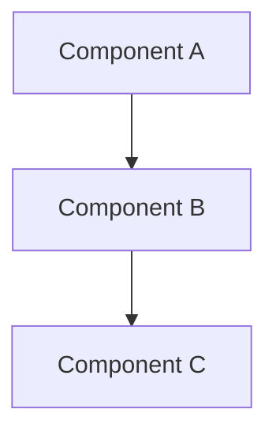
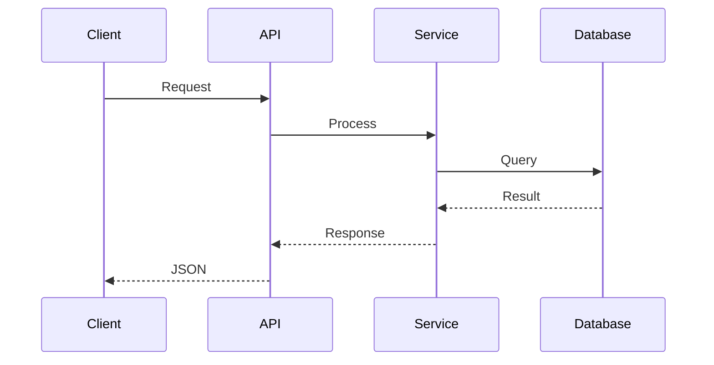

# DES-XXXX: [Title]

## Status: [DRAFT | REVIEW | APPROVED | IMPLEMENTED]

## Overview
Deskripsi singkat design ini dan rasionalnya.

## Architecture

### Component Diagram


### Module Structure
```
src/module/
├── module.module.ts
├── module.controller.ts
├── module.service.ts
├── dto/
│   └── create-module.dto.ts
└── entities/
    └── module.entity.ts
```

## Sequence Diagram


## API Specification

### Endpoint
`METHOD /api/v1/resource`

### Request
```json
{
  "field": "type"
}
```

### Response (Success)
```json
{
  "success": true,
  "message": "Success",
  "data": {}
}
```

## Database Schema

### New/Modified Tables
```sql
CREATE TABLE table_name (
  id UUID PRIMARY KEY DEFAULT gen_random_uuid(),
  field VARCHAR(255) NOT NULL,
  created_at TIMESTAMP DEFAULT NOW()
);
```

### Relations
- `table_name` belongs to `parent_table`

## Validation Rules
| Field | Type | Constraints |
|-------|------|-------------|
| field | string | required, max 255 chars |

## Error Handling
| Scenario | Status | ErrorCode | Message |
|----------|:------:|-----------|---------|
| Not found | 404 | NOT_FOUND | Resource not found |
| Invalid input | 400 | VALIDATION_ERROR | Validation failed |

## Security Considerations
- Authentication: JWT required
- Authorization: Role X required
- Data protection: [describe]

## Performance Considerations
- Caching: [describe if needed]
- Query optimization: [describe]
- Expected latency: < XXXms

## Testing Strategy
- Unit tests: [list]
- Property tests: [list properties]
- Integration tests: [list scenarios]

## Dependencies
- Requires: FR-XXXX, DES-XXXX
- Provides: [what this enables]
- Related: TASK-XXXX
