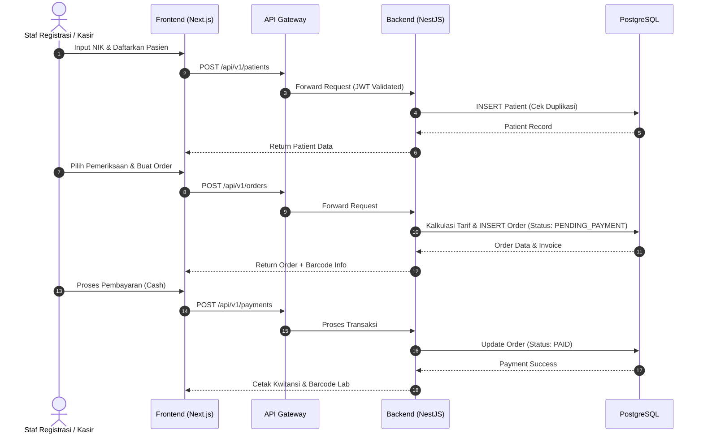
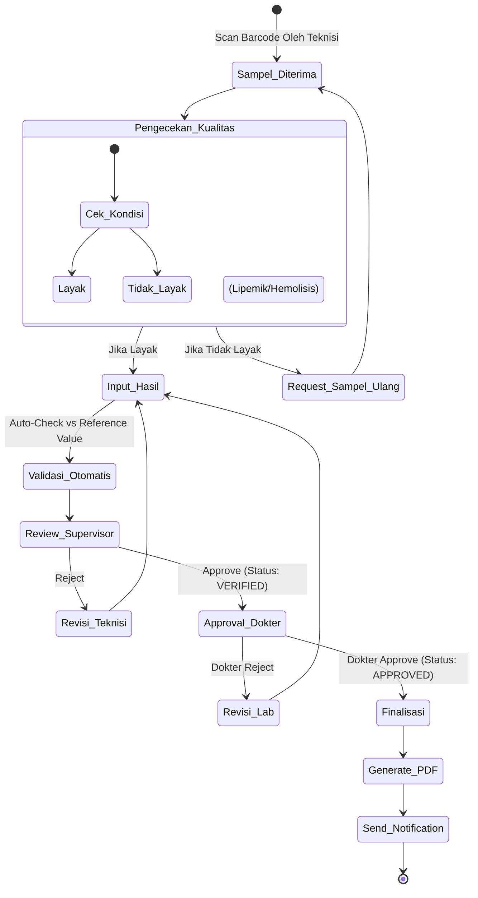
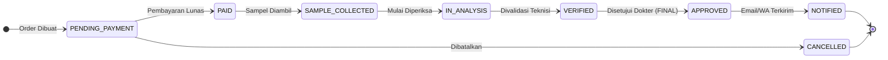
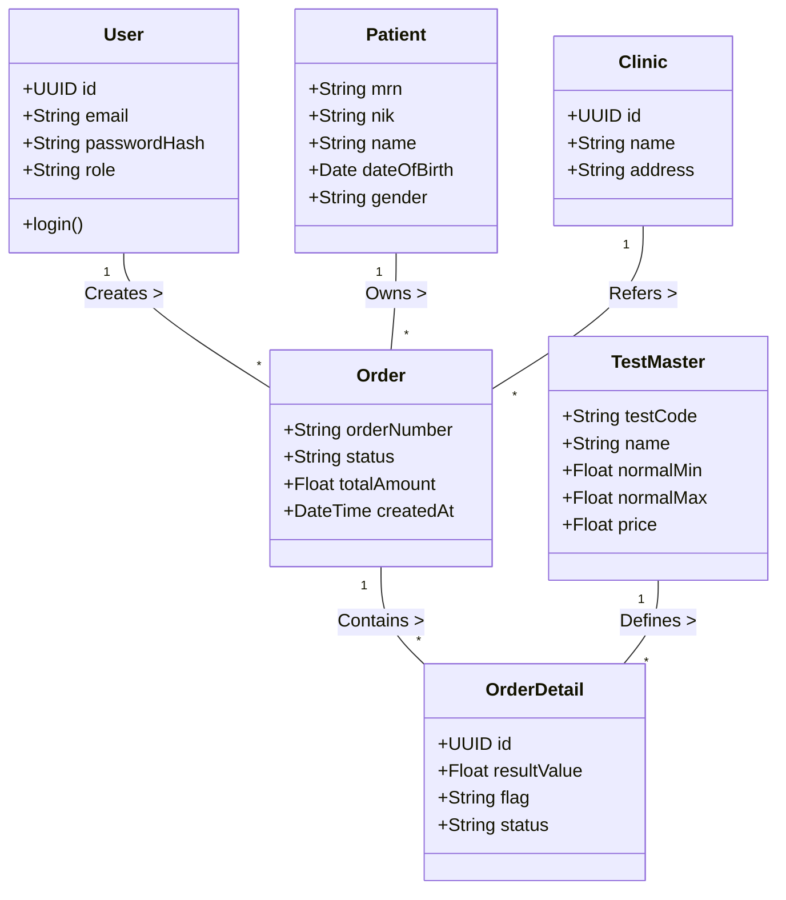

# Software Requirement Specification (SRS)
# Enterprise Laboratory Information System (eLIS)

| Field            | Detail                                       |
|------------------|----------------------------------------------|
| **Document ID**  | SRS-eLIS-2026-001                            |
| **Version**      | 1.0                                          |
| **Status**       | Draft                                        |
| **Date Created** | 2026-06-30                                   |

---

## Table of Contents
1. [Introduction](#1-introduction)
2. [Functional Requirements](#2-functional-requirements)
3. [Non-Functional Requirements](#3-non-functional-requirements)
4. [Role-Based Access Control (RBAC)](#4-role-based-access-control-rbac)
5. [Audit Trail Specification](#5-audit-trail-specification)
6. [API Requirements](#6-api-requirements)
7. [System Diagrams](#7-system-diagrams)
   - [7.1 Sequence Diagram](#71-sequence-diagram)
   - [7.2 Activity Diagram](#72-activity-diagram)
   - [7.3 State Diagram](#73-state-diagram)
   - [7.4 Class Diagram](#74-class-diagram)
   - [7.5 Deployment Diagram](#75-deployment-diagram)

---

## 1. Introduction

Dokumen Software Requirement Specification (SRS) ini mendefinisikan secara rinci spesifikasi teknis dan fungsional dari Enterprise Laboratory Information System (eLIS) untuk menjembatani *Business Requirement Document (BRD)* menuju implementasi arsitektur dan kode. Sistem dirancang dengan arsitektur **Modular Monolith** menggunakan stack Next.js (Frontend), NestJS (Backend), PostgreSQL, dan Redis.

---

## 2. Functional Requirements

### 2.1 Modul Authentication
- **F-AUTH-01**: Sistem harus menyediakan API login berbasis email/username dan password yang mengembalikan `accessToken` dan `refreshToken`.
- **F-AUTH-02**: `accessToken` berbentuk JWT dengan umur 15 menit, membawa *claims* `userId`, `role`, dan `klinikId`.
- **F-AUTH-03**: Password harus di-hash menggunakan `bcrypt` dengan cost factor 12.

### 2.2 Modul Master Data
- **F-MD-01**: Menyediakan REST API CRUD untuk Entitas: *Jenis Pemeriksaan, Panel, Kategori, Tarif, Dokter, Klinik*.
- **F-MD-02**: Master data tidak boleh dihapus secara hard-delete (harus menggunakan field `deletedAt` / soft delete).

### 2.3 Modul Manajemen Pasien & Order
- **F-PAT-01**: Input pasien harus memvalidasi keunikan `NIK`. Nomor RM (Rekam Medis) digenerate secara otomatis (format: `RM-YYYYMM-XXXX`).
- **F-ORD-01**: Sistem dapat membuat Order Lab yang berelasi dengan 1 Pasien dan memiliki N (satu atau lebih) Jenis Pemeriksaan.
- **F-ORD-02**: Saat Order dibuat, status otomatis menjadi `PENDING_PAYMENT`.

### 2.4 Modul Kasir & Billing
- **F-BIL-01**: Sistem dapat menghitung Total Harga otomatis dari master Tarif berdasarkan klinik perujuk dan diskon.
- **F-BIL-02**: Pembayaran sukses akan memicu event perubahan status order menjadi `PAID` dan memungkinkan cetak struk serta barcode.

### 2.5 Modul Analisa & Approval Lab
- **F-LAB-01**: Input hasil pemeriksaan harus memvalidasi tipe data dan mencocokkan dengan Nilai Rujukan (Min/Max).
- **F-LAB-02**: Sistem auto-flag nilai di luar rujukan (H/L) dan kritis (C).
- **F-LAB-03**: Order dinyatakan final (Approved) jika seluruh pemeriksaan di dalam order tersebut telah diverifikasi Teknisi dan diapprove Dokter (jika required).

---

## 3. Non-Functional Requirements

### 3.1 Security Requirement
- **Standar**: OWASP Top 10.
- **Encryption in Transit**: TLS 1.3 mandatory untuk semua komunikasi (Web to API).
- **Encryption at Rest**: AES-256 untuk kolom PII (Personally Identifiable Information) di database seperti `NIK` pasien.
- **Rate Limiting**: Endpoint `/api/auth/login` dan `/api/auth/otp` dibatasi maksimal 5 request per menit per IP (via Redis).
- **CORS**: Dibatasi ketat hanya pada domain frontend yang terdaftar (tidak menggunakan wildcard `*`).

### 3.2 Performance Requirement
- **API Latency**: 95% dari seluruh API read (GET) harus di bawah 200ms. API write (POST/PUT) di bawah 500ms.
- **Concurrent Users**: Mampu menahan 100 concurrent users aktif per server instance node.js.
- **Connection Pooling**: PostgreSQL harus menggunakan connection pooler (melalui Prisma Accelerate/PgBouncer connection pool management) dengan max pool sejalan dengan (CPU cores * 2) + 1.

### 3.3 Logging Requirement
- **Format Log**: JSON terstruktur, memudahkan index oleh Grafana Loki.
- **Request Tracing**: Setiap request HTTP dari gateway wajib digenerate `X-Request-ID` UUID.
- **Log Level**: `INFO` untuk request normal, `WARN` untuk exception tertangani, `ERROR` untuk fatal crash. Tidak ada log `DEBUG` di production.

### 3.4 Backup Requirement
- **Database (PostgreSQL)**: 
  - *Full Backup* harian (setiap pukul 02:00 AM).
  - *Incremental/WAL Backup* setiap 15 menit (Point-In-Time-Recovery / PITR siap pakai).
- **Object Storage (MinIO)**: Replikasi otomatis ke server backup (atau bucket sekunder) setiap hari.
- **Retensi**: Backup harian disimpan 30 hari, backup bulanan disimpan 5 tahun.

### 3.5 Disaster Recovery (DR)
- **RTO (Recovery Time Objective)**: 4 Jam (sistem hidup kembali).
- **RPO (Recovery Point Objective)**: 15 Menit (maksimal data hilang setara 15 menit transaksi, mengandalkan WAL archiver).

---

## 4. Role-Based Access Control (RBAC)

Setiap endpoint API dan elemen UI dikendalikan oleh Role.

| Modul / Menu | ADMIN | MANAGER | KASIR | TEKNISI | DOKTER_PJ | KLINIK |
|--------------|:-----:|:-------:|:-----:|:-------:|:---------:|:------:|
| Manage User | C R U D | R | - | - | - | - |
| Master Data | C R U D | R | R | R | R | - |
| Pasien | C R U D | R U | C R U | R | R | C R |
| Order & Kasir| R U | R U | C R U | R | R | C R (Own)|
| Analisa Lab | R | R | - | C R U | R | - |
| Approval Lab | R | R | - | R | R U (Approve) | - |
| Dashboard | R | R | - | - | R | - |
| Laporan | R | C R U | R (Own)| - | - | R (Own) |

*Keterangan: C=Create, R=Read, U=Update, D=Delete*

---

## 5. Audit Trail Specification

Sistem memiliki entitas/tabel `audit_logs` yang meng-intercept setiap operasi mutasi (Create, Update, Delete).

**Atribut Audit Log**:
- `id` (UUID)
- `timestamp` (UTC)
- `userId` (Siapa yang melakukan)
- `action` (CREATE, UPDATE, DELETE, LOGIN, EXPORT)
- `entityName` (Tabel yang diubah, misal: `patients`)
- `entityId` (ID record yang diubah)
- `oldValues` (JSONB)
- `newValues` (JSONB)
- `ipAddress` (IP Asal User)

**Aturan**:
1. Tabel ini hanya bisa di-*insert*. TIDAK ADA operasi UPDATE/DELETE pada tabel ini (Immutable).
2. Data sensitif (password hash) tidak disimpan di old/new values.

---

## 6. API Requirements

Sistem menggunakan REST API standar.

- **Format**: JSON (Request & Response).
- **Versioning**: Header-based versioning atau Path-based `/api/v1/...`.
- **Response Standard**:
  ```json
  {
    "success": true,
    "message": "Pesan sukses",
    "data": { ... },
    "meta": { "page": 1, "total": 50 } // untuk pagination
  }
  ```
- **Error Standard**:
  ```json
  {
    "success": false,
    "errorCode": "ERR_VALIDATION",
    "message": "Validasi gagal",
    "errors": [
      { "field": "nik", "message": "NIK harus 16 digit" }
    ],
    "traceId": "uuid-1234-..."
  }
  ```
- **Pagination & Filtering**: Endpoint list (GET) harus mendukung param `?page=1&limit=10&sort=createdAt:desc&search=budi`.
- **Swagger/OpenAPI**: Setiap endpoint wajib di-annotate dengan dekorator `@Api()` dari NestJS Swagger.

---

## 7. System Diagrams

### 7.1 Sequence Diagram

**Flow Registrasi, Kasir, dan Order Pemeriksaan**



### 7.2 Activity Diagram

**Main Laboratory Analysis Journey**



### 7.3 State Diagram

**State of Order (Order Lifecycle)**



### 7.4 Class Diagram

**Domain Entity Model (Simplified Conceptual)**



### 7.5 Deployment Diagram

**Dockerized Modular Monolith Architecture (Phase 1)**

```mermaid
graph TD
    Client[Klinik/Pasien Web Browser] --> |HTTPS| LB[Load Balancer / NGINX Gateway]
    ClientMobile[Mobile/Tablet Staf] --> |HTTPS| LB
    
    subgraph Docker Engine (VPS / Server)
        LB --> Frontend[Next.js Container <br> Port 3000]
        LB --> API_GW[API Gateway / Traefik <br> Port 80/443]
        
        Frontend --> API_GW
        
        API_GW --> Backend[NestJS Monolith Container <br> Port 4000]
        
        Backend --> DB[(PostgreSQL Container <br> Port 5432)]
        Backend --> Redis[(Redis Container <br> Port 6379)]
        Backend --> Minio[(MinIO Object Storage <br> Port 9000)]
        
        Worker[NestJS Queue Worker] --> Redis
        Worker --> Minio
    end
    
    Worker --> |SMTP| Email[Email Gateway]
    Worker --> |API| WA[WhatsApp Vendor API]
```

---
**END OF SRS DOCUMENT**
