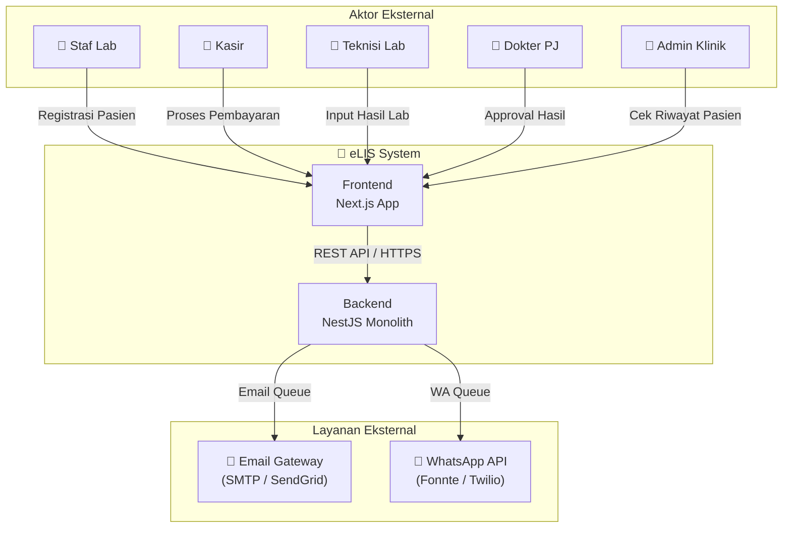
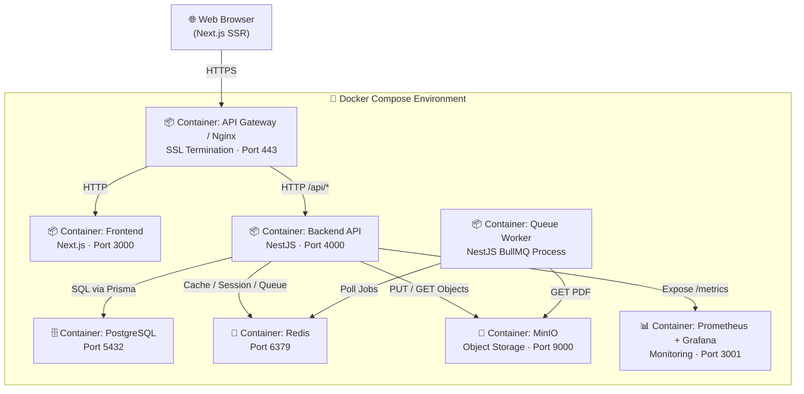
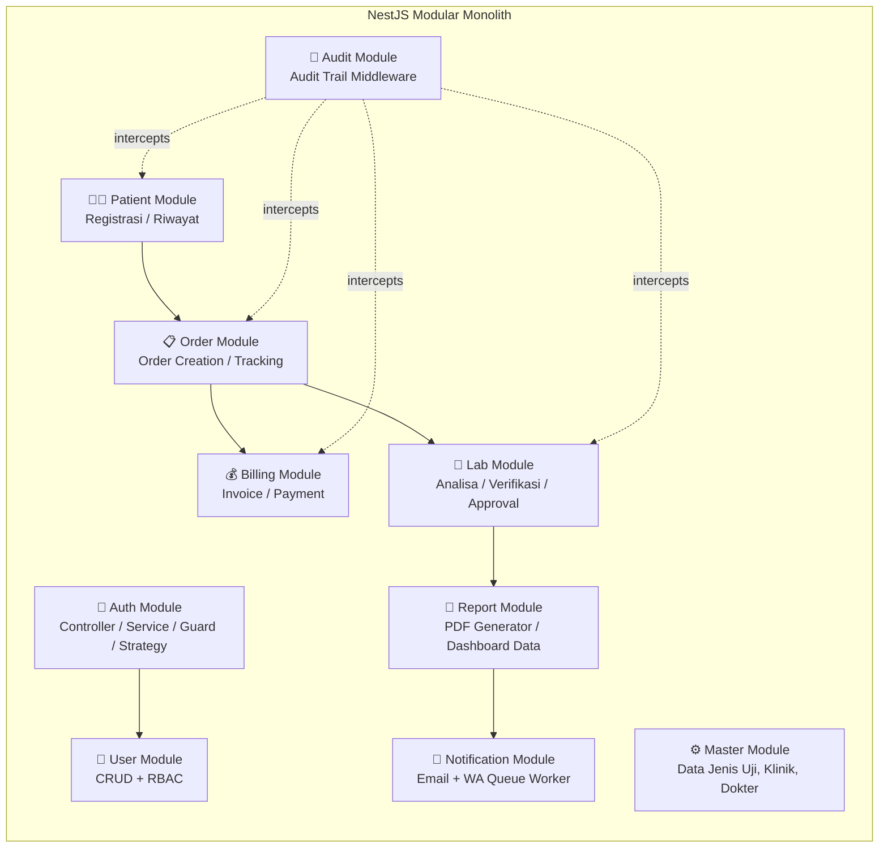
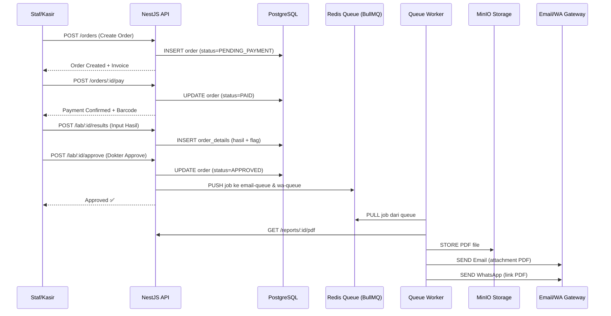

# System Architecture Document
# Enterprise Laboratory Information System (eLIS)

| Field            | Detail                                       |
|------------------|----------------------------------------------|
| **Document ID**  | ARCH-eLIS-2026-001                           |
| **Version**      | 1.0                                          |
| **Status**       | Final Draft                                  |
| **Date Created** | 2026-06-30                                   |
| **Referensi**    | ADR-0001 s/d ADR-0012, BRD-eLIS-v1.0        |

---

## 1. Architectural Overview

### 1.1 Filosofi Arsitektur
eLIS dirancang menggunakan pola **Modular Monolith** sebagai titik awal, dengan prinsip *Evolution-Ready Architecture*. Setiap modul domain bisnis memiliki batas yang jelas (*domain boundary*) sehingga ekstraksi ke Microservice di masa depan dapat dilakukan tanpa rewrite total.

> **Prinsip Utama**: "Mulai sederhana, scale dengan disiplin."

### 1.2 Pola Arsitektur yang Diadopsi

| Level | Pola | Detail |
|-------|------|--------|
| **Sistem** | Modular Monolith | Satu deployment unit, modul domain yang terisolasi secara logika |
| **Backend** | Layered Architecture | Controller → Service → Repository (via Prisma) |
| **Frontend** | Feature-Sliced Design | Komponen terorganisir per fitur/domain |
| **Komunikasi** | Request-Response (REST) | Frontend ↔ Backend via HTTP/JSON |
| **Async Processing** | Event-Driven Queue | BullMQ + Redis untuk notifikasi dan PDF |
| **Infrastruktur** | Containerized | Docker + Docker Compose → Future K8s |

---

## 2. System Context Diagram (C4 Level 1)

---

## 3. Container Diagram (C4 Level 2)

---

## 4. Component Diagram — Backend (C4 Level 3)

---

## 5. Data Flow Architecture

### 5.1 Happy Path: Registrasi → Kasir → Lab → Notifikasi

---

## 6. Security Architecture

| Layer | Kontrol Keamanan |
|-------|-----------------|
| **Network** | TLS 1.3, HSTS, CORS Strict Origin Policy |
| **API Gateway** | Rate Limiting (per IP), DDoS Basic Protection |
| **Authentication** | JWT (HS256, short-lived 15m) + Refresh Token (HttpOnly Cookie) |
| **Authorization** | RBAC via NestJS Guards per endpoint |
| **Data at Rest** | AES-256 untuk field PII, bcrypt-12 untuk password |
| **Audit** | Immutable `audit_logs` via Prisma Middleware |
| **Application** | Helmet.js (HTTP Security Headers), class-validator (Input Validation) |
| **Monitoring** | Prometheus Alerts untuk anomali request spike |

---

## 7. Scalability Architecture

### Phase 1 (Now) — Single Node
- 1 VPS/Server dengan Docker Compose.
- Single instance PostgreSQL, Redis, MinIO.
- Mampu menangani 1 lab + beberapa klinik rujukan.

### Phase 2 — Read Scaling
- **PostgreSQL Read Replica** diperkenalkan untuk memisahkan beban tulis dan baca (laporan & dashboard).
- **Redis Cluster** jika volume queue melebihi kapasitas single node.

### Phase 3 — Horizontal Scaling (SaaS)
- Migrasi ke **Kubernetes (K8s)** untuk auto-scaling pod Backend dan Worker.
- **Database Sharding per Tenant** atau schema isolation PostgreSQL.
- API Gateway (Kong) sebagai entry point pengganti Nginx.
- Ekstraksi Microservice dimulai dari modul dengan beban tertinggi (Notifikasi, PDF Generator).

---

## 8. Disaster Recovery & High Availability

| Aspek | Strategi |
|-------|----------|
| **RTO** | 4 Jam (Recovery Time Objective) |
| **RPO** | 15 Menit (Recovery Point Objective) |
| **DB Backup** | WAL Archiving + Full Backup Harian |
| **MinIO Backup** | Replikasi ke bucket sekunder setiap 24 jam |
| **Failover** | Docker `restart: always` policy + Health Check |
| **Monitoring Alert** | Grafana alert → Email/Telegram jika server down |

---
**END OF ARCHITECTURE DOCUMENT**
