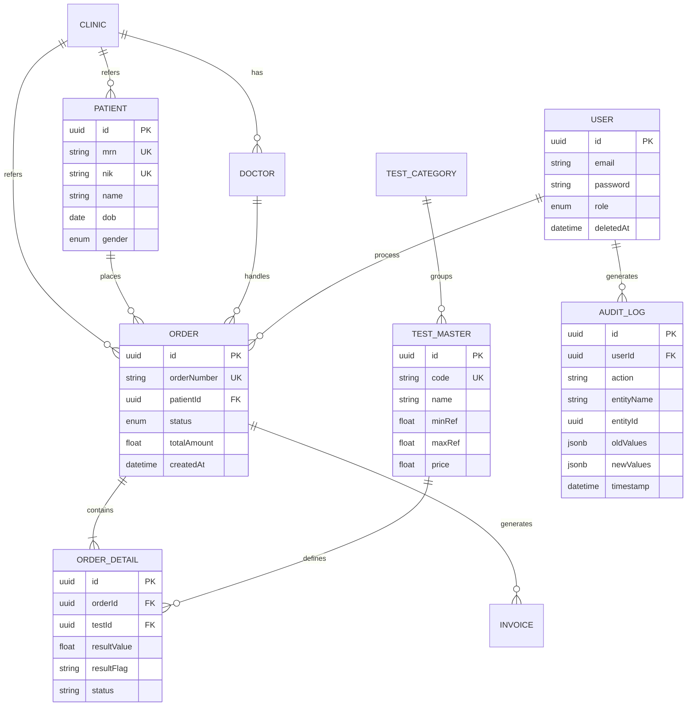

# Database Design Specification
# Enterprise Laboratory Information System (eLIS)

| Field            | Detail                                       |
|------------------|----------------------------------------------|
| **Document ID**  | DB-eLIS-2026-001                             |
| **Version**      | 1.0                                          |
| **Status**       | Draft                                        |
| **Date Created** | 2026-06-30                                   |

---

## 1. Arsitektur Database
- **RDBMS Utama**: PostgreSQL v15+.
- **ORM**: Prisma (TypeScript).
- **In-Memory Store**: Redis v7+ (Cache, Session, Queue, OTP).
- **Schema Management**: Prisma Migrate (Migration Plan terstruktur per sprint).

---

## 2. Entity Relationship Diagram (ERD)

---

## 3. Data Modeling

### 3.1 Conceptual Model
Sistem memodelkan domain klinis: Pasien melakukan pendaftaran, menghasilkan `Order` (permintaan pemeriksaan) yang ditangani oleh Dokter dan Teknisi. `Order` terdiri dari beberapa `OrderDetail` (Parameter Uji) yang nilainya dibandingkan dengan `TestMaster` (Nilai Rujukan). Operasi finansial menghasilkan `Invoice`. Segala operasi dimonitor oleh `AuditLog`.

### 3.2 Logical & Physical Model (PostgreSQL via Prisma)
- **Tipe Data Kunci**: Semua Primary Key (PK) wajib menggunakan `UUID` v4 untuk keamanan, obfuscation URL, dan persiapan microservices (mencegah ID collision saat shard/merge).
- **Timestamps**: Semua tabel memiliki `createdAt` (timestamptz) dan `updatedAt` (timestamptz).
- **Soft Delete**: Semua tabel master dan transaksi wajib memiliki field `deletedAt` (timestamptz, nullable). Data tidak pernah dihapus secara fisik (hard-delete) demi kepatuhan rekam medis.
- **Audit Table**: `audit_logs` akan menerima insert masif. Payload data masa lalu/baru disimpan dalam tipe `JSONB`.

### 3.3 Normalization
- Skema dinormalisasi hingga tahap ke-3 (3NF) untuk menghindari anomali *update*.
- Nama dan NIK pasien tidak diulang di tabel transaksi, melainkan melalui relasi Foreign Key (FK) `patientId`.

---

## 4. Indexing Strategy & Constraints

### 4.1 Indexing
Untuk memastikan performa (Response Time < 200ms) di tabel yang akan membengkak, indeks berikut diwajibkan:
1. `B-Tree Index` pada kolom yang sering dicari:
   - `patients.nik`
   - `patients.mrn`
   - `patients.name`
   - `orders.orderNumber`
   - `orders.status`
2. `B-Tree Index` pada Foreign Keys:
   - `orders.patientId`
   - `order_details.orderId`
3. `GIN Index` (Generalized Inverted Index):
   - Jika implementasi pencarian teks pasien menggunakan `tsvector` PostgreSQL.
   - Pada kolom `JSONB` di tabel `audit_logs` agar pencarian data histori (log) cepat.

### 4.2 Constraints
- **Unique Constraint**: `nik` (Pasien), `mrn` (Pasien), `orderNumber` (Order), `testCode` (TestMaster).
- **Foreign Key Constraint**: Menggunakan `ON DELETE RESTRICT` untuk mencegah penghapusan master data yang sudah memiliki transaksi. Relasi tidak menggunakan `CASCADE` delete karena sistem memberlakukan Soft Delete.

---

## 5. Audit & History Tables
Pencatatan rekam medis mengharuskan riwayat yang tak dapat diubah (*immutable*).
- **Tabel `audit_logs`**: Setiap *Create*, *Update*, *Delete* (Soft) akan memicu satu baris baru di tabel audit via Prisma Middleware.
- Kolom `oldValues` (JSONB) menyimpan snapshot state sebelum diubah.
- Kolom `newValues` (JSONB) menyimpan state setelah diubah.
- Data ini tidak pernah di-update atau di-delete.

---

## 6. Redis Design (In-Memory Database)

Redis tidak digunakan sebagai persistence utama, melainkan untuk mendukung sistem yang sangat cepat dan asynchronous.

| Prefix / Namespace | Tipe Data | Kegunaan | TTL (Kedaluwarsa) |
|--------------------|-----------|----------|-------------------|
| `cache:testmaster` | String (JSON) | Cache API daftar harga lab yang jarang berubah. | 24 Jam (atau invalidate manual saat harga diubah) |
| `session:user:{id}`| String | Menyimpan status aktif atau token refresh untuk multi-device auth. | 7 Hari |
| `blocklist:jwt:{jti}`| String | Mencegah token lama (setelah logout) digunakan kembali. | Sisa umur token |
| `otp:reset:{email}`| String | OTP untuk reset sandi. | 5 Menit |
| `bull:email_queue:*`| Hash/List | Redis stream queue oleh BullMQ untuk antrean email. | Persisten sampai job selesai/gagal. |
| `bull:wa_queue:*`  | Hash/List | Redis stream queue oleh BullMQ untuk antrean WhatsApp. | Persisten sampai job selesai/gagal. |

---

## 7. Migration Plan
- Menggunakan `prisma migrate dev` di tahap pengembangan.
- Menghasilkan file SQL mentah di direktori `prisma/migrations`.
- Eksekusi di staging/production menggunakan `prisma migrate deploy` melalui CI/CD pipeline (Docker).
- Jika ada *breaking change* pada skema yang sedang berjalan (contoh memisahkan 1 kolom menjadi 2), migrasi harus menggunakan metode *expand-and-contract* (penambahan kolom tanpa merusak lama -> copy data -> drop lama).

---
**END OF DATABASE DESIGN SPECIFICATION**
