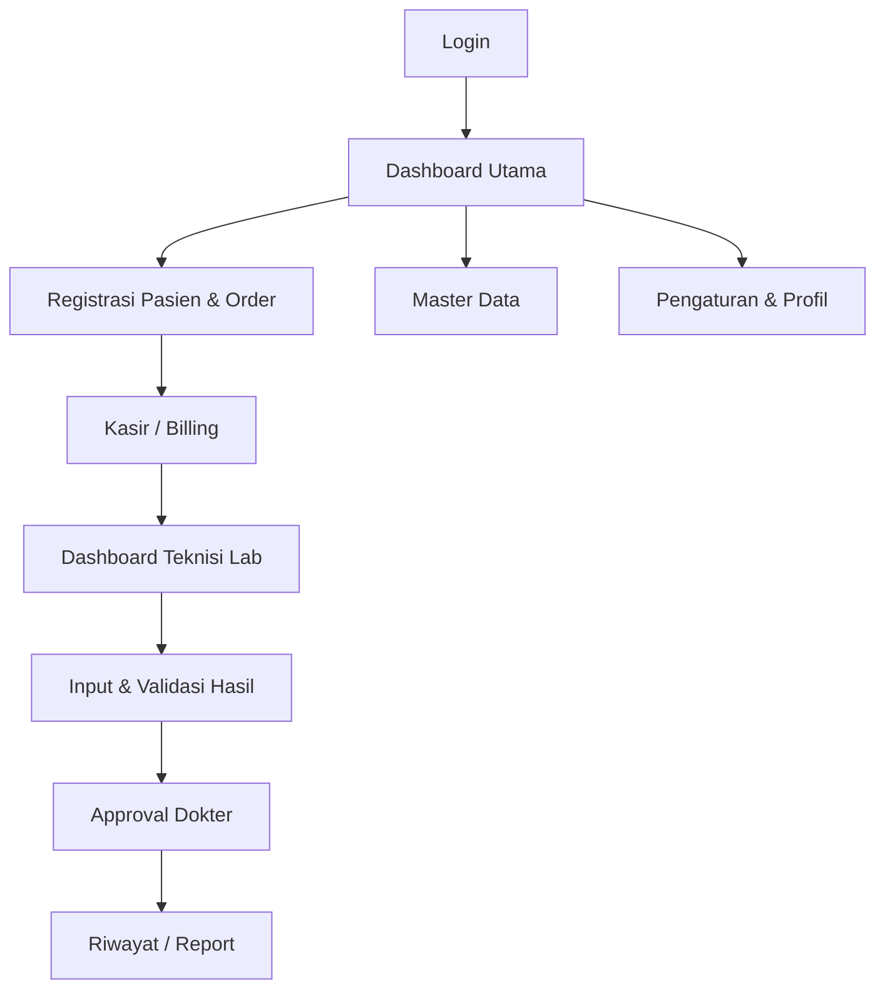

# UI/UX Design System & Wireframe
# Enterprise Laboratory Information System (eLIS)

| Field            | Detail                                       |
|------------------|----------------------------------------------|
| **Document ID**  | UIUX-eLIS-2026-001                           |
| **Version**      | 1.0                                          |
| **Status**       | Draft                                        |
| **Date Created** | 2026-06-30                                   |

---

## 1. Design Concept & Philosophy
Konsep utama dari antarmuka eLIS adalah **"Calm Medical Experience"**. Tujuan desain ini adalah mengurangi kecemasan atau kelelahan (burnout) pengguna yang menatap layar dalam waktu lama (staf registrasi, kasir, teknisi lab). 

**Aturan Emas**: Dilarang menggunakan warna "Biru Rumah Sakit" yang kaku dan dingin. Antarmuka harus terasa hangat, organik, modern, dan sangat responsif.

## 2. Design Tokens

### 2.1 Color Palette
- **Primary**: `Sage Green` (#9CB4A1) — Digunakan untuk elemen aksi utama (Primary Buttons, Active States).
- **Secondary**: `Muted Olive` (#7A8A73) — Digunakan untuk aksi sekunder, border, atau elemen pendukung.
- **Background**:
  - `Warm Off White` (#F9F8F6) — Latar belakang aplikasi utama.
  - `Cream` (#FDFCF0) — Latar belakang form atau modal.
  - `Beige` (#F4EFE6) — Latar belakang komponen yang di-highlight.
- **Text**:
  - `Deep Forest Green` (#2C3D2F) — Teks heading utama (H1-H6).
  - `Charcoal` (#333333) — Teks paragraf / data tabel (Body).
- **Status Colors (Soft/Pastel)**:
  - Sukses (Normal): Soft Mint Green
  - Peringatan (Abnormal): Soft Amber
  - Kritis/Gagal: Soft Coral Red

### 2.2 Typography
- **Primary Font**: `Plus Jakarta Sans` (Menghadirkan kesan modern, bersih, dan sangat terbaca pada data numerik / hasil lab).
- **Fallback Font**: `Inter`.
- **Hierarchy**:
  - H1: 32px, Bold (Deep Forest Green)
  - H2: 24px, SemiBold
  - Body: 14px, Regular (Charcoal)
  - Caption: 12px, Medium

### 2.3 Layout & Shapes
- **Grid System**: `Bento Grid` (Komponen tersusun dalam blok-blok rapi dengan jarak seragam).
- **Spacing**: High White Space (bernafas). Margin/Padding antar komponen harus proporsional (menggunakan skala 4px, misal: 16px, 24px, 32px).
- **Border Radius**: 
  - `Rounded 2XL` (16px) untuk card dan modal.
  - `Rounded 3XL` (24px) untuk container utama.
  - Elemen tidak boleh memiliki sudut tajam.
- **Shadows**: `Soft Shadow` (blur tinggi, opacity sangat rendah) untuk memberi efek `Soft Card` melayang.
- **Animation**: 
  - `Fade In` pada perpindahan halaman.
  - `Skeleton Loading` (pulsing skeleton) sebelum data dimuat, hindari spinner yang mengganggu.
  - `Smooth Hover` transition (200ms ease-in-out).

---

## 3. User Flow



---

## 4. Wireframe & Page Structure (High-Fidelity Description)

### 4.1 Login Page
- **Layout**: Split Screen. 
  - Kiri (60%): Grafis abstrak organik 3D berwarna Sage Green dengan tagline Calm Medical Experience.
  - Kanan (40%): Form login di atas card Cream dengan soft shadow.
- **Elemen**: Logo, Input Username (Rounded 2XL), Input Password, Button Login (Sage Green, Hover effect).

### 4.2 Dashboard Utama (Bento Grid)
```text
+-------------------------------------------------------------+
| [Logo]  Search Pasien...                 [Notif] [Profile]  |
+-------------------------------------------------------------+
| +-------+ +-------------------------+ +-------------------+ |
| |       | | TOTAL PASIEN HARI INI   | | PENDAPATAN HARI   | |
| | Menu  | | 124                     | | Rp 12.500.000     | |
| | Kiri  | +-------------------------+ +-------------------+ |
| |       | +-----------------------------------------------+ |
| | - Reg | | ANTRIAN LAB (Bento Card)                      | |
| | - Lab | | [  Order 1 - Pending  ] [  Order 2 - Proses ] | |
| | - Dok | +-----------------------------------------------+ |
| | - Rep | +-------------------------+ +-------------------+ |
| |       | | GRAFIK KUNJUNGAN        | | RECENT ACTIVITY   | |
| +-------+ +-------------------------+ +-------------------+ |
+-------------------------------------------------------------+
```
- Menampilkan metrik utama di dalam blok berdesain soft card.

### 4.3 Registrasi Pasien & Order
- **Layout**: Wizard Step / Two-column.
- **Elemen**:
  - Card 1: Cari Pasien (Auto-suggest NIK/Nama). Jika pasien baru, form muncul secara *smooth accordion*.
  - Card 2: Pilih Pemeriksaan (Multi-select dengan badge tags).
  - Footer Floating: Total Harga Real-time & Button "Lanjut Pembayaran".

### 4.4 Kasir / Billing
- **Layout**: POS-style (Point of Sale).
- **Elemen**:
  - Kiri: Rincian Invoice (Item, Harga, Diskon).
  - Kanan: Numpad besar, Pilihan Metode (Tunai, Transfer, EDC).
  - Modal: "Pembayaran Berhasil, Cetak Barcode?".

### 4.5 Laboratorium (Dashboard Teknisi)
- **Layout**: Kanban Board / List view.
- **Elemen**: 
  - Tab: [Menunggu Sampel], [Proses Analisa], [Selesai Validasi].
  - Form Input Hasil: 
    - Tabel dengan baris per Parameter.
    - Input angka. Jika di atas nilai rujukan, input box otomatis berborder *Soft Amber/Red* (peringatan halus).

### 4.6 Approval Dokter
- **Layout**: Split View Master-Detail.
- **Elemen**:
  - Kiri: Daftar order yang menunggu (List Card).
  - Kanan: Detail hasil, *highlight* warna untuk nilai kritis. Textarea untuk *Interpretasi Klinis*, Button besar "Setujui" & "Tolak".

### 4.7 Hasil Pemeriksaan (Preview Report)
- **Layout**: A4 PDF View preview.
- **Elemen**: Rendering HTML yang menyerupai PDF (kertas putih di atas *warm off-white background*). Tersedia tombol `Download PDF` dan `Kirim via WA`.

### 4.8 Master Data & Report
- **Layout**: Data Table Modern.
- **Elemen**: 
  - Header: Global Search, Filter Dropdowns, Button Add.
  - Table: Zebra-stripes tipis, hover baris, action menu (tiga titik vertical).
  - Pagination modern (bukan angka kecil, tapi rounded buttons).

### 4.9 Notification & Audit Trail
- **Notification**: Drawer sliding dari sisi kanan layar, memuat list notifikasi dengan badge *read/unread*.
- **Audit Trail**: Tabel read-only dengan filter Date Range, User, Action, dan Modal untuk melihat struktur JSON `oldValue` vs `newValue`.

---
**END OF UI/UX DESIGN SYSTEM**
