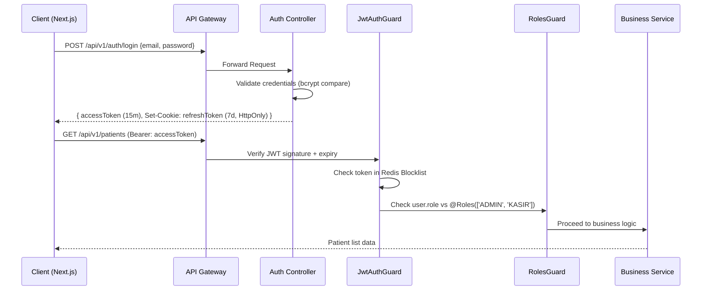
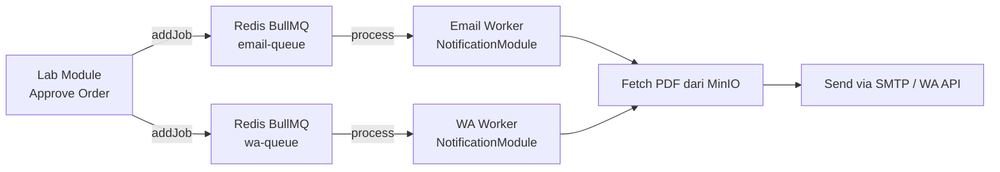

# Backend Architecture Specification
# Enterprise Laboratory Information System (eLIS)

| Field            | Detail                                       |
|------------------|----------------------------------------------|
| **Document ID**  | BE-eLIS-2026-001                             |
| **Version**      | 1.0                                          |
| **Status**       | Draft                                        |
| **Date Created** | 2026-06-30                                   |
| **Referensi**    | ADR-0002, SRS-eLIS, API-Docs-eLIS, ARCH-eLIS|

---

## 1. Technology Stack

| Layer | Technology | Versi | Keterangan |
|-------|-----------|-------|------------|
| **Framework** | NestJS | v10+ | Modular, DI native, decorator-based |
| **Language** | TypeScript | v5+ | Strict Mode, type-safe |
| **HTTP Adapter** | Express (default) / Fastify | - | Swap ke Fastify jika perlu perf lebih |
| **ORM** | Prisma | v5+ | Type-safe DB client, migration tooling |
| **Database** | PostgreSQL | v15+ | RDBMS utama |
| **Cache & Queue** | Redis (via ioredis + BullMQ) | v7+ | Cache, session, job queue |
| **Object Storage** | MinIO Client (AWS S3 SDK) | v3+ | File/PDF storage |
| **Auth** | JWT (jsonwebtoken) + bcrypt | - | Access + Refresh Token |
| **Validation** | class-validator + class-transformer | - | DTO validation layer |
| **Docs** | Swagger (NestJS @nestjs/swagger) | - | OpenAPI 3.0 auto-generated |
| **Testing** | Jest + Supertest | - | Unit + Integration + E2E |
| **Logging** | Pino | - | JSON structured logging, high perf |
| **Monitoring** | prom-client | - | Prometheus metrics exposure |

---

## 2. NestJS Module Structure

Setiap domain bisnis dienkapsulasi menjadi 1 NestJS Module yang berdiri sendiri. Tidak ada cross-module import langsung ke *Repository* atau *Database* modul lain. Komunikasi antar modul melalui *Service interface*.

```text
src/
├── main.ts                 # Bootstrap App (Global Pipes, Guards, Interceptors)
├── app.module.ts           # Root Module (import semua domain module)
│
├── common/                 # Shared utilities
│   ├── decorators/         # Custom Decorators (@CurrentUser, @Roles)
│   ├── filters/            # Global Exception Filters
│   ├── guards/             # JwtAuthGuard, RolesGuard (RBAC)
│   ├── interceptors/       # LoggingInterceptor, AuditInterceptor, TransformInterceptor
│   ├── pipes/              # Global ValidationPipe
│   └── prisma/             # PrismaService (Database client singleton)
│
├── auth/                   # Modul Autentikasi
│   ├── auth.module.ts
│   ├── auth.controller.ts  # POST /auth/login, /auth/refresh, /auth/logout
│   ├── auth.service.ts     # Logic: validate, generate token, bcrypt
│   ├── strategies/         # PassportJS strategies (jwt.strategy.ts)
│   └── dto/                # LoginDto, RefreshDto
│
├── users/                  # Modul Manajemen User & RBAC
├── patients/               # Modul Pasien (Registrasi, Riwayat)
├── clinics/                # Modul Klinik Mitra (Master Data)
├── doctors/                # Modul Dokter Rujukan (Master Data)
├── master/                 # Modul Test Master (Jenis Pemeriksaan, Tarif)
├── orders/                 # Modul Order & Kasir
├── billing/                # Modul Invoice & Payment
├── laboratory/             # Modul Analisa, Verifikasi, Approval
├── reports/                # Modul Laporan & PDF Generator
├── notifications/          # Modul Queue Worker (Email & WA)
└── audit/                  # Modul Audit Trail (Interceptor & Repository)
```

---

## 3. Layered Architecture per Module

Setiap modul mengikuti pola 3-layer yang ketat:

```
Request → Controller → Service → Repository (Prisma)
             ↑             ↑
            DTO           Business Logic + Validation
```

- **Controller**: Menerima HTTP request, validasi DTO, delegasi ke Service. Tidak ada business logic.
- **Service**: Mengandung seluruh business logic (kalkulasi tarif, status state machine, dll). Memanggil Prisma atau service lain.
- **DTO (Data Transfer Object)**: Mendefinisikan shape data masuk (input) dan keluar (output). Didekorasi dengan `class-validator`.
- **PrismaService**: Singleton client yang tersuntik ke Service via DI. Tidak ada query Prisma di Controller.

---

## 4. Global Interceptors & Middleware

### 4.1 TransformInterceptor (Response Envelope)
Otomatis membungkus semua response sukses ke format standar:
```json
{ "success": true, "message": "...", "data": {...} }
```

### 4.2 AuditInterceptor (Audit Trail)
Otomatis mencatat setiap operasi mutasi (POST, PUT, PATCH, DELETE) ke tabel `audit_logs`. Interceptor mengekstrak `userId` dari JWT dan menyimpan payload sebelum/sesudah perubahan.

### 4.3 LoggingInterceptor (Request Tracing)
Setiap request dicatat: method, path, status code, durasi (ms), dan `X-Request-ID`.

### 4.4 AllExceptionsFilter (Global Error Handler)
Menangkap semua exception yang tidak tertangani (unhandled), memformat ke response error standar, dan mencegah stack trace bocor ke client.

---

## 5. Authentication & Authorization Flow



---

## 6. Queue & Background Job Architecture



### Job Retry Policy:
- **Max Attempts**: 3x retry.
- **Backoff**: Exponential (1s, 5s, 25s).
- **Dead Letter Queue**: Job gagal setelah 3x disimpan ke `failed` queue untuk analisis manual.

---

## 7. Prisma & Database Interaction

- **Connection Pool**: Dikonfigurasi di URL `postgresql://...?connection_limit=20`.
- **Transactions**: Operasi multi-tabel (misal: buat Order + OrderDetail + Invoice sekaligus) wajib menggunakan `prisma.$transaction([...])`.
- **Soft Delete Middleware**: Prisma Middleware global akan secara otomatis:
  1. Mengisi `deletedAt = now()` saat operasi `delete` dipanggil.
  2. Menambahkan filter `WHERE deletedAt IS NULL` pada semua query `findMany` dan `findUnique`.

---

## 8. Testing Strategy (Backend)

| Tipe Test | Tool | Target Coverage | Cakupan |
|-----------|------|----------------|---------|
| **Unit Test** | Jest | > 80% | Service layer, helper functions, business logic |
| **Integration Test** | Jest + TestContainers | > 70% | Module-level (Service + Prisma + DB nyata) |
| **E2E Test** | Jest + Supertest | Happy paths tiap modul | API endpoint testing dari HTTP layer |

---
**END OF BACKEND ARCHITECTURE**
