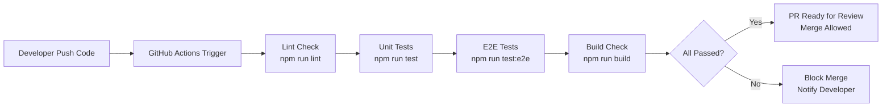

# Testing Plan & Strategy
# Enterprise Laboratory Information System (eLIS)

| Field            | Detail                                       |
|------------------|----------------------------------------------|
| **Document ID**  | TEST-eLIS-2026-001                           |
| **Version**      | 1.0                                          |
| **Status**       | Draft                                        |
| **Date Created** | 2026-06-30                                   |
| **Referensi**    | SRS-eLIS, BE-eLIS, FE-eLIS, API-Docs-eLIS   |

---

## 1. Testing Philosophy

Setiap perubahan kode (feature/fix) yang di-merge wajib melewati semua lapisan pengujian. Tidak ada feature yang di-deploy ke production jika ada test yang gagal. Testing diterapkan pada semua lapisan arsitektur mengikuti **Testing Pyramid**:

```
           /\
          /E2E\          <- Sedikit, tapi cover critical flow
         /------\
        /  Intg  \       <- Cukup, untuk validasi antar layer
       /----------\
      /  Unit Test \     <- Banyak, cepat, isolated
     /--------------\
```

---

## 2. Jenis & Cakupan Test

### 2.1 Unit Test (Backend – NestJS)
- **Tool**: Jest
- **Target Coverage**: ≥ 80% branch coverage pada semua Service Layer.
- **Cakupan**:
  - Business logic di `*.service.ts` (kalkulasi tarif, validasi state machine order, flag abnormal hasil lab).
  - Custom Guards (JwtAuthGuard, RolesGuard).
  - Custom Pipes & Decorators.
  - Utility/Helper functions.
- **Prinsip**: Semua dependency eksternal (Prisma, Redis) wajib di-*mock*.

### 2.2 Integration Test (Backend)
- **Tool**: Jest + Supertest + Test Database (PostgreSQL TestContainers atau DB instance khusus test).
- **Target Coverage**: ≥ 70% pada endpoint kritikal.
- **Cakupan**:
  - Alur lengkap 1 Controller → Service → Prisma → DB (database nyata, bukan mock).
  - Validasi response envelope format (`{ success, data, meta }`).
  - Validasi RBAC: request dengan role salah harus return 403 Forbidden.

### 2.3 E2E Test (Backend)
- **Tool**: Jest + Supertest.
- **Cakupan (Happy Path per Modul)**:
  - [x] Auth: Login → Dapatkan Token → Akses Protected Route → Logout.
  - [x] Patient: Buat Pasien → Cari → Update → Soft Delete.
  - [x] Order: Buat Order → Bayar → Konfirmasi Sampel → Input Hasil → Approve.
  - [x] Billing: Buat Invoice → Cek Total → Bayar.
  - [x] Lab: Scan Barcode → Input Hasil → Verifikasi → Approve → Trigger Queue.

### 2.4 Unit Test (Frontend – Next.js)
- **Tool**: Jest + React Testing Library (RTL).
- **Target Coverage**: ≥ 70% pada komponen kritikal.
- **Cakupan**:
  - Komponen form (PatientForm, OrderForm): validasi Zod schema.
  - Tabel data: render baris, sorting, filter.
  - Status badge: render warna yang benar berdasarkan `status` prop.

### 2.5 Performance Test
- **Tool**: k6 (load testing tool modern).
- **Skenario**:

| Skenario | VU (Virtual Users) | Durasi | Kriteria Keberhasilan |
|---|---|---|---|
| **Spike Test** | 0 → 100 VU (dalam 30 detik) | 2 menit | Error rate < 1%, p95 latency < 500ms |
| **Load Test** | 50 VU konstan | 5 menit | Error rate < 0.5%, p95 latency < 200ms |
| **Stress Test** | Bertahap naik hingga sistem gagal | - | Identifikasi breaking point |

### 2.6 Security Test
- **Tool**: OWASP ZAP (Zed Attack Proxy) — automated scanning.
- **Checklist**:
  - [ ] SQL Injection: Input validasi (Prisma parameterized queries).
  - [ ] XSS: Response tidak mengandung script yang bisa dieksekusi.
  - [ ] Broken Authentication: Akses endpoint tanpa token harus ditolak (401).
  - [ ] Broken Authorization (IDOR): User A tidak bisa akses data User B.
  - [ ] Rate Limiting: Login 6x berurutan harus mendapat 429 Too Many Requests.
  - [ ] Sensitive Data Exposure: Token tidak muncul di error log.

### 2.7 Accessibility Test (Frontend)
- **Tool**: axe-core (via `jest-axe`) + Lighthouse CI.
- **Target**: WCAG 2.1 Level AA minimum.
- **Checklist**:
  - [ ] Semua elemen form memiliki label (`aria-label` atau `<label>`).
  - [ ] Navigasi keyboard penuh (Tab, Enter, Escape pada Modal).
  - [ ] Contrast ratio warna ≥ 4.5:1.
  - [ ] Loading state menggunakan `aria-busy="true"`.

### 2.8 Regression Test
- Dijalankan otomatis pada setiap Pull Request ke branch `main` via CI/CD pipeline (GitHub Actions).
- Terdiri dari: seluruh Unit Test + seluruh E2E Test (Happy Path).

---

## 3. Test Case Per Menu (Critical Scenarios)

### 3.1 Login
| ID | Skenario | Input | Expected |
|----|----------|-------|----------|
| TC-AUTH-001 | Login sukses | Email+Pass valid | HTTP 200, `accessToken` di body, `refreshToken` di Cookie |
| TC-AUTH-002 | Login gagal - password salah | Email valid, Pass salah | HTTP 401, `ERR_INVALID_CREDENTIALS` |
| TC-AUTH-003 | Login brute force (6 attempt) | Percobaan ke-6 | HTTP 429, `ERR_RATE_LIMIT_EXCEEDED` |
| TC-AUTH-004 | Akses endpoint protected tanpa token | - | HTTP 401, `ERR_UNAUTHORIZED` |
| TC-AUTH-005 | Akses endpoint dengan role salah | Token valid (KASIR) akses endpoint ADMIN | HTTP 403, `ERR_FORBIDDEN` |

### 3.2 Patient
| ID | Skenario | Input | Expected |
|----|----------|-------|----------|
| TC-PAT-001 | Daftar pasien baru | NIK unik 16 digit, data lengkap | HTTP 201, nomor MRN ter-generate |
| TC-PAT-002 | Duplikasi NIK | NIK yang sudah ada | HTTP 409, `ERR_PATIENT_DUPLICATE_NIK` |
| TC-PAT-003 | Cari pasien by NIK | NIK valid | HTTP 200, data pasien ditemukan |
| TC-PAT-004 | Validasi NIK invalid | NIK < 16 digit | HTTP 400, `ERR_VALIDATION` |

### 3.3 Order & Billing
| ID | Skenario | Input | Expected |
|----|----------|-------|----------|
| TC-ORD-001 | Buat order baru | patientId valid, test array | HTTP 201, status `PENDING_PAYMENT`, total kalkulasi benar |
| TC-ORD-002 | Proses pembayaran | orderId valid, metode Cash | HTTP 200, status jadi `PAID`, invoice tersimpan |
| TC-ORD-003 | Bayar order yang sudah dibayar | orderId yang sudah `PAID` | HTTP 409, `ERR_ORDER_ALREADY_PAID` |

### 3.4 Laboratory
| ID | Skenario | Input | Expected |
|----|----------|-------|----------|
| TC-LAB-001 | Scan barcode konfirmasi sampel | orderId dengan status `PAID` | HTTP 200, status jadi `SAMPLE_COLLECTED` |
| TC-LAB-002 | Input hasil dengan nilai abnormal | nilai > maxRef | HTTP 200, flag otomatis terisi `H` (High) |
| TC-LAB-003 | Verifikasi hasil (Teknisi) | orderId status `IN_ANALYSIS` | HTTP 200, status jadi `VERIFIED` |
| TC-LAB-004 | Approval Dokter | orderId status `VERIFIED` | HTTP 200, status `APPROVED`, job dipush ke email-queue & wa-queue |
| TC-LAB-005 | Verifikasi tanpa hasil lengkap | orderId dengan detail kosong | HTTP 400, `ERR_RESULT_INCOMPLETE` |

### 3.5 Audit Trail
| ID | Skenario | Input | Expected |
|----|----------|-------|----------|
| TC-AUD-001 | Buat pasien → cek audit log | Buat pasien baru | 1 baris di `audit_logs` dengan action=`CREATE` |
| TC-AUD-002 | Update data → cek old/new values | Update nama pasien | `oldValues.name` = nama lama, `newValues.name` = nama baru |
| TC-AUD-003 | Cek imutabilitas | DELETE request ke `audit_logs` | HTTP 405 Method Not Allowed |

---

## 4. CI/CD Pipeline Integration



---

## 5. Definition of Done (DoD) per Menu

Sebuah menu/fitur baru hanya dianggap **selesai (DONE)** jika memenuhi seluruh kriteria berikut:

- [ ] **Code Complete**: Semua task di Jira/Linear ditandai selesai.
- [ ] **Unit Test**: Coverage ≥ 80% pada service layer, semua test hijau.
- [ ] **E2E Test**: Happy path dan critical edge case teruji.
- [ ] **Security Test**: Tidak ada temuan kritis dari OWASP ZAP scan.
- [ ] **Accessibility Test**: WCAG 2.1 AA terpenuhi (score Lighthouse ≥ 85).
- [ ] **Performance Test**: p95 latency < 200ms pada 50 VU concurrent.
- [ ] **UI Review**: Sesuai desain (Design System, warna, tipografi, animasi).
- [ ] **UX Review**: Alur kerja logis, tidak ada dead end, pesan error jelas.
- [ ] **Regression Test**: Semua test yang sudah ada tetap hijau (tidak ada yang pecah).
- [ ] **Code Review**: Minimal 1 reviewer (selain author) menyetujui PR.

---
**END OF TESTING PLAN**
